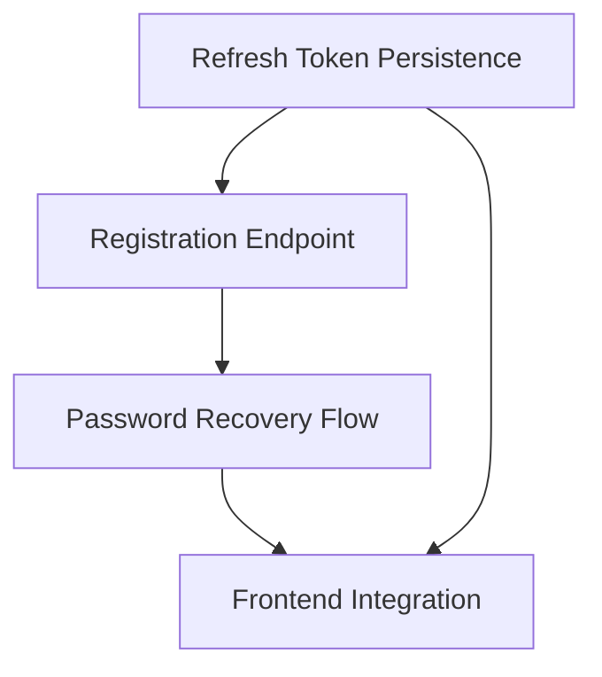

# Auth Implementation Order & Replan

## Current State (Evidence-Based)
- **Database Schema**: Fully supports `refreshTokenHash`, `lastLoginAt`, `passwordResetHash`, `emailVerificationHash`, etc. No migration is needed for these fields.
- **Audit Log**: `AuditService` is already integrated and actively logging `LOGIN_FAILED`, `LOGIN_SUCCESS`, `LOGOUT_SUCCESS`, and `CHANGE_PASSWORD`.
- **AuthService**: Contains `login`, `logout`, `refresh`, and `changePassword`. However, token rotation and persistence are bypassed via `TODO` comments.
- **Endpoints**: `/auth/register`, `/auth/forgot-password`, and `/auth/reset-password` do not exist.
- **Frontend**: Authentication UI exists but uses `setTimeout` mocks.

## Missing Pieces
1. **Refresh Token Persistence**: `auth.service.ts` fails to save, verify, or nullify `refreshTokenHash` and `lastLoginAt`.
2. **Registration Flow**: Backend endpoint `/auth/register` + Tenant/Role assignment + Email verification token generation.
3. **Password Recovery Flow**: Backend endpoints for `/auth/forgot-password` and `/auth/reset-password`.
4. **Frontend Integration**: Connecting the mocked UI to the new/updated backend endpoints.

## Dependency Graph

## Implementation Order
Based on the evidence that existing endpoints (`login`, `refresh`, `logout`) are incomplete and vulnerable without token persistence, they must be fixed first before adding new endpoints.

1. **Commit 1**: `feat(auth): implement refresh token persistence and login history` (Fixing existing `login`, `logout`, `refresh`).
2. **Commit 2**: `feat(auth): implement registration endpoint with tenant assignment`
3. **Commit 3**: `feat(auth): implement password recovery endpoints`
4. **Commit 4**: `feat(web): integrate auth frontend with real api`

## Commit Budget
- **1 Root Cause = 1 Commit**.
- Commit 1 addresses the *existing* technical debt in `AuthService`.
- Commit 2 addresses the *missing* Registration flow.
- Commit 3 addresses the *missing* Password Recovery flow.
- Commit 4 addresses the *mocked* Frontend.

## Rollback Strategy
If any commit fails regression or E2E tests:
1. **Local Rollback**: `git revert <commit-hash>`.
2. Since no database migrations are currently required for Auth, rolling back the codebase will not cause schema drift or data corruption.
3. Update `PROJECT_MEMORY.md` with the failure reason before replanning.
