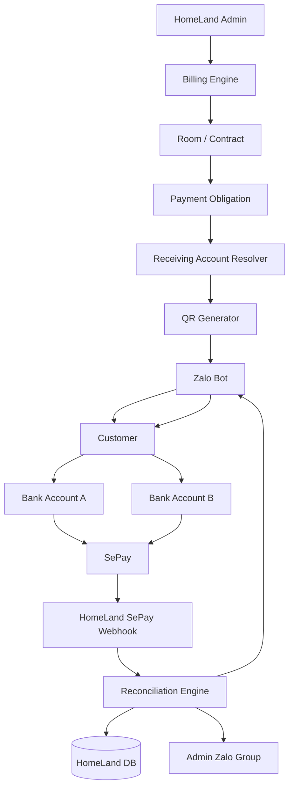
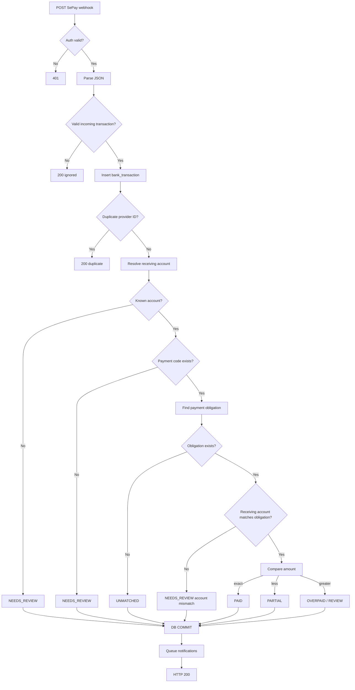
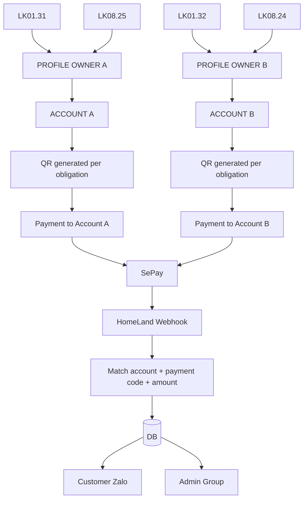

# HomeLand — SePay Integration Plan
## Multi-Receiving-Account, QR Test Popup, Auto Reconciliation, Zalo Confirmation

> Version: 1.0  
> Target: HomeLand serviced-apartment management system  
> Stack assumption: Node.js + Express + SQLite/MySQL/PostgreSQL + Zalo Bot + SePay  
> Main goal: support multiple receiving bank accounts by property owner/room while keeping one consistent payment-confirmation workflow.

---

# 1. Scope

This plan covers:

1. SePay settings inside HomeLand Admin.
2. Public webhook endpoint.
3. HMAC/API Key authentication.
4. Multiple receiving bank accounts.
5. Mapping receiving account → owner → rooms.
6. Payment obligation → receiving account.
7. Payment code generation.
8. QR generation.
9. Popup to enter a test amount and preview the QR.
10. Send test QR to Admin Group.
11. SePay webhook processing.
12. Automatic reconciliation.
13. Partial / exact / overpaid / missing-code cases.
14. Customer Zalo confirmation.
15. Admin Group notification.
16. Fallback reconciliation job.
17. Audit, security, idempotency and production test plan.

---

# 2. Official SePay behavior used by this plan

Verified from current SePay Developer documentation:

- SePay pushes bank transactions to a configured webhook via HTTP POST.
- Production webhook URLs must be public HTTPS URLs.
- SePay supports filtering webhook events by receiving bank account.
- One webhook can be configured for multiple linked bank accounts.
- Payment verification usually uses incoming transactions only.
- SePay supports API Key and HMAC-SHA256 webhook authentication.
- HMAC-SHA256 is the recommended production mode.
- SePay can retry failed webhook deliveries.
- Transaction `id` should be used for idempotency / duplicate prevention.
- Payload contains fields including:
  - `id`
  - `gateway`
  - `transactionDate`
  - `accountNumber`
  - `subAccount`
  - `code`
  - `content`
  - `transferType`
  - `transferAmount`
  - `referenceCode`
- SePay supports QR generation via `https://vietqr.app/img`.
- QR query parameters include:
  - `acc`
  - `bank`
  - `amount`
  - `des`
- Payment-code configuration can be used so SePay extracts a payment code into the `code` field.
- SePay can be configured to ignore transactions without payment codes, but HomeLand should **not** enable that option if manual reconciliation of missing-note transfers is required.

Recommended official references:

```text
https://developer.sepay.vn/vi/sepay-webhooks
https://developer.sepay.vn/vi/sepay-webhooks/tao-webhook
https://developer.sepay.vn/vi/sepay-webhooks/xac-thuc
https://developer.sepay.vn/vi/sepay-webhooks/tich-hop-webhook
https://developer.sepay.vn/vi/sepay-webhooks/tao-qr-va-form-thanh-toan
https://developer.sepay.vn/vi/sepay-webhooks/tai-khoan-ngan-hang
https://developer.sepay.vn/vi/sepay-webhooks/bao-mat
```

---

# 3. Target business mapping

HomeLand has at least two receiving-account groups.

Example requested mapping:

```text
OWNER / PAYMENT PROFILE A
├── LK01.31
└── LK08.25
    ↓
Receiving Bank Account A

OWNER / PAYMENT PROFILE B
├── LK01.32
└── LK08.24
    ↓
Receiving Bank Account B
```

Important principle:

```text
Room
→ Owner / Payment Profile
→ Receiving Bank Account
→ Payment Obligation
→ QR
```

A customer must always receive a QR generated from the **bank account assigned to that room/payment obligation**.

The webhook confirmation logic stays the same regardless of which account receives the money.

---

# 4. High-level architecture



---

# 5. Multi-account design

Do **not** hard-code bank-account selection in business code like:

```js
if (room === "LK01.31") account = "...";
```

Use database mapping.

Recommended model:

```text
payment_accounts
owners/payment_profiles
rooms
room_payment_accounts
```

---

# 6. Table: `payment_accounts`

```sql
CREATE TABLE payment_accounts (
    id INTEGER PRIMARY KEY AUTOINCREMENT,

    code TEXT NOT NULL UNIQUE,

    display_name TEXT NOT NULL,

    bank_code TEXT NOT NULL,
    bank_name TEXT,

    account_number TEXT NOT NULL,
    account_name TEXT NOT NULL,

    sepay_account_identifier TEXT,

    status TEXT NOT NULL DEFAULT 'ACTIVE',

    is_default INTEGER NOT NULL DEFAULT 0,

    created_at DATETIME DEFAULT CURRENT_TIMESTAMP,
    updated_at DATETIME DEFAULT CURRENT_TIMESTAMP
);

CREATE UNIQUE INDEX idx_payment_account_bank_number
ON payment_accounts(bank_code, account_number);
```

Example:

```text
ACC_OWNER_A
Bank: MBBank
Account: 1111111111
Name: OWNER A
Status: ACTIVE

ACC_OWNER_B
Bank: Vietcombank
Account: 2222222222
Name: OWNER B
Status: ACTIVE
```

---

# 7. Table: `payment_profiles`

Use a profile to represent a property owner or accounting bucket.

```sql
CREATE TABLE payment_profiles (
    id INTEGER PRIMARY KEY AUTOINCREMENT,

    code TEXT NOT NULL UNIQUE,
    name TEXT NOT NULL,

    payment_account_id INTEGER NOT NULL,

    status TEXT NOT NULL DEFAULT 'ACTIVE',

    created_at DATETIME DEFAULT CURRENT_TIMESTAMP,
    updated_at DATETIME DEFAULT CURRENT_TIMESTAMP,

    FOREIGN KEY(payment_account_id)
      REFERENCES payment_accounts(id)
);
```

Example:

```text
PROFILE_OWNER_A
→ ACC_OWNER_A

PROFILE_OWNER_B
→ ACC_OWNER_B
```

---

# 8. Map rooms to payment profiles

Add:

```sql
ALTER TABLE rooms
ADD COLUMN payment_profile_id INTEGER;
```

Or use a dedicated relation:

```sql
CREATE TABLE room_payment_profiles (
    id INTEGER PRIMARY KEY AUTOINCREMENT,

    room_id INTEGER NOT NULL,
    payment_profile_id INTEGER NOT NULL,

    valid_from DATE NOT NULL,
    valid_to DATE,

    status TEXT NOT NULL DEFAULT 'ACTIVE',

    created_at DATETIME DEFAULT CURRENT_TIMESTAMP,

    FOREIGN KEY(room_id)
      REFERENCES rooms(id),

    FOREIGN KEY(payment_profile_id)
      REFERENCES payment_profiles(id)
);
```

Dedicated history mapping is better if owners/bank accounts can change over time.

---

# 9. Requested mapping example

```text
PROFILE_OWNER_A
Payment account: ACC_OWNER_A

Rooms:
- LK01.31
- LK08.25
```

```text
PROFILE_OWNER_B
Payment account: ACC_OWNER_B

Rooms:
- LK01.32
- LK08.24
```

In database:

```text
LK01.31 → PROFILE_OWNER_A → ACC_OWNER_A
LK08.25 → PROFILE_OWNER_A → ACC_OWNER_A

LK01.32 → PROFILE_OWNER_B → ACC_OWNER_B
LK08.24 → PROFILE_OWNER_B → ACC_OWNER_B
```

---

# 10. Payment obligation must freeze the receiving account

This is important.

When a monthly invoice/payment obligation is created, copy the selected account into the obligation.

Add:

```sql
ALTER TABLE payment_obligations
ADD COLUMN payment_account_id INTEGER;
```

Also optionally store immutable snapshots:

```sql
ALTER TABLE payment_obligations
ADD COLUMN receiving_bank_code TEXT;

ALTER TABLE payment_obligations
ADD COLUMN receiving_account_number TEXT;

ALTER TABLE payment_obligations
ADD COLUMN receiving_account_name TEXT;
```

Why?

If an owner changes bank account tomorrow, invoices created yesterday must still reconcile against the account that was originally shown in the QR.

Flow:

```text
Room
→ current payment profile
→ account
→ create obligation
→ snapshot account on obligation
```

After this point, QR generation uses the obligation snapshot, not the room's current setting.

---

# 11. Resolution service

`paymentAccountResolver.service.js`

```js
async function resolvePaymentAccountForRoom({
  roomId,
  billingDate,
  repositories
}) {
  const mapping =
    await repositories.roomPaymentProfiles
      .findActiveForDate(roomId, billingDate);

  if (!mapping) {
    throw new Error("ROOM_PAYMENT_PROFILE_NOT_CONFIGURED");
  }

  const profile =
    await repositories.paymentProfiles
      .findById(mapping.payment_profile_id);

  if (!profile || profile.status !== "ACTIVE") {
    throw new Error("PAYMENT_PROFILE_INACTIVE");
  }

  const account =
    await repositories.paymentAccounts
      .findById(profile.payment_account_id);

  if (!account || account.status !== "ACTIVE") {
    throw new Error("PAYMENT_ACCOUNT_INACTIVE");
  }

  return {
    profile,
    account
  };
}
```

---

# 12. Create payment obligation

```js
async function createPaymentObligation({
  invoice,
  tenant,
  room,
  amountDue,
  repositories
}) {
  const { account } =
    await resolvePaymentAccountForRoom({
      roomId: room.id,
      billingDate: invoice.billing_month,
      repositories
    });

  const paymentCode =
    await generateUniquePaymentCode();

  return repositories.paymentObligations.create({
    invoiceId: invoice.id,
    tenantId: tenant.id,

    amountDue,
    amountPaid: 0,

    paymentCode,

    paymentAccountId: account.id,

    receivingBankCode: account.bank_code,
    receivingAccountNumber: account.account_number,
    receivingAccountName: account.account_name,

    dueDate: invoice.due_date,
    status: "PENDING"
  });
}
```

---

# 13. Payment code strategy

HomeLand setting:

```text
Prefix = HL
```

Recommended payment code:

```text
HL + random alphanumeric
```

Example:

```text
HL7A91F2C8
HL98AF610B
```

Do not encode sensitive customer data in the payment code.

Avoid using phone number as payment code.

---

# 14. Unique payment code generator

```js
const crypto = require("crypto");

function buildRandomPaymentCode(prefix = "HL") {
  const suffix = crypto
    .randomBytes(5)
    .toString("hex")
    .toUpperCase();

  return `${prefix}${suffix}`;
}

async function generateUniquePaymentCode(
  repository,
  prefix = "HL"
) {
  for (let i = 0; i < 10; i++) {
    const code =
      buildRandomPaymentCode(prefix);

    const exists =
      await repository.findByPaymentCode(code);

    if (!exists) {
      return code;
    }
  }

  throw new Error(
    "FAILED_TO_GENERATE_UNIQUE_PAYMENT_CODE"
  );
}
```

---

# 15. SePay payment-code configuration

Configure the same prefix in SePay Dashboard.

HomeLand:

```text
HL
```

SePay:

```text
Company / Common configuration
→ Payment code structure
→ Prefix = HL
```

The goal is for SePay webhook payload to contain:

```json
{
  "code": "HL7A91F2C8"
}
```

---

# 16. Webhook account selection in SePay

SePay supports selecting multiple linked bank accounts for one webhook.

For HomeLand:

```text
Webhook: HomeLand Payment Confirmation
Accounts:
✓ Receiving Account A
✓ Receiving Account B
```

Recommended:

```text
Event: Incoming only
Payment verification: enabled
Skip transactions without payment code: OFF
```

Why OFF?

If the customer removes the payment note, HomeLand still needs the transaction so it can be put into:

```text
NEEDS_REVIEW
```

instead of disappearing from the HomeLand workflow.

---

# 17. One webhook or two webhooks?

Recommended:

```text
ONE webhook
+ MULTIPLE receiving accounts
```

Example:

```text
SePay
├── Bank Account A
└── Bank Account B
      ↓
POST
/api/v1/payments/sepay/webhook
```

The webhook payload contains `accountNumber`, so HomeLand can identify which account received the money.

This keeps one reconciliation pipeline.

Only use separate webhooks if there is a strong operational or security reason.

---

# 18. Webhook URL

Current local development URL:

```text
http://127.0.0.1:3001/api/v1/payments/sepay/webhook
```

This is for local access only.

Production must be public HTTPS:

```text
https://api.your-domain.com/api/v1/payments/sepay/webhook
```

Temporary development tunnel:

```text
https://xxxxx.trycloudflare.com/api/v1/payments/sepay/webhook
```

---

# 19. Admin Settings — target UI

Recommended page:

```text
Settings
└── Integrations
    └── SePay
```

Card layout:

```text
SEPAY
Tích hợp thanh toán SePay                [ ON ]

WEBHOOK
Webhook Endpoint
[ https://api.domain.com/api/v1/payments/sepay/webhook ]

Auth Mode
[ HMAC-SHA256 ▼ ]

HMAC Secret
[ ****************************** ]

Webhook Status
Connected / Not verified

Last Webhook
24/08/2026 17:10:20


PAYMENT CODE
Payment Code Prefix
[ HL ]

Skip no-code transaction
[ OFF ]


RECEIVING ACCOUNTS
+ Add Receiving Account

Account A
Bank: MBBank
Account: ****1111
Name: OWNER A
Rooms: LK01.31, LK08.25
Status: Active

Account B
Bank: Vietcombank
Account: ****2222
Name: OWNER B
Rooms: LK01.32, LK08.24
Status: Active


TEST
[ Test QR ]
[ Test Reconciliation ]
[ Send Test QR to Admin ]
[ Open Unmatched Transactions ]

                                    [ Save SePay ]
```

---

# 20. Receiving Accounts sub-page

Add a dedicated section:

```text
Settings > Integrations > SePay > Receiving Accounts
```

Table:

| Account Code | Bank | Account | Account Name | Profile/Owner | Rooms | Status |
|---|---|---|---|---|---|---|
| ACC_OWNER_A | MBBank | ****1111 | OWNER A | Owner A | LK01.31, LK08.25 | Active |
| ACC_OWNER_B | VCB | ****2222 | OWNER B | Owner B | LK01.32, LK08.24 | Active |

Buttons:

```text
[ Add Account ]
[ Edit ]
[ Test QR ]
[ Manage Rooms ]
[ Disable ]
```

Do not delete accounts that have historical transactions.

Set:

```text
status = INACTIVE
```

instead.

---

# 21. Add Receiving Account popup

Fields:

```text
Add Receiving Account

Account Code
[ ACC_OWNER_A ]

Display Name
[ Chủ LK01.31 / LK08.25 ]

Bank
[ MBBank ▼ ]

Account Number
[ 0123456789 ]

Account Name
[ NGUYEN ... ]

SePay Linked Account
[ select mapped SePay account if available ]

Payment Profile
[ Owner A ]

Status
[ Active ]

[ Cancel ] [ Save ]
```

---

# 22. Room mapping popup

```text
Assign Rooms

Receiving Account:
ACC_OWNER_A

Selected Rooms:
[x] LK01.31
[x] LK08.25
[ ] LK01.32
[ ] LK08.24

Effective From:
[ 24/08/2026 ]

[ Cancel ] [ Save Mapping ]
```

The system must prevent two active payment profiles for the same room/date unless the business explicitly supports split-owner payments.

---

# 23. QR generation

Official QR format:

```text
https://vietqr.app/img
?acc={ACCOUNT}
&bank={BANK}
&amount={AMOUNT}
&des={PAYMENT_CODE}
```

Node.js:

```js
function buildPaymentQrUrl({
  accountNumber,
  bankCode,
  amount,
  paymentCode
}) {
  const params = new URLSearchParams({
    acc: String(accountNumber),
    bank: String(bankCode),
    amount: String(Math.round(amount)),
    des: String(paymentCode)
  });

  return (
    `https://vietqr.app/img?${params.toString()}`
  );
}
```

---

# 24. Required popup: Test QR

This is a mandatory Admin feature.

Button:

```text
[Test QR]
```

On click, open modal.

---

# 25. Test QR popup UI

```text
┌─────────────────────────────────────────────┐
│ Test QR SePay                              │
│                                             │
│ Tài khoản nhận                             │
│ [ Chủ LK01.31 / LK08.25              ▼ ]  │
│                                             │
│ Hoặc chọn phòng                            │
│ [ LK01.31                              ▼ ]  │
│                                             │
│ Số tiền test                               │
│ [ 10000                                  ] │
│                                             │
│ Mã thanh toán                              │
│ [ HLTEST7A91F2 ]                            │
│ [ Tạo mã mới ]                             │
│                                             │
│ [ Tạo QR ]                                 │
│                                             │
│ ─────────────────────────────────────────  │
│                                             │
│          [ QR PREVIEW ]                     │
│                                             │
│ Ngân hàng: MBBank                          │
│ STK: ****1111                              │
│ Số tiền: 10.000đ                           │
│ Nội dung: HLTEST7A91F2                     │
│                                             │
│ [ Mở QR ] [ Gửi tới Admin Group ]          │
│                                             │
│                           [ Đóng ]           │
└─────────────────────────────────────────────┘
```

---

# 26. Test QR UX rules

The popup must:

1. Require amount > 0.
2. Allow selecting:
   - receiving account directly, or
   - room.
3. If a room is selected, automatically resolve its assigned receiving account.
4. Generate a temporary `HLTEST...` code.
5. Display:
   - bank
   - masked account
   - account name
   - amount
   - payment code
   - QR image
6. Not create a production invoice.
7. Not mark anything as paid.
8. Test code should be identifiable as test data.

---

# 27. Frontend modal state example

```js
const initialState = {
  roomId: null,
  paymentAccountId: null,
  amount: 10000,
  paymentCode: "",
  qrUrl: "",
  loading: false,
  error: null
};
```

---

# 28. Test QR API

```text
POST /api/v1/admin/integrations/sepay/test-qr
```

Request by room:

```json
{
  "roomId": 101,
  "amount": 10000
}
```

or by payment account:

```json
{
  "paymentAccountId": 1,
  "amount": 10000
}
```

---

# 29. Test QR API response

```json
{
  "success": true,
  "test": true,
  "paymentCode": "HLTEST7A91F2",
  "amount": 10000,
  "account": {
    "id": 1,
    "code": "ACC_OWNER_A",
    "bankCode": "MBBank",
    "accountNumberMasked": "******1111",
    "accountName": "OWNER A"
  },
  "qrUrl": "https://vietqr.app/img?..."
}
```

Do not send full account information unless needed by the Admin UI.

---

# 30. Test QR backend

```js
router.post(
  "/api/v1/admin/integrations/sepay/test-qr",
  requireAdmin,
  async (req, res) => {
    try {
      const amount = Number(req.body.amount);

      if (
        !Number.isFinite(amount) ||
        amount <= 0
      ) {
        return res.status(400).json({
          success: false,
          code: "INVALID_AMOUNT"
        });
      }

      let account = null;

      if (req.body.roomId) {
        const resolved =
          await resolvePaymentAccountForRoom({
            roomId: Number(req.body.roomId),
            billingDate:
              new Date().toISOString().slice(0, 10),
            repositories
          });

        account = resolved.account;
      }

      if (
        !account &&
        req.body.paymentAccountId
      ) {
        account =
          await repositories.paymentAccounts
            .findById(
              Number(req.body.paymentAccountId)
            );
      }

      if (!account) {
        return res.status(400).json({
          success: false,
          code: "PAYMENT_ACCOUNT_NOT_FOUND"
        });
      }

      const suffix =
        require("crypto")
          .randomBytes(4)
          .toString("hex")
          .toUpperCase();

      const paymentCode =
        `HLTEST${suffix}`;

      const qrUrl =
        buildPaymentQrUrl({
          accountNumber:
            account.account_number,
          bankCode:
            account.bank_code,
          amount,
          paymentCode
        });

      return res.json({
        success: true,
        test: true,
        paymentCode,
        amount,
        account: {
          id: account.id,
          code: account.code,
          bankCode: account.bank_code,
          accountNumberMasked:
            maskAccountNumber(
              account.account_number
            ),
          accountName:
            account.account_name
        },
        qrUrl
      });
    } catch (error) {
      return res.status(500).json({
        success: false,
        code: "TEST_QR_FAILED"
      });
    }
  }
);
```

---

# 31. Send Test QR to Admin Group

Button:

```text
[ Gửi tới Admin Group ]
```

Endpoint:

```text
POST /api/v1/admin/integrations/sepay/test-qr/send-admin
```

Request:

```json
{
  "paymentAccountId": 1,
  "amount": 10000
}
```

Message:

```text
HomeLand - Test QR

Tài khoản: Chủ LK01.31 / LK08.25
Số tiền: 10.000đ
Mã: HLTEST7A91F2

QR:
https://vietqr.app/img?...
```

If Zalo media/photo API is later verified and implemented, replace URL fallback with the QR image.

---

# 32. Admin test matrix for both accounts

Before production, run:

```text
Test A
Room: LK01.31
Expected account: ACC_OWNER_A

Test B
Room: LK08.25
Expected account: ACC_OWNER_A

Test C
Room: LK01.32
Expected account: ACC_OWNER_B

Test D
Room: LK08.24
Expected account: ACC_OWNER_B
```

If any QR points to the wrong account:

```text
STOP production
```

Do not fix by changing the QR manually. Fix the room/payment-profile mapping.

---

# 33. Webhook authentication

Recommended production mode:

```text
HMAC-SHA256
```

Admin setting:

```text
Auth Mode
[ HMAC-SHA256 ]

HMAC Secret
[ ************************ ]
```

API Key can remain as an alternative but only show the matching secret field for the selected mode.

---

# 34. Express raw body

For HMAC verification:

```js
app.post(
  "/api/v1/payments/sepay/webhook",
  express.raw({
    type: "application/json"
  }),
  sepayWebhookHandler
);

app.use(express.json());
```

Do not run `express.json()` before the SePay raw-body route if the signature is calculated from raw request bytes.

---

# 35. HMAC verification

```js
const crypto = require("crypto");

function verifySePayHmac({
  rawBody,
  signature,
  timestamp,
  secret
}) {
  if (
    !rawBody ||
    !signature ||
    !timestamp ||
    !secret
  ) {
    return false;
  }

  const ts = Number(timestamp);

  if (!Number.isFinite(ts)) {
    return false;
  }

  const now =
    Math.floor(Date.now() / 1000);

  if (Math.abs(now - ts) > 300) {
    return false;
  }

  const data =
    `${timestamp}.${rawBody.toString("utf8")}`;

  const expected =
    "sha256=" +
    crypto
      .createHmac("sha256", secret)
      .update(data)
      .digest("hex");

  const left = Buffer.from(expected);
  const right = Buffer.from(signature);

  if (left.length !== right.length) {
    return false;
  }

  return crypto.timingSafeEqual(
    left,
    right
  );
}
```

---

# 36. Normalize SePay payload

```js
function normalizeSePayTransaction(payload) {
  return {
    providerTransactionId:
      String(payload.id),

    gateway:
      payload.gateway || null,

    transactionDate:
      payload.transactionDate || null,

    accountNumber:
      payload.accountNumber
        ? String(payload.accountNumber)
        : null,

    subAccount:
      payload.subAccount || null,

    code:
      payload.code
        ? String(payload.code)
            .trim()
            .toUpperCase()
        : null,

    content:
      payload.content
        ? String(payload.content)
        : "",

    description:
      payload.description
        ? String(payload.description)
        : "",

    transferType:
      payload.transferType || null,

    transferAmount:
      Number(payload.transferAmount || 0),

    accumulated:
      Number(payload.accumulated || 0),

    referenceCode:
      payload.referenceCode
        ? String(payload.referenceCode)
        : null,

    raw:
      payload
  };
}
```

---

# 37. Webhook processing flow



---

# 38. Critical multi-account validation

Matching only by payment code is not enough.

Also validate the receiving account.

Example obligation:

```text
payment_code = HL7A91F2C8
payment_account_id = ACC_OWNER_A
account_number = 1111111111
```

Webhook:

```json
{
  "code": "HL7A91F2C8",
  "accountNumber": "2222222222",
  "transferAmount": 3500000
}
```

This is not a normal auto-match.

Result:

```text
NEEDS_REVIEW
reason = RECEIVING_ACCOUNT_MISMATCH
```

Do not automatically mark the obligation as paid.

---

# 39. Find receiving account by webhook account number

```js
const receivingAccount =
  await paymentAccounts.findByAccountNumber(
    tx.accountNumber
  );

if (!receivingAccount) {
  return markNeedsReview({
    reason: "UNKNOWN_RECEIVING_ACCOUNT"
  });
}
```

Then:

```js
if (
  Number(obligation.payment_account_id) !==
  Number(receivingAccount.id)
) {
  return markNeedsReview({
    reason:
      "RECEIVING_ACCOUNT_MISMATCH"
  });
}
```

---

# 40. Exact payment

```text
remaining due = 3.500.000
received      = 3.500.000

→ PAID
```

---

# 41. Partial payment

```text
remaining due = 3.500.000
received      = 2.000.000

→ PARTIAL
amount_paid = 2.000.000
remaining = 1.500.000
```

The next QR may still use the same payment code or a replacement code depending on accounting policy.

Recommendation for simplicity:

```text
same payment code
amount = remaining balance
```

---

# 42. Overpayment

```text
remaining due = 3.500.000
received      = 5.000.000

→ OVERPAID
→ review required
```

Do not automatically allocate the extra amount to another tenant or another room.

---

# 43. Missing payment code

If:

```text
code = null
```

then:

```text
NEEDS_REVIEW
```

Do not auto-confirm based only on amount.

Candidate matching can use:

```text
- receiving bank account
- exact amount
- open obligations
- recent due date
- recent transaction time
```

but should remain:

```text
NEEDS_REVIEW
```

until Admin confirms.

---

# 44. Why multi-account improves missing-code review

Suppose:

```text
Account A receives 3.500.000
```

Candidate search can be limited to obligations assigned to Account A.

It should not search Account B's rooms.

So for missing code:

```text
transaction.accountNumber
→ payment_account
→ rooms/profile
→ open obligations
```

This reduces ambiguity.

---

# 45. Candidate matching query

Pseudo SQL:

```sql
SELECT po.*
FROM payment_obligations po
WHERE po.payment_account_id = ?
  AND po.status IN (
    'PENDING',
    'PARTIAL',
    'OVERDUE'
  )
  AND (po.amount_due - po.amount_paid) = ?
ORDER BY po.due_date ASC;
```

If:

```text
0 candidates
→ UNMATCHED

1 candidate
→ NEEDS_REVIEW / HIGH_CONFIDENCE

2+ candidates
→ NEEDS_REVIEW / AMBIGUOUS
```

---

# 46. Reconciliation transaction table

Add account relation:

```sql
ALTER TABLE bank_transactions
ADD COLUMN payment_account_id INTEGER;

ALTER TABLE bank_transactions
ADD COLUMN review_reason TEXT;
```

Useful statuses:

```text
UNMATCHED
MATCHED
NEEDS_REVIEW
ALLOCATED
IGNORED
```

---

# 47. Race-safe idempotency

Must use a unique provider transaction ID.

```sql
CREATE UNIQUE INDEX
idx_bank_transactions_provider_unique
ON bank_transactions(
  provider,
  provider_transaction_id
);
```

Recommended transaction:

```text
BEGIN

INSERT transaction
if duplicate:
  ROLLBACK/RETURN 200

resolve account
match obligation
create allocation
update obligation
update invoice

COMMIT

enqueue notifications
return 200
```

---

# 48. Admin payment-account validation

On Save:

```text
1. Bank code required.
2. Account number required.
3. Account name required.
4. Duplicate bank+account not allowed.
5. At least one receiving account must be ACTIVE.
6. Every occupied room requiring payment must have an active mapping.
```

Add a validation page:

```text
[ Validate Room Payment Mapping ]
```

Output:

```text
OK
LK01.31 → ACC_OWNER_A
LK08.25 → ACC_OWNER_A
LK01.32 → ACC_OWNER_B
LK08.24 → ACC_OWNER_B

Missing:
none
```

---

# 49. SePay configuration status

HomeLand should track:

```text
enabled
auth_mode
webhook_url
webhook_verified_at
last_webhook_at
last_webhook_status
last_webhook_error
payment_code_prefix
```

Do not rely on a single green toggle.

---

# 50. Admin Settings recommended final structure

```text
SEPAY INTEGRATION
[ Enabled ]

A. WEBHOOK
- Public Webhook URL
- Authentication Mode
- API Key OR HMAC Secret
- Last Webhook
- Status

B. PAYMENT CODE
- Prefix
- Test code generator

C. RECEIVING ACCOUNTS
- Account A
- Account B
- Add account
- Room mapping

D. QR TEST
- Test QR
- Send QR to Admin

E. RECONCILIATION
- Test reconciliation
- Unmatched transactions
- Last fallback reconciliation

F. MESSAGE
- Payment success template
- Payment due template
```

---

# 51. Popup: Test QR — final requirements

Mandatory:

```text
[ Test QR ]
```

Popup fields:

```text
Select by:
(o) Room
( ) Receiving account

Room:
[ LK01.31 ▼ ]

Resolved account:
Chủ LK01.31 / LK08.25
MBBank • ****1111

Test amount:
[ 10000 ]

Payment code:
[ auto-generated HLTEST... ]

[ Generate QR ]
```

After generation:

```text
QR Preview

Bank: MBBank
Account: ****1111
Account Name: OWNER A
Amount: 10.000đ
Description: HLTEST...

[ Open QR ]
[ Send to Admin Group ]
[ Regenerate ]
```

---

# 52. Popup test behavior for Account B

Select:

```text
Room: LK01.32
```

Expected:

```text
Resolved account:
Chủ LK01.32 / LK08.24
Bank account B
```

The QR must not use Account A.

---

# 53. Optional QR scanner validation

Admin can visually confirm.

For stronger testing, add:

```text
[ Mark test verified ]
```

This only records that Admin visually checked the QR.

Do not automatically infer that a QR is correct merely because the URL generated.

---

# 54. Test Reconciliation popup

Button:

```text
[ Test đối soát ]
```

Popup:

```text
Test Reconciliation

Receiving Account
[ ACC_OWNER_A ▼ ]

Payment Code
[ HLTEST7A91F2 ]

Expected Amount
[ 10000 ]

Received Amount
[ 10000 ]

Receiving Account Number
[ automatically selected ]

[ Run Test ]
```

Expected result:

```text
MATCHED
Amount: EXACT
Account: MATCH
Result: PAID_SIMULATION
```

Test mode must not update real invoices.

---

# 55. Test mismatch

Test:

```text
Obligation account = ACC_OWNER_A
Webhook account = ACC_OWNER_B
```

Expected:

```text
NEEDS_REVIEW
RECEIVING_ACCOUNT_MISMATCH
```

This test is required before production.

---

# 56. Zalo payment notification

When creating a real payment obligation:

```text
HomeLand - Thanh toán

Phòng: LK01.31
Kỳ: 09/2026
Số tiền: 3.500.000đ
Hạn: 05/09/2026
Mã: HL7A91F2C8

QR:
<QR URL>

Vui lòng giữ nguyên nội dung thanh toán.
```

Keep messages concise.

---

# 57. Zalo success notification

```text
HomeLand - Đã nhận thanh toán

Phòng: LK01.31
Kỳ: 09/2026
Số tiền: 3.500.000đ
Mã: HL7A91F2C8

Trạng thái: Đã thanh toán
```

---

# 58. Admin success notification

```text
Thanh toán đã đối soát

Phòng: LK01.31
Khách: Nguyễn A
Số tiền: 3.500.000đ
Mã: HL7A91F2C8
Tài khoản nhận: ACC_OWNER_A
Nguồn: SePay
```

---

# 59. Account mismatch admin notification

```text
Giao dịch cần kiểm tra

Mã: HL7A91F2C8
Số tiền: 3.500.000đ

Tài khoản dự kiến:
ACC_OWNER_A

Tài khoản thực nhận:
ACC_OWNER_B

Lý do:
RECEIVING_ACCOUNT_MISMATCH
```

---

# 60. Missing-code Admin notification

```text
Giao dịch chưa đối soát

Tài khoản nhận: ACC_OWNER_A
Số tiền: 3.500.000đ
Nội dung: NGUYEN VAN A

Không tìm thấy mã thanh toán.
Trạng thái: Cần kiểm tra
```

---

# 61. Admin unmatched screen

Columns:

```text
Date
SePay ID
Receiving Account
Amount
Code
Content
Reference
Status
Suggested Match
Action
```

Actions:

```text
[ Review ]
[ Allocate ]
[ Ignore ]
```

---

# 62. Manual allocation rules

Admin may allocate an unmatched transaction only to an obligation:

```text
- not CANCELLED
- receiving account compatible
```

If Admin overrides account mismatch, require:

```text
reason
audit log
```

Example:

```text
Manual override reason:
"Customer transferred to owner's other account"
```

---

# 63. Multi-account invoice safety

An invoice for one room should normally use one receiving account.

If the business later needs one invoice split across multiple owners/accounts, that should be a separate feature.

Current baseline:

```text
1 obligation
→ 1 payment account
→ 1 QR
```

---

# 64. Account changes

Do not edit historical obligations when changing a room's account.

Example:

```text
Before 01/10/2026:
LK01.31 → ACC_OWNER_A

From 01/10/2026:
LK01.31 → ACC_OWNER_C
```

Old September invoice remains:

```text
ACC_OWNER_A
```

New October invoice uses:

```text
ACC_OWNER_C
```

This is why mapping should have `valid_from` / `valid_to`.

---

# 65. Fallback reconciliation job

Webhook is primary.

Fallback:

```text
every 15 minutes
```

Flow:

```text
SePay transaction API
→ transactions after last cursor/ID
→ compare with bank_transactions
→ insert missing transactions
→ same reconciliation engine
```

Do not maintain separate logic for webhook vs fallback.

Both should call:

```js
reconciliationService.process(tx)
```

---

# 66. Single reconciliation engine

```text
Webhook
    ↓
normalize()
    ↓
processTransaction()

Fallback API
    ↓
normalize()
    ↓
processTransaction()
```

No duplicated business rules.

---

# 67. Notification timing

Recommended:

```text
DB transaction COMMIT
→ enqueue notification
→ return webhook 200
→ worker sends Zalo
```

Do not block SePay response while waiting for multiple Zalo API calls.

---

# 68. SePay webhook response

Successful processing:

```json
{
  "success": true
}
```

Duplicate transaction should also normally return HTTP 200 after detecting the duplicate.

---

# 69. Webhook request validation

Minimum:

```text
auth
JSON valid
transaction id
transfer type
amount > 0
account number
```

Then reconciliation.

---

# 70. `transferType`

Payment confirmation webhook should accept only:

```text
in
```

Other transaction types:

```text
IGNORED
```

---

# 71. Unknown account

If SePay sends an account not configured in HomeLand:

```text
NEEDS_REVIEW
reason = UNKNOWN_RECEIVING_ACCOUNT
```

Send Admin alert.

Do not discard it silently.

---

# 72. SePay Dashboard configuration

Recommended live webhook:

```text
Name:
HomeLand Payment Confirmation

URL:
https://api.domain.com/api/v1/payments/sepay/webhook

Event:
Incoming

Content-Type:
application/json

Retry:
Enabled

Accounts:
✓ Account A
✓ Account B

Payment verification:
Enabled

Skip no-code:
OFF

Payment prefix:
HL

Authentication:
HMAC-SHA256
```

---

# 73. Test-mode workflow

Before live:

```text
1. Create SePay Test mode webhook.
2. Point to test/staging HomeLand URL.
3. Test HMAC.
4. Test account A transaction.
5. Test account B transaction.
6. Test exact payment.
7. Test partial.
8. Test overpayment.
9. Test missing code.
10. Test duplicate.
11. Test account mismatch.
```

Then test a small real transfer in Live.

---

# 74. Production checklist

```text
[ ] Public HTTPS webhook
[ ] HMAC configured
[ ] Retry enabled
[ ] Payment prefix HL configured in HomeLand
[ ] Payment prefix HL configured in SePay
[ ] Account A linked to SePay
[ ] Account B linked to SePay
[ ] Account A saved in HomeLand
[ ] Account B saved in HomeLand
[ ] LK01.31 → Account A
[ ] LK08.25 → Account A
[ ] LK01.32 → Account B
[ ] LK08.24 → Account B

[ ] QR popup test LK01.31
[ ] QR popup test LK08.25
[ ] QR popup test LK01.32
[ ] QR popup test LK08.24

[ ] Exact payment test
[ ] Partial payment test
[ ] Overpayment test
[ ] Missing-code test
[ ] Duplicate webhook test
[ ] Unknown account test
[ ] Account mismatch test

[ ] Customer Zalo success message
[ ] Admin Group success message
[ ] Unmatched transaction page
[ ] Audit log
[ ] Fallback reconciliation
```

---

# 75. Definition of Done

SePay integration is complete only when all of the following are proven:

```text
Room → correct account
Account → correct QR
QR → correct amount
QR → correct payment code

Bank transfer
→ SePay webhook
→ correct account recognized
→ payment code recognized
→ obligation matched
→ amount allocated once

Payment state persisted
→ customer notified
→ admin notified
```

For the requested two-account arrangement:

```text
LK01.31 → Account A
LK08.25 → Account A

LK01.32 → Account B
LK08.24 → Account B
```

All four routes must pass the QR popup test and real/test-mode reconciliation independently.

---

# 76. Recommended implementation order

## Slice 1 — Receiving Accounts

```text
payment_accounts
payment_profiles
room mapping
Admin CRUD
mapping validation
```

## Slice 2 — QR Test Popup

```text
room selector
account resolver
amount input
test code
QR preview
send test QR to Admin
```

## Slice 3 — Payment Obligation Integration

```text
snapshot receiving account
payment code
real QR
Zalo payment request
```

## Slice 4 — SePay Webhook

```text
HTTPS
HMAC
raw body
payload normalize
idempotency
account resolution
```

## Slice 5 — Reconciliation

```text
exact
partial
overpaid
missing code
account mismatch
unknown account
```

## Slice 6 — Notifications

```text
customer success
admin success
admin review alerts
retry
```

## Slice 7 — Fallback + Production Hardening

```text
transaction API fallback
audit
health/status
monitoring
failure injection
```

---

# 77. Final mapping



The central rule is:

```text
Do not decide payment success from amount alone.

Auto-confirm only when the transaction can safely be associated with:
1. a known receiving account,
2. a valid payment obligation,
3. a valid payment code,
4. a compatible amount state.
```

This allows HomeLand to operate multiple owner receiving accounts while preserving the same automatic confirmation workflow.
