# HomeLand Integration Guide
## Zalo Bot + Admin Group + Customer ChatID + SePay QR + Auto Reconciliation

> Version: 1.0  
> Target stack: Node.js + Express + SQLite/MySQL + Zalo Bot API + SePay  
> Project: HomeLand – Căn hộ dịch vụ cho thuê  
> Mục tiêu: một Zalo Bot phục vụ đồng thời nhóm Admin và khách thuê, tự động ghi nhận `chat_id`, phát sinh nghĩa vụ thanh toán, tạo QR SePay, đối soát giao dịch và gửi trạng thái về đúng khách/phòng.

---

# 1. Phạm vi và mức độ xác minh

## 1.1. Phần đã xác minh từ tài liệu Zalo Bot người dùng cung cấp

Các tài liệu đã cung cấp gồm:

- `getMe`
- `getUpdates`
- `setWebhook`
- `sendMessage`

Các điểm đã xác minh:

1. API Zalo Bot dùng dạng endpoint:
   `https://bot-api.zaloplatforms.com/bot<BOT_TOKEN>/<METHOD>`
2. `getMe` dùng để kiểm tra token và thông tin Bot.
3. `getUpdates` không sử dụng được khi webhook đang được cấu hình.
4. `setWebhook` dùng URL HTTPS public và có `secret_token`.
5. `sendMessage` nhận `chat_id` và `text`.
6. `chat_id` là khóa thực tế dùng để Bot gửi tin nhắn đến cuộc hội thoại.

## 1.2. Điểm chưa chốt cứng trong tài liệu này

Payload JSON đầy đủ của **Zalo incoming webhook message** chưa được cung cấp dưới dạng text parse được.

Do đó tài liệu này cố ý tách riêng:

```text
Zalo raw webhook
      ↓
normalizeZaloUpdate()
      ↓
NormalizedUpdate
```

Bạn chỉ cần cập nhật **một file adapter** sau khi chốt payload thực tế. Toàn bộ phần còn lại của hệ thống không thay đổi.

## 1.3. Phần đã xác minh từ SePay Developer

Theo tài liệu SePay Developer hiện tại:

- SePay có webhook giao dịch realtime.
- Webhook gửi HTTP POST tới server.
- Server nên trả HTTP 200 sau khi xử lý hợp lệ.
- SePay hỗ trợ API Key và HMAC-SHA256 để xác thực webhook.
- HMAC-SHA256 dùng:
  - `X-SePay-Signature`
  - `X-SePay-Timestamp`
  - dữ liệu ký: `{timestamp}.{raw_body}`
- SePay có cơ chế retry webhook khi endpoint lỗi.
- SePay hỗ trợ tạo QR VietQR với số tiền và nội dung thanh toán điền sẵn.
- Payload giao dịch có các trường quan trọng như:
  - `id`
  - `gateway`
  - `transactionDate`
  - `accountNumber`
  - `code`
  - `content`
  - `transferAmount`
  - `referenceCode`

Nguồn tham khảo chính:

- https://developer.sepay.vn/vi/sepay-webhooks
- https://developer.sepay.vn/vi/sepay-webhooks/tich-hop-webhook
- https://developer.sepay.vn/vi/sepay-webhooks/xac-thuc
- https://developer.sepay.vn/vi/sepay-webhooks/tao-qr-va-form-thanh-toan
- https://developer.sepay.vn/vi/sepay-webhooks/tao-webhook

---

# 2. Mục tiêu nghiệp vụ HomeLand

Hệ thống cần giải quyết 4 khối chính:

```text
A. Zalo Admin
B. Zalo Customer
C. Billing + Contract
D. SePay Payment + Reconciliation
```

## 2.1. Admin Group

Nhóm Admin nhận:

- khách đăng ký Bot thành công
- đăng ký thất bại
- phòng chưa đăng ký người nhận
- tạo hóa đơn
- gửi hóa đơn thành công
- gửi hóa đơn thất bại
- khách thanh toán
- thanh toán thiếu
- thanh toán dư
- giao dịch không match
- khách trễ hạn
- sắp hết hạn hợp đồng
- khách chọn gia hạn
- khách chọn không gia hạn
- lỗi Zalo webhook
- lỗi SePay webhook

## 2.2. Customer

Khách nhận:

- đăng ký thành công
- tiền cọc
- xác nhận đã nhận cọc
- tiền phòng
- tiền điện
- tiền nước
- phí dịch vụ
- tổng thanh toán
- QR thanh toán
- xác nhận thanh toán
- nhắc trễ hạn
- thủ tục tạm trú
- sắp hết hạn hợp đồng
- yêu cầu xác nhận gia hạn / không gia hạn
- các thông báo vận hành khác

---

# 3. Kiến trúc tổng thể

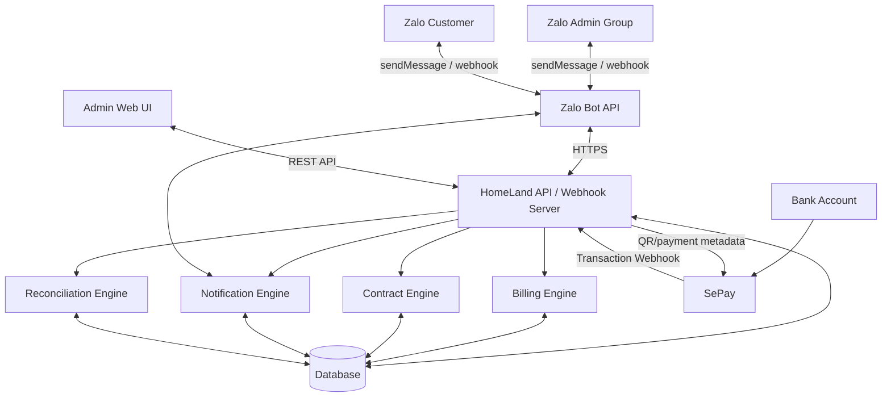

---

# 4. Mapping chức năng

| Module | Input | Output | Database |
|---|---|---|---|
| Zalo Webhook | incoming update | normalized event | webhook_logs |
| Customer Registration | `DK phone room` | bind chat_id | tenants, room_tenants |
| Admin Notification | internal event | group message | notification_logs |
| Customer Notification | billing/contract event | private message | notification_logs |
| Billing | room + tenant + month | obligations | invoices, payment_obligations |
| SePay QR | obligation | QR URL / QR image | payment_obligations |
| SePay Webhook | bank transaction | transaction record | bank_transactions |
| Reconciliation | transaction + obligation | match status | payment_allocations |
| Contract Scheduler | expiry date | reminder | contracts |
| Admin Settings | credentials/config | connection status | system_settings |

---

# 5. Code graph đề xuất

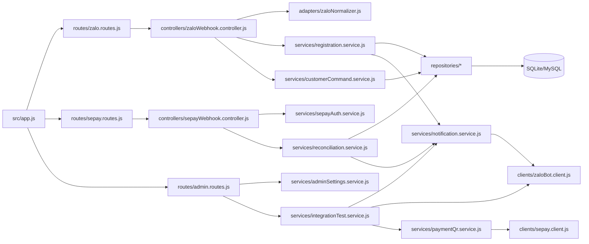

---

# 6. Cấu trúc thư mục

```text
homeland-backend/
├─ src/
│  ├─ app.js
│  ├─ server.js
│  │
│  ├─ config/
│  │  ├─ env.js
│  │  └─ constants.js
│  │
│  ├─ clients/
│  │  ├─ zaloBot.client.js
│  │  └─ sepay.client.js
│  │
│  ├─ adapters/
│  │  └─ zaloNormalizer.js
│  │
│  ├─ controllers/
│  │  ├─ zaloWebhook.controller.js
│  │  ├─ sepayWebhook.controller.js
│  │  └─ adminIntegration.controller.js
│  │
│  ├─ routes/
│  │  ├─ zalo.routes.js
│  │  ├─ sepay.routes.js
│  │  └─ admin.routes.js
│  │
│  ├─ services/
│  │  ├─ registration.service.js
│  │  ├─ notification.service.js
│  │  ├─ billing.service.js
│  │  ├─ paymentQr.service.js
│  │  ├─ reconciliation.service.js
│  │  ├─ contractReminder.service.js
│  │  ├─ adminSettings.service.js
│  │  └─ integrationTest.service.js
│  │
│  ├─ repositories/
│  │  ├─ tenant.repository.js
│  │  ├─ room.repository.js
│  │  ├─ contract.repository.js
│  │  ├─ invoice.repository.js
│  │  ├─ payment.repository.js
│  │  └─ notification.repository.js
│  │
│  ├─ jobs/
│  │  ├─ paymentDue.job.js
│  │  ├─ overdue.job.js
│  │  ├─ contractExpiry.job.js
│  │  └─ reconciliationFallback.job.js
│  │
│  └─ utils/
│     ├─ paymentCode.js
│     ├─ phone.js
│     └─ money.js
│
├─ migrations/
├─ data/
│  └─ homeland.sqlite
├─ .env
├─ .env.example
└─ package.json
```

---

# 7. Database model

## 7.1. rooms

```sql
CREATE TABLE rooms (
    id INTEGER PRIMARY KEY AUTOINCREMENT,
    room_number TEXT NOT NULL UNIQUE,
    monthly_rent INTEGER NOT NULL DEFAULT 0,
    status TEXT NOT NULL DEFAULT 'VACANT',
    created_at DATETIME DEFAULT CURRENT_TIMESTAMP,
    updated_at DATETIME DEFAULT CURRENT_TIMESTAMP
);
```

Status:

```text
VACANT
OCCUPIED
MAINTENANCE
INACTIVE
```

---

## 7.2. tenants

```sql
CREATE TABLE tenants (
    id INTEGER PRIMARY KEY AUTOINCREMENT,
    full_name TEXT,
    phone TEXT NOT NULL,
    zalo_chat_id TEXT,
    zalo_registered_at DATETIME,
    status TEXT NOT NULL DEFAULT 'ACTIVE',
    created_at DATETIME DEFAULT CURRENT_TIMESTAMP,
    updated_at DATETIME DEFAULT CURRENT_TIMESTAMP
);

CREATE INDEX idx_tenants_phone ON tenants(phone);
CREATE INDEX idx_tenants_zalo_chat_id ON tenants(zalo_chat_id);
```

---

## 7.3. contracts

```sql
CREATE TABLE contracts (
    id INTEGER PRIMARY KEY AUTOINCREMENT,
    room_id INTEGER NOT NULL,
    contract_code TEXT UNIQUE,
    start_date DATE NOT NULL,
    end_date DATE NOT NULL,
    status TEXT NOT NULL DEFAULT 'ACTIVE',
    renewal_status TEXT DEFAULT 'NONE',
    created_at DATETIME DEFAULT CURRENT_TIMESTAMP,
    updated_at DATETIME DEFAULT CURRENT_TIMESTAMP,
    FOREIGN KEY(room_id) REFERENCES rooms(id)
);
```

Status:

```text
DRAFT
ACTIVE
EXPIRING
TERMINATED
EXPIRED
CANCELLED
```

Renewal status:

```text
NONE
PENDING
REQUESTED
DECLINED
CONFIRMED
```

---

## 7.4. contract_tenants

Đây là bảng xử lý trường hợp ở ghép.

```sql
CREATE TABLE contract_tenants (
    id INTEGER PRIMARY KEY AUTOINCREMENT,
    contract_id INTEGER NOT NULL,
    tenant_id INTEGER NOT NULL,

    rent_share_type TEXT NOT NULL DEFAULT 'FIXED',
    rent_share_value INTEGER NOT NULL DEFAULT 0,

    electric_share_percent REAL DEFAULT 0,
    water_share_percent REAL DEFAULT 0,
    service_share_percent REAL DEFAULT 0,

    status TEXT NOT NULL DEFAULT 'ACTIVE',

    created_at DATETIME DEFAULT CURRENT_TIMESTAMP,

    FOREIGN KEY(contract_id) REFERENCES contracts(id),
    FOREIGN KEY(tenant_id) REFERENCES tenants(id)
);
```

Ví dụ phòng `31.06`:

```text
rent = 6.000.000

Tenant A = 3.000.000
Tenant B = 3.000.000
```

Database:

```text
A rent_share_type = FIXED
A rent_share_value = 3000000

B rent_share_type = FIXED
B rent_share_value = 3000000
```

---

# 8. Invoice và nghĩa vụ thanh toán

## 8.1. invoices

Invoice là hóa đơn tổng của phòng.

```sql
CREATE TABLE invoices (
    id INTEGER PRIMARY KEY AUTOINCREMENT,
    invoice_code TEXT NOT NULL UNIQUE,
    contract_id INTEGER NOT NULL,
    billing_month TEXT NOT NULL,

    rent_total INTEGER NOT NULL DEFAULT 0,
    electric_total INTEGER NOT NULL DEFAULT 0,
    water_total INTEGER NOT NULL DEFAULT 0,
    service_total INTEGER NOT NULL DEFAULT 0,
    other_total INTEGER NOT NULL DEFAULT 0,

    total_amount INTEGER NOT NULL DEFAULT 0,
    due_date DATE NOT NULL,

    status TEXT NOT NULL DEFAULT 'PENDING',

    created_at DATETIME DEFAULT CURRENT_TIMESTAMP,
    updated_at DATETIME DEFAULT CURRENT_TIMESTAMP,

    FOREIGN KEY(contract_id) REFERENCES contracts(id)
);
```

---

## 8.2. payment_obligations

Mỗi người ở ghép có obligation riêng.

```sql
CREATE TABLE payment_obligations (
    id INTEGER PRIMARY KEY AUTOINCREMENT,

    invoice_id INTEGER NOT NULL,
    tenant_id INTEGER NOT NULL,

    rent_amount INTEGER NOT NULL DEFAULT 0,
    electric_amount INTEGER NOT NULL DEFAULT 0,
    water_amount INTEGER NOT NULL DEFAULT 0,
    service_amount INTEGER NOT NULL DEFAULT 0,
    other_amount INTEGER NOT NULL DEFAULT 0,

    amount_due INTEGER NOT NULL,
    amount_paid INTEGER NOT NULL DEFAULT 0,

    payment_code TEXT NOT NULL UNIQUE,

    status TEXT NOT NULL DEFAULT 'PENDING',

    due_date DATE NOT NULL,
    paid_at DATETIME,

    created_at DATETIME DEFAULT CURRENT_TIMESTAMP,
    updated_at DATETIME DEFAULT CURRENT_TIMESTAMP,

    FOREIGN KEY(invoice_id) REFERENCES invoices(id),
    FOREIGN KEY(tenant_id) REFERENCES tenants(id)
);
```

Status:

```text
PENDING
PARTIAL
PAID
OVERDUE
OVERPAID
CANCELLED
NEEDS_REVIEW
```

---

# 9. Bank transaction và đối soát

```sql
CREATE TABLE bank_transactions (
    id INTEGER PRIMARY KEY AUTOINCREMENT,

    provider TEXT NOT NULL DEFAULT 'SEPAY',
    provider_transaction_id TEXT NOT NULL UNIQUE,

    gateway TEXT,
    transaction_date DATETIME,
    account_number TEXT,

    transfer_type TEXT,
    transfer_amount INTEGER NOT NULL,

    code TEXT,
    content TEXT,
    reference_code TEXT,

    match_status TEXT NOT NULL DEFAULT 'UNMATCHED',

    raw_payload TEXT,

    received_at DATETIME DEFAULT CURRENT_TIMESTAMP
);
```

`provider_transaction_id` phải unique để chống webhook retry tạo trùng.

---

## 9.1. payment_allocations

```sql
CREATE TABLE payment_allocations (
    id INTEGER PRIMARY KEY AUTOINCREMENT,

    bank_transaction_id INTEGER NOT NULL,
    payment_obligation_id INTEGER NOT NULL,

    allocated_amount INTEGER NOT NULL,

    allocation_type TEXT NOT NULL DEFAULT 'AUTO',
    created_at DATETIME DEFAULT CURRENT_TIMESTAMP,

    FOREIGN KEY(bank_transaction_id) REFERENCES bank_transactions(id),
    FOREIGN KEY(payment_obligation_id) REFERENCES payment_obligations(id)
);
```

---

# 10. Notification log

```sql
CREATE TABLE notification_logs (
    id INTEGER PRIMARY KEY AUTOINCREMENT,

    channel TEXT NOT NULL,
    recipient_type TEXT NOT NULL,

    recipient_chat_id TEXT,
    tenant_id INTEGER,
    room_id INTEGER,

    notification_type TEXT NOT NULL,

    status TEXT NOT NULL,
    provider_message_id TEXT,

    error_code TEXT,
    error_message TEXT,

    created_at DATETIME DEFAULT CURRENT_TIMESTAMP
);
```

Status:

```text
PENDING
SENT
FAILED
SKIPPED
```

---

# 11. System settings

Không nên bắt buộc lưu token plaintext trong DB nếu có thể dùng secret manager hoặc `.env`.

```sql
CREATE TABLE system_settings (
    key TEXT PRIMARY KEY,
    value TEXT,
    is_secret INTEGER NOT NULL DEFAULT 0,
    updated_at DATETIME DEFAULT CURRENT_TIMESTAMP
);
```

Key gợi ý:

```text
ZALO_ADMIN_GROUP_CHAT_ID
ZALO_WEBHOOK_URL
ZALO_WEBHOOK_CONNECTED_AT
SEPAY_BANK_ACCOUNT
SEPAY_BANK_NAME
SEPAY_ACCOUNT_NAME
SEPAY_WEBHOOK_URL
```

Token/secret ưu tiên `.env`:

```env
ZALO_BOT_TOKEN=
ZALO_WEBHOOK_SECRET=
ZALO_ADMIN_GROUP_CHAT_ID=4e5f8d2fa960403e1971

SEPAY_WEBHOOK_SECRET=
SEPAY_API_KEY=

SEPAY_BANK_ACCOUNT=
SEPAY_BANK_CODE=
SEPAY_ACCOUNT_NAME=

PUBLIC_BASE_URL=https://api.example.com
ADMIN_BASE_URL=https://admin.example.com
```

---

# 12. Zalo Bot client

`src/clients/zaloBot.client.js`

```js
const axios = require("axios");

class ZaloBotClient {
  constructor({ token }) {
    if (!token) throw new Error("Missing ZALO_BOT_TOKEN");

    this.token = token;
    this.baseURL = `https://bot-api.zaloplatforms.com/bot${token}`;
  }

  async getMe() {
    const { data } = await axios.post(
      `${this.baseURL}/getMe`,
      {},
      { timeout: 15000 }
    );

    return data;
  }

  async sendMessage(chatId, text, options = {}) {
    if (!chatId) {
      throw new Error("Missing chatId");
    }

    if (!text) {
      throw new Error("Missing text");
    }

    const payload = {
      chat_id: String(chatId),
      text: String(text)
    };

    if (options.parse_mode) {
      payload.parse_mode = options.parse_mode;
    }

    const { data } = await axios.post(
      `${this.baseURL}/sendMessage`,
      payload,
      {
        headers: {
          "Content-Type": "application/json"
        },
        timeout: 15000
      }
    );

    return data;
  }

  async setWebhook({ url, secretToken }) {
    const { data } = await axios.post(
      `${this.baseURL}/setWebhook`,
      {
        url,
        secret_token: secretToken
      },
      {
        headers: {
          "Content-Type": "application/json"
        },
        timeout: 15000
      }
    );

    return data;
  }
}

module.exports = ZaloBotClient;
```

---

# 13. Normalized Zalo Update

Toàn hệ thống chỉ làm việc với dạng chuẩn:

```js
{
  updateId: "...",
  chatId: "...",
  chatType: "group" | "private" | "unknown",
  senderId: "...",
  text: "...",
  raw: {}
}
```

`src/adapters/zaloNormalizer.js`

```js
function firstDefined(...values) {
  return values.find(
    value => value !== undefined && value !== null && value !== ""
  );
}

function normalizeZaloUpdate(raw) {
  // PHẦN NÀY CẦN CHỐT LẠI THEO RAW PAYLOAD THỰC TẾ CỦA BOT.
  // Không để business logic ở đây.

  const chatId = firstDefined(
    raw?.message?.chat?.id,
    raw?.message?.chat_id,
    raw?.chat?.id,
    raw?.chat_id,
    raw?.data?.message?.chat?.id,
    raw?.event?.message?.chat?.id
  );

  const text = firstDefined(
    raw?.message?.text,
    raw?.text,
    raw?.data?.message?.text,
    raw?.event?.message?.text
  );

  const senderId = firstDefined(
    raw?.message?.from?.id,
    raw?.from?.id,
    raw?.sender?.id,
    raw?.data?.sender?.id
  );

  const chatType = firstDefined(
    raw?.message?.chat?.type,
    raw?.chat?.type,
    "unknown"
  );

  return {
    updateId: firstDefined(raw?.update_id, raw?.id, null),
    chatId: chatId ? String(chatId) : null,
    chatType,
    senderId: senderId ? String(senderId) : null,
    text: typeof text === "string" ? text.trim() : null,
    raw
  };
}

module.exports = {
  normalizeZaloUpdate
};
```

Sau khi có RAW JSON thực tế, thay bằng mapping chính xác.

---

# 14. Zalo webhook endpoint

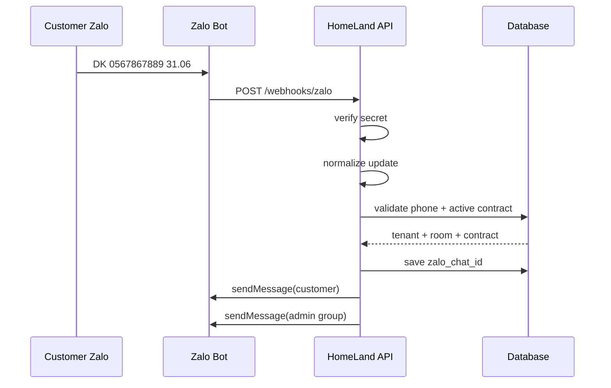

Express:

```js
const express = require("express");
const { normalizeZaloUpdate } = require("../adapters/zaloNormalizer");

const router = express.Router();

router.post("/webhooks/zalo", async (req, res) => {
  const expectedSecret = process.env.ZALO_WEBHOOK_SECRET;

  // Tên header cần chốt theo webhook thực tế của Zalo.
  const receivedSecret =
    req.headers["x-bot-api-secret-token"];

  if (expectedSecret && receivedSecret !== expectedSecret) {
    return res.status(401).json({
      ok: false,
      error: "INVALID_WEBHOOK_SECRET"
    });
  }

  // ACK trước, xử lý async sau nếu kiến trúc production dùng queue.
  res.status(200).json({ ok: true });

  try {
    const update = normalizeZaloUpdate(req.body);

    console.log("[ZALO UPDATE]", {
      updateId: update.updateId,
      chatId: update.chatId,
      chatType: update.chatType,
      senderId: update.senderId,
      text: update.text
    });

    if (!update.chatId || !update.text) {
      return;
    }

    await handleZaloMessage(update);
  } catch (error) {
    console.error("[ZALO WEBHOOK ERROR]", error);
  }
});

module.exports = router;
```

---

# 15. Phân luồng Admin và Customer

```js
async function handleZaloMessage(update) {
  const adminGroupChatId =
    String(process.env.ZALO_ADMIN_GROUP_CHAT_ID || "");

  if (update.chatId === adminGroupChatId) {
    return handleAdminMessage(update);
  }

  return handleCustomerMessage(update);
}
```

---

# 16. Customer registration command

Cú pháp:

```text
DK 0567867889 31.01
```

Khuyến nghị **mỗi tài khoản Zalo đăng ký một số điện thoại chính**.

Nếu hai người ở ghép muốn nhận riêng, mỗi người tự nhắn:

```text
Tenant A:
DK 0567867889 31.06

Tenant B:
DK 0329484353 31.06
```

Không nên hiểu:

```text
DK 0567867889,0329484353 31.06
```

là hai `chat_id`, vì webhook hiện tại chỉ cho ta `chat_id` của người gửi.

Có thể cho phép hai số nhưng hiểu số thứ hai là contact phụ.

---

## 16.1. Parser

```js
function normalizePhone(phone) {
  return phone.replace(/\D/g, "");
}

function parseRegisterCommand(text) {
  const match = text.match(
    /^DK\s+([\d,\s]+)\s+([A-Za-z0-9._-]+)$/i
  );

  if (!match) return null;

  const phones = match[1]
    .split(",")
    .map(normalizePhone)
    .filter(Boolean);

  const roomNumber = match[2].trim();

  if (!phones.length) return null;

  return {
    primaryPhone: phones[0],
    secondaryPhones: phones.slice(1),
    roomNumber
  };
}
```

---

# 17. Registration validation

Không cho phép ai biết số phòng là đăng ký được.

Điều kiện:

```text
room exists
AND
active contract exists
AND
phone belongs to active contract
AND
tenant.status = ACTIVE
```

Flow:

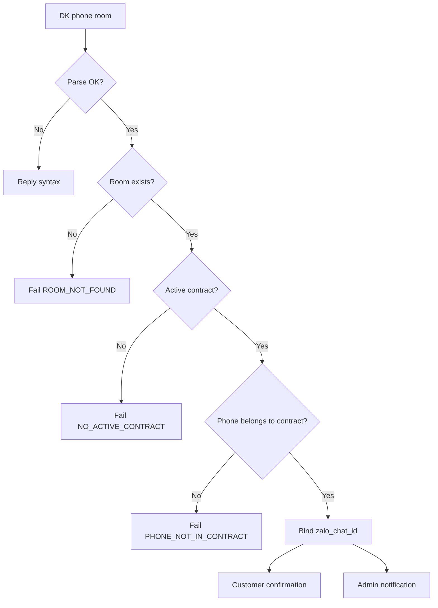

---

# 18. registration.service.js

```js
async function registerCustomerZalo({
  chatId,
  primaryPhone,
  roomNumber,
  repositories,
  notifier
}) {
  const room = await repositories.rooms.findByNumber(roomNumber);

  if (!room) {
    await notifier.sendCustomer(
      chatId,
      `Không thể đăng ký.\nKhông tìm thấy phòng ${roomNumber}.`
    );

    await notifier.sendAdmin(
      `Đăng ký Bot thất bại\nPhòng: ${roomNumber}\nSĐT: ${primaryPhone}\nLý do: ROOM_NOT_FOUND`
    );

    return {
      ok: false,
      code: "ROOM_NOT_FOUND"
    };
  }

  const contract =
    await repositories.contracts.findActiveByRoomId(room.id);

  if (!contract) {
    await notifier.sendCustomer(
      chatId,
      `Không thể đăng ký.\nPhòng ${roomNumber} không có hợp đồng đang hoạt động.`
    );

    return {
      ok: false,
      code: "NO_ACTIVE_CONTRACT"
    };
  }

  const tenant =
    await repositories.tenants.findByPhoneAndContract(
      primaryPhone,
      contract.id
    );

  if (!tenant) {
    await notifier.sendCustomer(
      chatId,
      `Không thể xác minh đăng ký.\nSĐT chưa được ghi nhận cho phòng ${roomNumber}.`
    );

    await notifier.sendAdmin(
      `Đăng ký Bot cần kiểm tra\nPhòng: ${roomNumber}\nSĐT: ${primaryPhone}\nLý do: PHONE_NOT_IN_CONTRACT`
    );

    return {
      ok: false,
      code: "PHONE_NOT_IN_CONTRACT"
    };
  }

  await repositories.tenants.bindZaloChatId(
    tenant.id,
    chatId
  );

  await notifier.sendCustomer(
    chatId,
    [
      "HomeLand - Đăng ký thành công",
      `Phòng: ${roomNumber}`,
      `SĐT: ${primaryPhone}`,
      "",
      "Tài khoản Zalo này sẽ nhận thông báo liên quan đến hợp đồng và thanh toán."
    ].join("\n")
  );

  await notifier.sendAdmin(
    [
      "Khách đã đăng ký Zalo Bot",
      `Phòng: ${roomNumber}`,
      `SĐT: ${primaryPhone}`,
      `Chat ID: ${chatId}`
    ].join("\n")
  );

  return {
    ok: true,
    tenantId: tenant.id,
    roomId: room.id,
    contractId: contract.id
  };
}
```

---

# 19. Xử lý khách ở ghép

Ví dụ:

```text
Room 31.06
Monthly rent: 6.000.000
Tenant A: 3.000.000
Tenant B: 3.000.000
```

Không đánh dấu trạng thái thanh toán theo phòng.

Phải tạo:

```text
Invoice 31.06 / 2026-09 = 6.000.000

Obligation A = 3.000.000
Obligation B = 3.000.000
```

Nếu điện nước:

```text
Electric = 800.000
Water = 200.000
```

chia 50/50:

```text
A:
rent      3.000.000
electric    400.000
water       100.000
total     3.500.000

B:
rent      3.000.000
electric    400.000
water       100.000
total     3.500.000
```

---

# 20. Payment code

Không dùng số điện thoại làm khóa thanh toán chính.

Khuyến nghị:

```text
HL + random/sequence
```

Ví dụ:

```text
HL8F27K3
HL6X91P2
```

Database biết:

```text
HL8F27K3
   ↓
obligation_id = 501
tenant_id = 101
room = 31.06
billing_month = 2026-09
amount_due = 3.500.000
```

Generator:

```js
const crypto = require("crypto");

function generatePaymentCode() {
  const random = crypto
    .randomBytes(5)
    .toString("hex")
    .toUpperCase()
    .slice(0, 8);

  return `HL${random}`;
}

module.exports = {
  generatePaymentCode
};
```

---

# 21. QR payment architecture

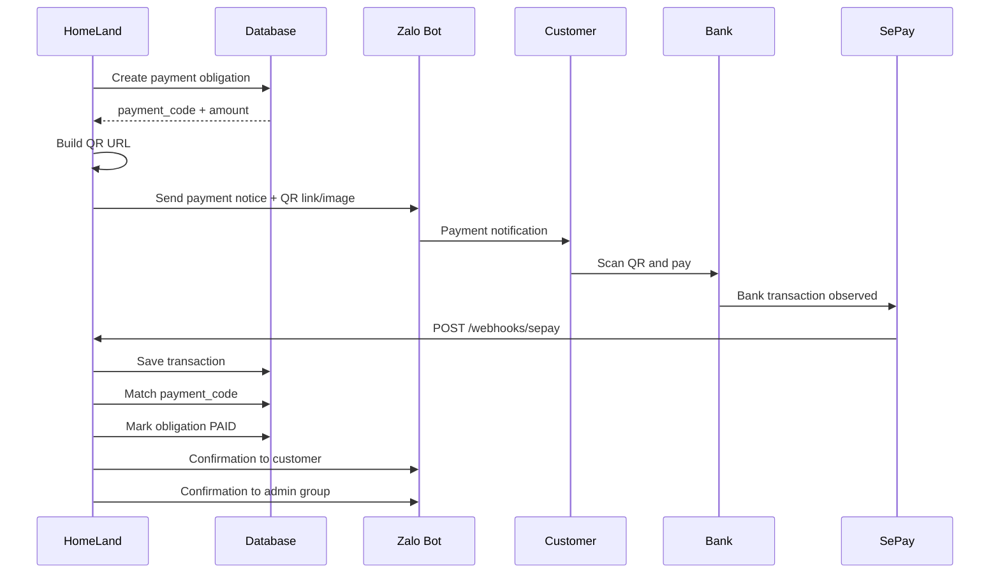

---

# 22. Tạo QR SePay

SePay Developer xác nhận QR VietQR có thể điền sẵn:

- tài khoản
- số tiền
- nội dung

Đối với HomeLand:

```text
account = tài khoản HomeLand
amount = payment_obligation.amount_due
description = payment_obligation.payment_code
```

Ví dụ URL generator nên được đóng gói:

```js
function buildPaymentQrUrl({
  bankCode,
  accountNumber,
  amount,
  paymentCode
}) {
  // URL cụ thể cần bám theo endpoint QR SePay/VietQR bạn đang sử dụng.
  // Hàm này chỉ là adapter để không để URL format rải rác trong business logic.

  const params = new URLSearchParams({
    acc: accountNumber,
    bank: bankCode,
    amount: String(amount),
    des: paymentCode
  });

  return `https://vietqr.app/img?${params.toString()}`;
}
```

Lưu ý:

> Trước khi production, kiểm tra lại format query parameter chính xác trên trang SePay QR hiện hành. Không hard-code format QR ở nhiều file.

---

# 23. Gửi QR qua Zalo

Có hai mức triển khai.

## Mode A — an toàn, ít phụ thuộc

Dùng `sendMessage`:

```text
HomeLand - Thanh toán tháng 09/2026

Phòng: 31.06
Số tiền: 3.500.000đ
Hạn: 05/09/2026
Mã: HL8F27K3

QR thanh toán:
https://...
```

Đây là mode fallback.

## Mode B — gửi ảnh QR trực tiếp

Nếu endpoint gửi media/photo của Zalo Bot đã được xác minh trong tài liệu đầy đủ, triển khai:

```js
async function sendQrImage(chatId, qrImageUrl, caption) {
  // TODO: adapter sendPhoto/sendImage theo schema chính thức Zalo.
}
```

Không nên giả định payload media khi chưa xác minh tài liệu endpoint đó.

Notification service chỉ gọi:

```js
await notifier.sendPaymentRequest({
  chatId,
  qrUrl,
  text
});
```

Adapter quyết định dùng image hay fallback link.

---

# 24. Tin nhắn thanh toán ngắn gọn

Không cần Markdown phức tạp.

```text
HomeLand - Thanh toán

Phòng: 31.06
Kỳ: 09/2026
Tiền phòng: 3.000.000đ
Điện + nước: 500.000đ
Tổng: 3.500.000đ

Hạn: 05/09/2026
Mã: HL8F27K3

Vui lòng dùng QR và giữ nguyên nội dung thanh toán.
```

Sau khi thanh toán:

```text
HomeLand - Đã nhận thanh toán

Phòng: 31.06
Kỳ: 09/2026
Số tiền: 3.500.000đ
Mã: HL8F27K3

Trạng thái: Đã thanh toán
```

Trễ hạn:

```text
HomeLand - Nhắc thanh toán

Phòng: 31.06
Kỳ: 09/2026
Còn phải thanh toán: 3.500.000đ
Hạn: 05/09/2026

Vui lòng hoàn tất thanh toán.
```

---

# 25. Notification service

```js
class NotificationService {
  constructor({
    zaloClient,
    adminGroupChatId,
    notificationRepository
  }) {
    this.zaloClient = zaloClient;
    this.adminGroupChatId = String(adminGroupChatId);
    this.notificationRepository = notificationRepository;
  }

  async sendCustomer(chatId, text, meta = {}) {
    try {
      const result =
        await this.zaloClient.sendMessage(chatId, text);

      await this.notificationRepository.create({
        channel: "ZALO",
        recipientType: "CUSTOMER",
        recipientChatId: String(chatId),
        notificationType: meta.type || "GENERAL",
        status: "SENT"
      });

      return result;
    } catch (error) {
      await this.notificationRepository.create({
        channel: "ZALO",
        recipientType: "CUSTOMER",
        recipientChatId: String(chatId),
        notificationType: meta.type || "GENERAL",
        status: "FAILED",
        errorMessage:
          error.response?.data
            ? JSON.stringify(error.response.data)
            : error.message
      });

      throw error;
    }
  }

  async sendAdmin(text, meta = {}) {
    return this.sendCustomer(
      this.adminGroupChatId,
      text,
      {
        ...meta,
        type: meta.type || "ADMIN_EVENT"
      }
    );
  }
}

module.exports = NotificationService;
```

---

# 26. Gửi payment request

```js
async function sendPaymentRequest({
  obligation,
  tenant,
  room,
  qrUrl,
  notifier
}) {
  if (!tenant.zalo_chat_id) {
    await notifier.sendAdmin(
      [
        "Không gửi được thông báo thanh toán",
        `Phòng: ${room.room_number}`,
        `SĐT: ${tenant.phone}`,
        `Mã: ${obligation.payment_code}`,
        "Lý do: CUSTOMER_CHAT_ID_NOT_REGISTERED"
      ].join("\n")
    );

    return {
      ok: false,
      code: "CUSTOMER_CHAT_ID_NOT_REGISTERED"
    };
  }

  const text = [
    "HomeLand - Thanh toán",
    "",
    `Phòng: ${room.room_number}`,
    `Số tiền: ${formatMoney(obligation.amount_due)}`,
    `Hạn: ${obligation.due_date}`,
    `Mã: ${obligation.payment_code}`,
    "",
    `QR: ${qrUrl}`,
    "",
    "Vui lòng giữ nguyên nội dung thanh toán."
  ].join("\n");

  await notifier.sendCustomer(
    tenant.zalo_chat_id,
    text,
    { type: "PAYMENT_DUE" }
  );

  return { ok: true };
}
```

---

# 27. SePay webhook

Production endpoint:

```text
POST /webhooks/sepay
```

Khuyến nghị dùng HMAC-SHA256.

SePay docs:

```text
X-SePay-Signature: sha256=<hex>
X-SePay-Timestamp: <unix timestamp>
```

Dữ liệu ký:

```text
{timestamp}.{raw_body}
```

Do đó **không được parse JSON trước khi verify signature**.

---

# 28. Express raw body cho SePay

Thứ tự middleware rất quan trọng:

```js
const express = require("express");

const app = express();

app.post(
  "/webhooks/sepay",
  express.raw({ type: "application/json" }),
  sepayWebhookHandler
);

// Các route khác mới dùng JSON parser.
app.use(express.json());
```

Nếu `express.json()` chạy trước endpoint SePay, bạn có thể mất raw bytes cần để verify HMAC.

---

# 29. Verify HMAC SePay

```js
const crypto = require("crypto");

function safeEqual(a, b) {
  const aBuffer = Buffer.from(String(a));
  const bBuffer = Buffer.from(String(b));

  if (aBuffer.length !== bBuffer.length) {
    return false;
  }

  return crypto.timingSafeEqual(aBuffer, bBuffer);
}

function verifySePayHmac({
  rawBody,
  signature,
  timestamp,
  secret
}) {
  if (!rawBody || !signature || !timestamp || !secret) {
    return false;
  }

  const timestampNumber = Number(timestamp);

  if (!Number.isFinite(timestampNumber)) {
    return false;
  }

  // ±5 phút chống replay.
  const now = Math.floor(Date.now() / 1000);

  if (Math.abs(now - timestampNumber) > 300) {
    return false;
  }

  const signedPayload =
    `${timestamp}.${rawBody.toString("utf8")}`;

  const hash = crypto
    .createHmac("sha256", secret)
    .update(signedPayload)
    .digest("hex");

  const expected = `sha256=${hash}`;

  return safeEqual(expected, signature);
}

module.exports = {
  verifySePayHmac
};
```

---

# 30. SePay webhook controller

```js
async function sepayWebhookHandler(req, res) {
  const signature =
    req.headers["x-sepay-signature"];

  const timestamp =
    req.headers["x-sepay-timestamp"];

  const verified = verifySePayHmac({
    rawBody: req.body,
    signature,
    timestamp,
    secret: process.env.SEPAY_WEBHOOK_SECRET
  });

  if (!verified) {
    return res.status(401).json({
      success: false,
      message: "Invalid signature"
    });
  }

  let payload;

  try {
    payload = JSON.parse(req.body.toString("utf8"));
  } catch {
    return res.status(400).json({
      success: false,
      message: "Invalid JSON"
    });
  }

  try {
    await reconciliationService.handleTransaction(payload);

    return res.status(200).json({
      success: true
    });
  } catch (error) {
    console.error("[SEPAY WEBHOOK]", error);

    // Có thể trả 500 để SePay retry.
    return res.status(500).json({
      success: false
    });
  }
}
```

---

# 31. Normalize SePay transaction

```js
function normalizeSePayTransaction(payload) {
  return {
    providerTransactionId: String(payload.id),

    gateway: payload.gateway || null,
    transactionDate: payload.transactionDate || null,
    accountNumber: payload.accountNumber || null,

    transferType: payload.transferType || null,

    transferAmount:
      Number(payload.transferAmount || 0),

    code:
      payload.code
        ? String(payload.code).trim().toUpperCase()
        : null,

    content:
      payload.content
        ? String(payload.content).trim()
        : "",

    referenceCode:
      payload.referenceCode
        ? String(payload.referenceCode)
        : null,

    raw: payload
  };
}
```

---

# 32. Reconciliation rules

Ưu tiên match:

```text
1. provider_transaction_id duplicate?
2. transfer_type = in?
3. exact payment_code?
4. obligation ACTIVE/PENDING?
5. compare amount
6. allocate payment
7. update obligation
8. update invoice
9. notify customer
10. notify admin
```

Không dùng:

```text
amount == expected
```

làm điều kiện duy nhất để auto-paid.

---

# 33. State mapping

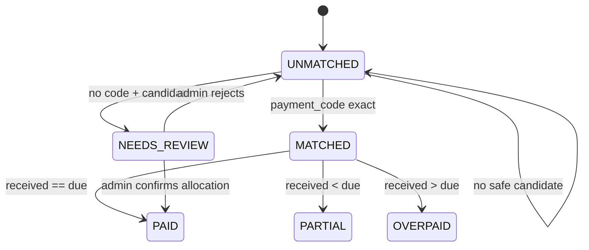

---

# 34. Reconciliation service

```js
async function handleTransaction(payload) {
  const tx = normalizeSePayTransaction(payload);

  const existing =
    await bankTransactions.findByProviderId(
      tx.providerTransactionId
    );

  if (existing) {
    return {
      ok: true,
      duplicate: true
    };
  }

  const savedTx =
    await bankTransactions.create({
      provider: "SEPAY",
      providerTransactionId: tx.providerTransactionId,
      gateway: tx.gateway,
      transactionDate: tx.transactionDate,
      accountNumber: tx.accountNumber,
      transferType: tx.transferType,
      transferAmount: tx.transferAmount,
      code: tx.code,
      content: tx.content,
      referenceCode: tx.referenceCode,
      matchStatus: "UNMATCHED",
      rawPayload: JSON.stringify(tx.raw)
    });

  if (
    tx.transferType &&
    tx.transferType.toLowerCase() !== "in"
  ) {
    return {
      ok: true,
      ignored: true
    };
  }

  if (!tx.code) {
    await handleMissingPaymentCode(savedTx, tx);

    return {
      ok: true,
      status: "NEEDS_REVIEW"
    };
  }

  const obligation =
    await paymentObligations.findByPaymentCode(
      tx.code
    );

  if (!obligation) {
    await bankTransactions.setMatchStatus(
      savedTx.id,
      "UNMATCHED"
    );

    await notifier.sendAdmin(
      [
        "Giao dịch chưa đối soát",
        `Số tiền: ${formatMoney(tx.transferAmount)}`,
        `Mã: ${tx.code}`,
        "Lý do: PAYMENT_CODE_NOT_FOUND"
      ].join("\n")
    );

    return {
      ok: true,
      status: "UNMATCHED"
    };
  }

  return applyTransactionToObligation({
    transaction: savedTx,
    tx,
    obligation
  });
}
```

---

# 35. Exact amount

Nếu:

```text
amount received = remaining due
```

thì:

```text
PAID
```

Pseudo:

```js
if (tx.transferAmount === remainingDue) {
  await allocate(
    transaction.id,
    obligation.id,
    tx.transferAmount
  );

  await markPaid(obligation.id);

  await notifyPaymentSuccess(...);
}
```

---

# 36. Partial payment

Ví dụ:

```text
due = 3.500.000
received = 2.000.000
```

Result:

```text
amount_paid = 2.000.000
remaining = 1.500.000
status = PARTIAL
```

Khách:

```text
HomeLand - Đã nhận thanh toán

Phòng: 31.06
Đã nhận: 2.000.000đ
Còn lại: 1.500.000đ
Mã: HL8F27K3
```

Admin cũng được báo.

---

# 37. Overpayment

```text
due remaining = 3.500.000
received = 7.000.000
```

Không tự động phân bổ sang người khác.

```text
status = OVERPAID
needs admin review = true
```

Admin:

```text
Thanh toán vượt số tiền

Phòng: 31.06
Khách: Nguyễn A
Phải thu: 3.500.000đ
Đã nhận: 7.000.000đ
Chênh lệch: +3.500.000đ

Cần phân bổ thủ công.
```

---

# 38. Khách không giữ note

Nếu `code = null`:

```text
không được auto PAID chỉ dựa vào số tiền
```

Fallback candidate matching:

```text
same amount
+ open obligation
+ time window
+ optional sender/account metadata if available
```

Nhưng kết quả chỉ:

```text
NEEDS_REVIEW
```

Admin UI hiện candidate để chọn.

---

# 39. Admin reconciliation UI

Trang:

```text
/admin/payments/unmatched
```

Mỗi transaction:

```text
Transaction
- SePay ID
- Date
- Amount
- Content
- Code
- Reference

Suggested matches:
[ ] 31.06 / Nguyen A / 3.500.000
[ ] 31.06 / Nguyen B / 3.500.000

[Confirm allocation]
[Reject]
```

Không auto chọn nếu có hơn một candidate.

---

# 40. Admin Settings – Integration page

Bắt buộc có:

```text
Settings
└─ Integrations
   ├─ Zalo Bot
   └─ SePay
```

---

# 41. Zalo Bot Settings UI

Fields:

```text
Bot Token                  [************]
Admin Group Chat ID        [4e5f8d2fa960403e1971]
Webhook URL                [https://api.domain.com/webhooks/zalo]
Webhook Secret             [************]
Connection Status          [Connected / Error]
Last Webhook Event         [timestamp]
Last Error                 [...]
```

Buttons:

```text
[Test Bot Token]
[Test Admin Group]
[Connect Webhook]
[Test Webhook]
[Disconnect Webhook]   optional
[Copy Webhook URL]
```

---

# 42. Button: Test Bot Token

Frontend:

```js
async function testZaloBot() {
  const res = await fetch(
    "/api/admin/integrations/zalo/test",
    {
      method: "POST",
      headers: {
        "Content-Type": "application/json"
      }
    }
  );

  return res.json();
}
```

Backend:

```js
router.post(
  "/admin/integrations/zalo/test",
  requireAdmin,
  async (req, res) => {
    try {
      const result =
        await zaloClient.getMe();

      res.json({
        ok: true,
        result
      });
    } catch (error) {
      res.status(400).json({
        ok: false,
        error:
          error.response?.data || error.message
      });
    }
  }
);
```

UI success:

```text
Connected
Bot: HomeLand
```

---

# 43. Button: Test Admin Group

```js
router.post(
  "/admin/integrations/zalo/test-admin-group",
  requireAdmin,
  async (req, res) => {
    try {
      const chatId =
        process.env.ZALO_ADMIN_GROUP_CHAT_ID;

      await zaloClient.sendMessage(
        chatId,
        [
          "HomeLand - Test kết nối",
          "",
          "Zalo Bot đã kết nối với nhóm Admin."
        ].join("\n")
      );

      res.json({ ok: true });
    } catch (error) {
      res.status(400).json({
        ok: false,
        error:
          error.response?.data || error.message
      });
    }
  }
);
```

---

# 44. Button: Connect Webhook

Frontend sends:

```text
POST /api/admin/integrations/zalo/connect-webhook
```

Backend:

```js
router.post(
  "/admin/integrations/zalo/connect-webhook",
  requireAdmin,
  async (req, res) => {
    const webhookUrl =
      `${process.env.PUBLIC_BASE_URL}/webhooks/zalo`;

    try {
      const result =
        await zaloClient.setWebhook({
          url: webhookUrl,
          secretToken:
            process.env.ZALO_WEBHOOK_SECRET
        });

      await settings.set(
        "ZALO_WEBHOOK_URL",
        webhookUrl
      );

      await settings.set(
        "ZALO_WEBHOOK_CONNECTED_AT",
        new Date().toISOString()
      );

      res.json({
        ok: true,
        webhookUrl,
        result
      });
    } catch (error) {
      res.status(400).json({
        ok: false,
        webhookUrl,
        error:
          error.response?.data || error.message
      });
    }
  }
);
```

---

# 45. Button: Test Webhook

Mục đích:

- kiểm tra URL public có hoạt động
- kiểm tra route của HomeLand
- không giả lập webhook Zalo như request thật có secret nếu UI không có secret

Tạo health endpoint:

```text
GET /webhooks/zalo/health
```

Response:

```json
{
  "ok": true,
  "service": "zalo-webhook",
  "timestamp": "..."
}
```

Admin button gọi endpoint và hiện:

```text
Public endpoint reachable
```

---


# 45A. Lấy Chat ID trực tiếp trong nhóm Admin

Không cần nhắn riêng với Bot để lấy `chat_id`.

Cách setup khuyến nghị:

```text
1. Thêm HomeLand Bot vào nhóm Admin.
2. Trong chính nhóm Admin, gửi:
   /id
3. Zalo gửi webhook về HomeLand.
4. HomeLand lấy chat_id của cuộc hội thoại hiện tại.
5. Bot trả lại Chat ID ngay trong nhóm.
6. Admin copy Chat ID vào Settings hoặc dùng /setadmin để lưu tự động.
```

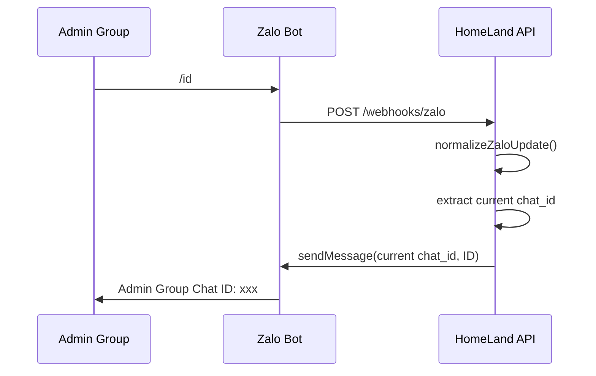

Điểm quan trọng:

```text
chat_id cần lấy là chat_id của conversation/group đang gửi lệnh,
không phải Bot ID và không phải sender/user ID.
```

## 45B. Command `/id` trả Chat ID ngay trong group

Thêm command này trước bước phân luồng Admin/Customer:

```js
async function handleZaloMessage(update) {
  if (!update?.chatId || !update?.text) {
    return;
  }

  const command = update.text.trim().toLowerCase();

  if (
    command === "/id" ||
    command === "/chatid" ||
    command === "chatid"
  ) {
    await zaloClient.sendMessage(
      update.chatId,
      [
        "HomeLand - Chat ID",
        "",
        `Chat ID: ${update.chatId}`,
        `Chat type: ${update.chatType || "unknown"}`
      ].join("\n")
    );

    console.log("[ZALO CHAT ID]", {
      chatId: update.chatId,
      chatType: update.chatType,
      senderId: update.senderId
    });

    return;
  }

  const adminGroupChatId =
    String(process.env.ZALO_ADMIN_GROUP_CHAT_ID || "");

  if (
    adminGroupChatId &&
    update.chatId === adminGroupChatId
  ) {
    return handleAdminMessage(update);
  }

  return handleCustomerMessage(update);
}
```

Trong nhóm Admin chỉ cần gửi:

```text
/id
```

Bot trả:

```text
HomeLand - Chat ID

Chat ID: 4e5f8d2fa960403e1971
Chat type: group
```

> [Unverified] `chatType` phụ thuộc payload webhook thực tế của Zalo. Phần `chat_id` nên lấy từ adapter `normalizeZaloUpdate()` sau khi đã xác minh raw webhook thực tế.

## 45C. Tự động bind Admin Group bằng `/setadmin`

Để không cần copy/paste Chat ID, Admin có thể kết nối group bằng lệnh:

```text
/setadmin <SETUP_CODE>
```

Ví dụ:

```text
/setadmin A91F72BC
```

Flow:

```text
Admin Web
   ↓
Generate one-time setup code
   ↓
A91F72BC
   ↓
Admin gửi trong đúng Zalo group:
   /setadmin A91F72BC
   ↓
Zalo webhook
   ↓
HomeLand lấy current chat_id
   ↓
validate setup code
   ↓
save ZALO_ADMIN_GROUP_CHAT_ID
   ↓
invalidate setup code
   ↓
Bot reply thành công ngay trong group
```

Không nên cho `/setadmin` chạy mà không có mã xác thực.

## 45D. Parser `/setadmin`

```js
function parseSetAdminCommand(text) {
  const match = String(text || "")
    .trim()
    .match(/^\/setadmin\s+(.+)$/i);

  if (!match) {
    return null;
  }

  return {
    setupCode: match[1].trim()
  };
}
```

## 45E. One-time setup code từ Admin UI

Admin Settings > Integrations > Zalo thêm button:

```text
[Generate Group Connect Code]
```

Backend:

```js
const crypto = require("crypto");

router.post(
  "/admin/integrations/zalo/admin-group/setup-code",
  requireAdmin,
  async (req, res) => {
    const code =
      crypto.randomBytes(4)
        .toString("hex")
        .toUpperCase();

    const expiresAt =
      new Date(Date.now() + 10 * 60 * 1000);

    await settingsRepository.set(
      "ZALO_ADMIN_SETUP_TOKEN",
      code
    );

    await settingsRepository.set(
      "ZALO_ADMIN_SETUP_TOKEN_EXPIRES_AT",
      expiresAt.toISOString()
    );

    res.json({
      ok: true,
      code,
      expiresAt: expiresAt.toISOString(),
      command: `/setadmin ${code}`
    });
  }
);
```

Admin UI hiển thị:

```text
Connect Admin Group

Trong nhóm Zalo Admin gửi:

/setadmin A91F72BC

Mã hết hạn sau 10 phút.
```

## 45F. Validate setup code

```js
async function validateAdminSetupCode(
  providedCode,
  settingsRepository
) {
  const expected =
    await settingsRepository.get(
      "ZALO_ADMIN_SETUP_TOKEN"
    );

  const expiresAt =
    await settingsRepository.get(
      "ZALO_ADMIN_SETUP_TOKEN_EXPIRES_AT"
    );

  if (!expected || !expiresAt) {
    return false;
  }

  if (Date.now() > new Date(expiresAt).getTime()) {
    return false;
  }

  return (
    String(providedCode).toUpperCase() ===
    String(expected).toUpperCase()
  );
}
```

## 45G. Bind Chat ID của group hiện tại

```js
async function trySetAdminGroup({
  update,
  settingsRepository,
  zaloClient
}) {
  const parsed =
    parseSetAdminCommand(update.text);

  if (!parsed) {
    return false;
  }

  const valid =
    await validateAdminSetupCode(
      parsed.setupCode,
      settingsRepository
    );

  if (!valid) {
    await zaloClient.sendMessage(
      update.chatId,
      "HomeLand - Mã kết nối nhóm Admin không hợp lệ hoặc đã hết hạn."
    );

    return true;
  }

  await settingsRepository.set(
    "ZALO_ADMIN_GROUP_CHAT_ID",
    String(update.chatId)
  );

  await settingsRepository.set(
    "ZALO_ADMIN_GROUP_CONNECTED_AT",
    new Date().toISOString()
  );

  await settingsRepository.delete(
    "ZALO_ADMIN_SETUP_TOKEN"
  );

  await settingsRepository.delete(
    "ZALO_ADMIN_SETUP_TOKEN_EXPIRES_AT"
  );

  await zaloClient.sendMessage(
    update.chatId,
    [
      "HomeLand - Kết nối nhóm Admin thành công",
      "",
      `Chat ID: ${update.chatId}`
    ].join("\n")
  );

  console.log("[ADMIN GROUP CONNECTED]", {
    chatId: update.chatId,
    senderId: update.senderId
  });

  return true;
}
```

## 45H. Tích hợp vào message router

```js
async function handleZaloMessage(update) {
  if (!update?.chatId || !update?.text) {
    return;
  }

  const command =
    update.text.trim().toLowerCase();

  if (
    command === "/id" ||
    command === "/chatid" ||
    command === "chatid"
  ) {
    await zaloClient.sendMessage(
      update.chatId,
      [
        "HomeLand - Chat ID",
        `Chat ID: ${update.chatId}`
      ].join("\n")
    );

    return;
  }

  const adminSetupHandled =
    await trySetAdminGroup({
      update,
      settingsRepository,
      zaloClient
    });

  if (adminSetupHandled) {
    return;
  }

  const savedAdminGroupId =
    await settingsRepository.get(
      "ZALO_ADMIN_GROUP_CHAT_ID"
    );

  const adminGroupChatId =
    String(
      savedAdminGroupId ||
      process.env.ZALO_ADMIN_GROUP_CHAT_ID ||
      ""
    );

  if (
    adminGroupChatId &&
    update.chatId === adminGroupChatId
  ) {
    return handleAdminMessage(update);
  }

  return handleCustomerMessage(update);
}
```

## 45I. SettingsRepository mẫu cho SQLite

```js
class SettingsRepository {
  constructor(db) {
    this.db = db;
  }

  async get(key) {
    const row = this.db
      .prepare(
        `
        SELECT value
        FROM system_settings
        WHERE key = ?
        `
      )
      .get(key);

    return row?.value || null;
  }

  async set(key, value) {
    this.db
      .prepare(
        `
        INSERT INTO system_settings (
          key,
          value,
          is_secret,
          updated_at
        )
        VALUES (?, ?, 0, CURRENT_TIMESTAMP)

        ON CONFLICT(key)
        DO UPDATE SET
          value = excluded.value,
          updated_at = CURRENT_TIMESTAMP
        `
      )
      .run(key, String(value));
  }

  async delete(key) {
    this.db
      .prepare(
        `
        DELETE FROM system_settings
        WHERE key = ?
        `
      )
      .run(key);
  }
}
```

## 45J. Admin UI hiển thị trạng thái group

Fields:

```text
Admin Group
Status: Connected / Not connected
Chat ID: 4e5f8d2fa960403e1971
Connected at: 24/08/2026 16:30
```

Buttons:

```text
[Generate Group Connect Code]
[Test Admin Group]
[Copy Chat ID]
[Clear Admin Group]
[Refresh]
```

Hướng dẫn trên UI:

```text
1. Thêm HomeLand Bot vào nhóm Zalo Admin.
2. Bấm Generate Group Connect Code.
3. Trong nhóm gửi /setadmin <CODE>.
4. Quay lại trang này và bấm Refresh.
```

## 45K. Endpoint trạng thái Admin Group

```js
router.get(
  "/admin/integrations/zalo/admin-group",
  requireAdmin,
  async (req, res) => {
    const chatId =
      await settingsRepository.get(
        "ZALO_ADMIN_GROUP_CHAT_ID"
      );

    const connectedAt =
      await settingsRepository.get(
        "ZALO_ADMIN_GROUP_CONNECTED_AT"
      );

    res.json({
      ok: true,
      connected: Boolean(chatId),
      chatId: chatId || null,
      connectedAt: connectedAt || null
    });
  }
);
```

## 45L. Button Test Admin Group

```js
router.post(
  "/admin/integrations/zalo/test-admin-group",
  requireAdmin,
  async (req, res) => {
    const chatId =
      await settingsRepository.get(
        "ZALO_ADMIN_GROUP_CHAT_ID"
      );

    if (!chatId) {
      return res.status(400).json({
        ok: false,
        code: "ADMIN_GROUP_NOT_CONNECTED",
        message:
          "Hãy tạo mã kết nối và gửi /setadmin <CODE> trong nhóm Zalo Admin."
      });
    }

    try {
      await zaloClient.sendMessage(
        chatId,
        [
          "HomeLand - Test nhóm Admin",
          "",
          "Kết nối Zalo Bot đang hoạt động."
        ].join("\n")
      );

      return res.json({
        ok: true,
        chatId
      });
    } catch (error) {
      return res.status(400).json({
        ok: false,
        code: "SEND_FAILED",
        error:
          error.response?.data ||
          error.message
      });
    }
  }
);
```

## 45M. Clear / reconnect Admin Group

```js
router.delete(
  "/admin/integrations/zalo/admin-group",
  requireAdmin,
  async (req, res) => {
    await settingsRepository.delete(
      "ZALO_ADMIN_GROUP_CHAT_ID"
    );

    await settingsRepository.delete(
      "ZALO_ADMIN_GROUP_CONNECTED_AT"
    );

    res.json({
      ok: true
    });
  }
);
```

Sau đó muốn nối group mới:

```text
1. Thêm Bot vào group mới.
2. Generate Group Connect Code.
3. Gửi /setadmin <CODE> trong group mới.
4. Chat ID group mới được lưu tự động.
```

## 45N. Khuyến nghị production

Phương án khuyến nghị:

```text
Không yêu cầu Admin tự tìm/copy Chat ID.
```

Thay bằng:

```text
Admin Web
→ Generate one-time code
→ Admin gửi /setadmin CODE trong group
→ webhook lấy current chat_id
→ lưu DB
→ invalidate code
→ gửi test message vào chính group
```

One-time code nên:

```text
- hết hạn sau 10 phút
- chỉ dùng một lần
- không log secret
- bị xóa ngay sau khi bind thành công
```

Đây là luồng phù hợp nhất cho HomeLand vì việc kết nối Admin Group được thực hiện ngay từ Settings mà người vận hành không cần biết cấu trúc `chat_id`.


# 46. Auto capture Customer ChatID

Không có button “Generate ChatID”.

ChatID được lấy khi khách tự tương tác với Bot.

Admin UI hiển thị:

```text
Customer
Phone
Room
Zalo Status
Chat ID
Registered At
```

Ví dụ:

```text
Nguyen A
0567867889
31.06
CONNECTED
a1b2c3...
24/08/2026
```

Nếu chưa đăng ký:

```text
NOT_REGISTERED
```

---

# 47. Button: Test Customer Notification

Admin Customer Detail:

```text
Zalo connection
Status: Connected
Chat ID: xxxxxxxxx

[Test notification]
[Send payment reminder]
```

Backend:

```js
router.post(
  "/admin/tenants/:tenantId/test-zalo",
  requireAdmin,
  async (req, res) => {
    const tenant =
      await tenants.findById(req.params.tenantId);

    if (!tenant?.zalo_chat_id) {
      return res.status(400).json({
        ok: false,
        code: "CHAT_ID_NOT_REGISTERED"
      });
    }

    await zaloClient.sendMessage(
      tenant.zalo_chat_id,
      "HomeLand - Tin nhắn kiểm tra\nKết nối Zalo đang hoạt động."
    );

    res.json({ ok: true });
  }
);
```

---

# 48. SePay Settings UI

```text
SePay Integration

Bank Code             [...]
Bank Account          [...]
Account Name          [...]

Webhook URL           https://api.domain.com/webhooks/sepay
Webhook Auth          HMAC-SHA256
Webhook Secret        ********

Status                Connected / Unknown
Last Transaction      ...
Last Webhook          ...
Last Error            ...
```

Buttons:

```text
[Test QR]
[Test SePay Webhook]
[Copy Webhook URL]
[Create test obligation]
[Open unmatched transactions]
```

---

# 49. Button: Test QR

Admin nhập:

```text
Amount: 10000
Description: HLTEST123
```

Backend:

```text
POST /api/admin/integrations/sepay/test-qr
```

```js
router.post(
  "/admin/integrations/sepay/test-qr",
  requireAdmin,
  async (req, res) => {
    const amount =
      Number(req.body.amount || 10000);

    const paymentCode =
      `HLTEST${Date.now().toString().slice(-6)}`;

    const qrUrl = buildPaymentQrUrl({
      bankCode: process.env.SEPAY_BANK_CODE,
      accountNumber:
        process.env.SEPAY_BANK_ACCOUNT,
      amount,
      paymentCode
    });

    res.json({
      ok: true,
      amount,
      paymentCode,
      qrUrl
    });
  }
);
```

UI hiển thị QR preview.

---

# 50. Button: Send Test QR to Admin

```text
[Send QR test to Admin]
```

Backend:

```js
router.post(
  "/admin/integrations/sepay/send-test-qr",
  requireAdmin,
  async (req, res) => {
    const amount = 10000;

    const paymentCode =
      `HLTEST${Date.now().toString().slice(-6)}`;

    const qrUrl = buildPaymentQrUrl({
      bankCode: process.env.SEPAY_BANK_CODE,
      accountNumber:
        process.env.SEPAY_BANK_ACCOUNT,
      amount,
      paymentCode
    });

    await zaloClient.sendMessage(
      process.env.ZALO_ADMIN_GROUP_CHAT_ID,
      [
        "HomeLand - Test QR",
        `Số tiền: ${formatMoney(amount)}`,
        `Mã: ${paymentCode}`,
        "",
        qrUrl
      ].join("\n")
    );

    res.json({
      ok: true,
      paymentCode,
      qrUrl
    });
  }
);
```

---

# 51. Button: Test SePay Webhook

Có hai kiểu test.

## Test nội bộ

Admin UI gửi mock transaction tới internal service:

```text
POST /api/admin/integrations/sepay/test-reconciliation
```

Không gọi endpoint public có HMAC thật.

Payload:

```json
{
  "transferAmount": 10000,
  "code": "HLTEST123"
}
```

Mục tiêu:

```text
test matching logic
```

## Test thật

Dùng chức năng gửi thử webhook trong SePay Dashboard/Test mode.

Đây là cách đúng để kiểm tra:

```text
SePay
→ internet
→ Cloudflare/Nginx
→ HomeLand
→ HMAC
→ reconciliation
```

---

# 52. Admin Integration Dashboard mapping

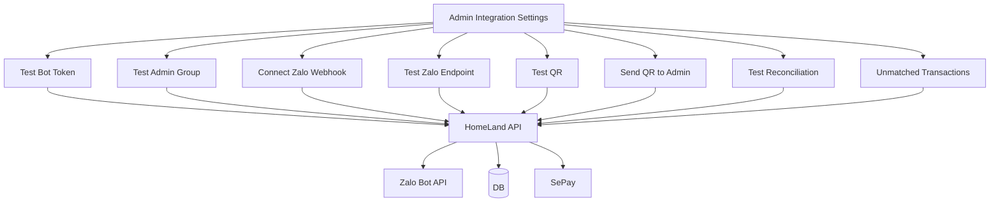

---

# 53. Contract expiry engine

Daily job:

```text
every day 08:00
```

Query:

```text
active contracts ending in:
30 days
14 days
7 days
3 days
1 day
```

Không gửi lặp nếu đã gửi mốc đó.

Table:

```sql
CREATE TABLE contract_reminder_logs (
    id INTEGER PRIMARY KEY AUTOINCREMENT,
    contract_id INTEGER NOT NULL,
    reminder_days INTEGER NOT NULL,
    sent_at DATETIME DEFAULT CURRENT_TIMESTAMP,

    UNIQUE(contract_id, reminder_days)
);
```

---

# 54. Contract expiry message

```text
HomeLand - Hợp đồng sắp hết hạn

Phòng: 31.06
Ngày hết hạn: 30/09/2026
Còn: 30 ngày

Vui lòng phản hồi nhu cầu gia hạn với quản lý.
```

Nếu chưa xác minh button interactive của Zalo, dùng text:

```text
GH 31.06
```

hoặc:

```text
KGH 31.06
```

Sau này có thể thay bằng button nếu API hỗ trợ.

---

# 55. Customer command set

Giữ tối giản:

```text
DK <SĐT> <PHÒNG>
TT
HD
GH
KGH
```

Ý nghĩa:

```text
DK  đăng ký
TT  xem trạng thái thanh toán
HD  xem thông tin hợp đồng cơ bản
GH  yêu cầu gia hạn
KGH không gia hạn
```

Không nên để Bot trả lời chat chung không liên quan.

---

# 56. Admin command set

Tùy chọn:

```text
/id
/room 31.06
/payment 31.06
/customer 0567867889
/unmatched
```

Phần nghiệp vụ chính vẫn nên thao tác qua Admin Web UI thay vì lệnh text.

---

# 57. Notification routing rules

```js
async function notifyRoomPayment(obligationId) {
  const data =
    await payments.getNotificationContext(
      obligationId
    );

  if (!data) {
    throw new Error("OBLIGATION_NOT_FOUND");
  }

  if (data.contract_status !== "ACTIVE") {
    await notifier.sendAdmin(
      `Bỏ qua thông báo: hợp đồng không ACTIVE\nPayment: ${obligationId}`
    );

    return;
  }

  if (!data.zalo_chat_id) {
    await notifier.sendAdmin(
      [
        "Không gửi được thông báo",
        `Phòng: ${data.room_number}`,
        `SĐT: ${data.phone}`,
        "Lý do: ZALO_NOT_REGISTERED"
      ].join("\n")
    );

    return;
  }

  await sendPaymentRequest(...);
}
```

---

# 58. Khi khách rời phòng

Không xóa lịch sử.

```text
contract.status = TERMINATED
contract_tenants.status = INACTIVE
```

Có thể:

```text
tenant.zalo_chat_id
```

vẫn giữ cho audit nhưng notification query luôn yêu cầu:

```text
contract ACTIVE
AND
contract_tenant ACTIVE
```

---

# 59. Khi khách đổi phòng

Không sửa history của contract cũ.

Tạo:

```text
new contract / contract_tenant mapping
```

Payment code mới sẽ gắn với obligation mới.

---

# 60. Một khách có thể ở nhiều phòng?

Nếu nghiệp vụ cho phép:

```text
tenant
  ├ contract_tenant A
  └ contract_tenant B
```

Một `zalo_chat_id` có thể nhận thông báo cho nhiều nghĩa vụ.

Tin nhắn luôn phải ghi:

```text
Phòng
Kỳ
Mã thanh toán
```

---

# 61. Idempotency

Cực kỳ quan trọng cho SePay.

Webhook có thể retry.

Không được:

```text
same transaction
→ amount_paid += money
→ retry
→ amount_paid += money again
```

Bắt buộc:

```sql
provider_transaction_id UNIQUE
```

Transaction flow:

```text
BEGIN
INSERT bank_transactions
  if UNIQUE conflict → duplicate → return OK

allocate
update obligation
COMMIT
```

---

# 62. Database transaction

```js
await db.transaction(async trx => {
  const created =
    await bankTransactions.insertIfNew(
      tx,
      trx
    );

  if (!created) {
    return;
  }

  await allocations.create(..., trx);
  await obligations.updatePaid(..., trx);
});
```

Sau khi DB commit mới gửi Zalo.

Nếu Zalo fail:

```text
payment vẫn PAID
notification log = FAILED
admin có thể retry notification
```

Không rollback payment chỉ vì gửi Zalo lỗi.

---

# 63. Notification retry

Table thêm:

```text
retry_count
next_retry_at
```

Policy:

```text
max 3 retries
1m
5m
15m
```

Sau đó Admin:

```text
CUSTOMER_NOTIFICATION_FAILED
```

---

# 64. Scheduler

Gợi ý:

```text
08:00 contract expiry
09:00 payment due reminders
12:00 overdue reminders
every 10m reconciliation fallback
```

Không gửi nhắc liên tục.

Có bảng:

```text
reminder_key UNIQUE
```

Ví dụ:

```text
PAYMENT:501:DUE_3D
PAYMENT:501:DUE_1D
PAYMENT:501:OVERDUE_1D
PAYMENT:501:OVERDUE_3D
```

---

# 65. Payment reminder policy

Ví dụ:

```text
T-3 days
T-1 day
Due date
T+1 day
T+3 days
T+7 days
```

Chỉ áp dụng khi:

```text
remaining_due > 0
```

Nếu `PAID`, không gửi.

---

# 66. Admin notification examples

## Registration

```text
Khách đăng ký Zalo Bot

Phòng: 31.06
SĐT: 0567867889
Chat ID: xxxxx
Trạng thái: Thành công
```

## Payment success

```text
Thanh toán đã đối soát

Phòng: 31.06
Khách: Nguyễn A
Số tiền: 3.500.000đ
Mã: HL8F27K3
Nguồn: SePay
```

## Missing code

```text
Giao dịch cần kiểm tra

Số tiền: 3.500.000đ
Nội dung: NGUYEN VAN A
Mã: Không có

Không tự động xác nhận.
```

## Send failure

```text
Gửi thông báo thất bại

Phòng: 31.06
SĐT: 0567867889
Loại: PAYMENT_DUE
Lý do: ZALO_NOT_REGISTERED
```

---

# 67. Security boundaries

## Zalo

Không log:

```text
BOT_TOKEN
WEBHOOK_SECRET
```

Không gửi secret tới frontend.

Admin API:

```text
GET /settings
```

chỉ trả:

```text
configured: true
masked: ****1234
```

---

# 68. SePay security

Production:

```text
HMAC-SHA256 preferred
```

Verify:

```text
timestamp freshness
signature constant-time
raw body
```

Webhook endpoint không yêu cầu user login, nhưng bắt buộc verify provider auth.

---

# 69. Admin endpoint security

Tất cả:

```text
/api/admin/*
```

phải có:

```text
authenticated admin
role check
CSRF protection if cookie auth
rate limit
audit log
```

Đặc biệt:

```text
Connect Webhook
Change Token
Change Secret
Manual payment allocation
Mark paid
```

cần audit.

---

# 70. Audit log

```sql
CREATE TABLE audit_logs (
    id INTEGER PRIMARY KEY AUTOINCREMENT,
    admin_user_id INTEGER,
    action TEXT NOT NULL,
    entity_type TEXT,
    entity_id TEXT,
    metadata TEXT,
    created_at DATETIME DEFAULT CURRENT_TIMESTAMP
);
```

Ví dụ:

```text
CONNECT_ZALO_WEBHOOK
MANUAL_PAYMENT_ALLOCATION
MARK_PAYMENT_PAID
DISABLE_TENANT_NOTIFICATION
UPDATE_CONTRACT
```

---

# 71. Observability

Mỗi request nên có:

```text
request_id
```

Log:

```text
[ZALO]
[SEPAY]
[BILLING]
[NOTIFY]
[ADMIN]
```

Ví dụ:

```text
[SEPAY] tx=92704 code=HL8F27K3 amount=3500000
[RECON] obligation=501 status=PAID
[ZALO] chat=xxxx type=PAYMENT_SUCCESS status=SENT
```

Không log token.

---

# 72. Health endpoints

```text
GET /health
GET /health/database
GET /health/zalo
GET /health/sepay
```

`/health/zalo` không nên gọi Zalo mỗi lần load balancer ping.

Admin “Test Bot” mới gọi `getMe`.

---

# 73. Admin page status cards

```text
Zalo Bot
Status: Connected
Admin Group: Connected
Webhook: Connected
Last Event: 2 minutes ago

SePay
Webhook URL: Configured
Security: HMAC-SHA256
Last Transaction: 5 minutes ago
Unmatched: 2
```

---

# 74. Frontend button state

Khi bấm:

```text
[Connect Webhook]
```

UI:

```text
Connecting...
```

Disable button để tránh double click.

Success:

```text
Connected
```

Error:

```text
Connection failed
View details
```

Không dump secret/error stack cho browser.

---

# 75. API endpoints tổng hợp

## Zalo

```text
POST /webhooks/zalo
GET  /webhooks/zalo/health
```

## SePay

```text
POST /webhooks/sepay
GET  /webhooks/sepay/health
```

## Admin Integration

```text
GET  /api/admin/integrations
POST /api/admin/integrations/zalo/test
POST /api/admin/integrations/zalo/test-admin-group
POST /api/admin/integrations/zalo/connect-webhook
POST /api/admin/integrations/zalo/test-endpoint

POST /api/admin/integrations/sepay/test-qr
POST /api/admin/integrations/sepay/send-test-qr
POST /api/admin/integrations/sepay/test-reconciliation
```

## Customer

```text
GET /api/admin/tenants/:id
POST /api/admin/tenants/:id/test-zalo
POST /api/admin/tenants/:id/send-payment-reminder
```

## Reconciliation

```text
GET  /api/admin/payments/unmatched
GET  /api/admin/payments/transactions/:id
POST /api/admin/payments/transactions/:id/allocate
POST /api/admin/payments/transactions/:id/reject-match
```

---

# 76. Full event map

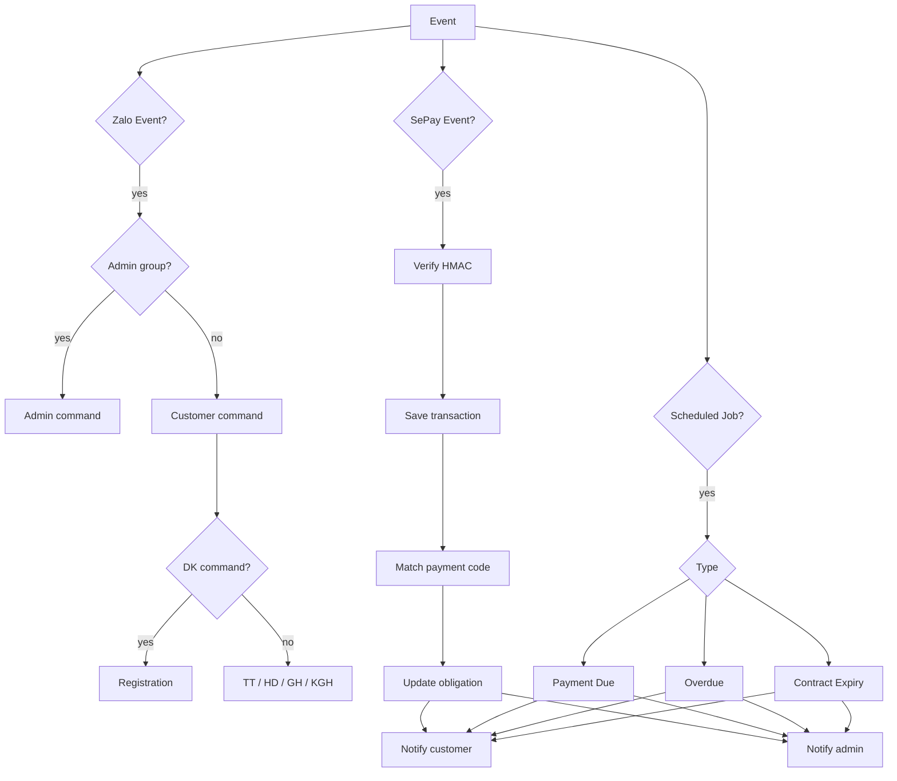

---

# 77. End-to-end: đăng ký khách

```text
1. Admin tạo khách trong HomeLand.
2. Admin tạo contract.
3. Admin map tenant vào room.
4. Khách ký hợp đồng.
5. HomeLand yêu cầu khách mở Zalo Bot.
6. Khách nhắn:
   DK 0567867889 31.06
7. Zalo POST webhook.
8. HomeLand lấy chat_id.
9. HomeLand kiểm tra:
   - phone
   - room
   - active contract
10. HomeLand bind chat_id vào tenant.
11. Bot trả xác nhận khách.
12. Bot gửi thông báo Admin.
```

---

# 78. End-to-end: tạo hóa đơn

```text
1. Billing Engine tạo invoice phòng.
2. Tính rent/electric/water/service.
3. Lấy contract_tenants ACTIVE.
4. Chia nghĩa vụ mỗi tenant.
5. Tạo payment_obligation.
6. Generate payment_code.
7. Generate QR.
8. Lấy tenant.zalo_chat_id.
9. Nếu có:
   gửi notification.
10. Nếu không:
   log failure.
   gửi Admin alert.
```

---

# 79. End-to-end: khách thanh toán

```text
1. Khách scan QR.
2. App ngân hàng có:
   amount
   payment_code
3. Tiền vào tài khoản.
4. SePay phát hiện giao dịch.
5. SePay POST HomeLand webhook.
6. Verify HMAC.
7. Chống duplicate.
8. Lưu raw transaction.
9. Match payment_code.
10. Compare amount.
11. Allocate.
12. Update obligation.
13. Update invoice aggregate status.
14. Commit DB.
15. Gửi xác nhận khách.
16. Gửi xác nhận Admin.
```

---

# 80. Invoice aggregate status

Nếu phòng có 2 tenant:

```text
A = PAID
B = PENDING
```

Invoice:

```text
PARTIAL
```

Nếu:

```text
A = PAID
B = PAID
```

Invoice:

```text
PAID
```

Không lấy một giao dịch của A làm PAID cả phòng.

---

# 81. Aggregate calculator

```js
async function refreshInvoiceStatus(invoiceId) {
  const obligations =
    await paymentObligations.findByInvoiceId(
      invoiceId
    );

  const totalDue =
    obligations.reduce(
      (sum, item) => sum + item.amount_due,
      0
    );

  const totalPaid =
    obligations.reduce(
      (sum, item) => sum + item.amount_paid,
      0
    );

  let status = "PENDING";

  if (totalPaid <= 0) {
    status = "PENDING";
  } else if (totalPaid < totalDue) {
    status = "PARTIAL";
  } else {
    status = "PAID";
  }

  await invoices.updateStatus(
    invoiceId,
    status
  );

  return {
    totalDue,
    totalPaid,
    status
  };
}
```

---

# 82. Không note theo SePay

Policy HomeLand:

```text
Exact payment_code
→ AUTO MATCH

No payment_code
→ NEVER AUTO-PAID based only on amount
→ NEEDS_REVIEW
```

Nếu chỉ có một candidate:

```text
confidence = HIGH
```

nhưng vẫn:

```text
NEEDS_REVIEW
```

Admin confirm.

---

# 83. Có nên dùng phone làm note?

Khuyến nghị:

```text
Không.
```

Phone dùng cho:

```text
identity
customer search
registration validation
contact
```

Payment note dùng:

```text
payment_code
```

Vì phone không biểu diễn:

```text
which room
which invoice
which billing month
which obligation
deposit vs rent vs utilities
```

---

# 84. Tiền cọc

Deposit nên là obligation riêng:

```text
type = DEPOSIT
```

Không trộn với monthly invoice.

```sql
ALTER TABLE payment_obligations
ADD COLUMN obligation_type TEXT
DEFAULT 'MONTHLY_BILL';
```

Types:

```text
DEPOSIT
MONTHLY_BILL
CONTRACT_FEE
DAMAGE_FEE
OTHER
```

---

# 85. Payment code vẫn unique cho cọc

Ví dụ:

```text
HLDEP7F12
```

SePay match như bình thường.

Customer:

```text
HomeLand - Thanh toán cọc

Phòng: 31.06
Số tiền: 6.000.000đ
Mã: HLDEP7F12

QR: ...
```

Sau payment:

```text
HomeLand - Đã nhận tiền cọc

Phòng: 31.06
Số tiền: 6.000.000đ
Trạng thái: Đã ghi nhận
```

---

# 86. Test plan

## ZALO-01

```text
Test getMe
Expected: Bot identity returned
```

## ZALO-02

```text
Test admin group message
Expected: Admin receives test
```

## ZALO-03

```text
Connect webhook
Expected: setWebhook success
```

## ZALO-04

```text
Customer sends:
DK valid_phone valid_room

Expected:
chat_id bound
customer receives confirmation
admin receives registration event
```

## ZALO-05

```text
DK wrong phone

Expected:
no bind
customer receives failure
admin receives warning
```

---

# 87. SePay test plan

## SEPAY-01

```text
Generate QR
Expected:
amount correct
description/payment_code correct
```

## SEPAY-02

```text
Exact code + exact amount
Expected:
PAID
```

## SEPAY-03

```text
Exact code + partial amount
Expected:
PARTIAL
```

## SEPAY-04

```text
Exact code + over amount
Expected:
OVERPAID / review
```

## SEPAY-05

```text
No code + same amount as multiple obligations
Expected:
NEEDS_REVIEW
```

## SEPAY-06

```text
Same provider transaction sent twice
Expected:
one allocation only
```

## SEPAY-07

```text
Invalid HMAC
Expected:
401
no transaction saved
```

---

# 88. Failure injection tests

## Zalo unavailable

Expected:

```text
payment remains PAID
notification FAILED
retry queue created
admin alert eventually
```

## Database unavailable

Expected:

```text
SePay endpoint 500
SePay can retry
no partial allocation
```

## Server restart after transaction insert

Use SQL transaction so:

```text
either full commit
or rollback
```

## Duplicate SePay webhook

Expected:

```text
UNIQUE provider_transaction_id
no duplicate payment
```

---

# 89. Production deployment mapping

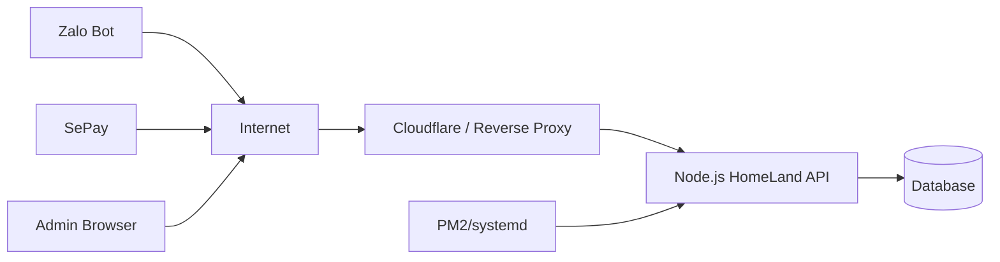

Production URL:

```text
https://api.homeland.example/webhooks/zalo
https://api.homeland.example/webhooks/sepay
```

---

# 90. Cloudflare route

Nếu Node chạy:

```text
127.0.0.1:3000
```

Cloudflare:

```text
api.homeland.example
→ http://localhost:3000
```

Zalo setting:

```text
https://api.homeland.example/webhooks/zalo
```

SePay setting:

```text
https://api.homeland.example/webhooks/sepay
```

---

# 91. Startup validation

Khi app start:

```js
const required = [
  "ZALO_BOT_TOKEN",
  "ZALO_WEBHOOK_SECRET",
  "ZALO_ADMIN_GROUP_CHAT_ID",
  "SEPAY_WEBHOOK_SECRET",
  "SEPAY_BANK_ACCOUNT",
  "SEPAY_BANK_CODE",
  "PUBLIC_BASE_URL"
];

for (const key of required) {
  if (!process.env[key]) {
    throw new Error(
      `Missing environment variable: ${key}`
    );
  }
}
```

Không print secret value.

---

# 92. package.json gợi ý

```json
{
  "name": "homeland-backend",
  "version": "1.0.0",
  "main": "src/server.js",
  "scripts": {
    "dev": "node src/server.js",
    "start": "node src/server.js",
    "test": "node --test"
  },
  "dependencies": {
    "axios": "^1",
    "dotenv": "^16",
    "express": "^5"
  }
}
```

Database package tùy lựa chọn:

```text
better-sqlite3
```

hoặc ORM:

```text
Prisma
```

---

# 93. MVP implementation order

## Phase 1 — Zalo foundation

```text
getMe
sendMessage
Admin group
setWebhook
raw webhook
normalize update
```

## Phase 2 — Registration

```text
rooms
tenants
contracts
contract_tenants
DK command
chat_id binding
admin notification
```

## Phase 3 — Billing

```text
invoice
payment obligation
shared room split
payment code
```

## Phase 4 — SePay

```text
QR
webhook
HMAC
idempotency
reconciliation
```

## Phase 5 — Automation

```text
payment reminders
overdue
contract expiry
notification retries
```

## Phase 6 — Admin UI

```text
Integration Settings
Test buttons
Unmatched payment
Customer Zalo status
Audit log
```

---

# 94. Definition of Done cho Zalo

Zalo integration chỉ được coi là hoàn tất khi:

```text
[ ] Test Bot Token pass
[ ] Test Admin Group pass
[ ] Connect Webhook pass
[ ] Incoming customer message reaches server
[ ] chat_id captured
[ ] DK valid passes
[ ] DK invalid rejected
[ ] customer receives private response
[ ] admin receives registration response
[ ] notification failures logged
```

---

# 95. Definition of Done cho SePay

```text
[ ] QR contains amount
[ ] QR contains payment code
[ ] HMAC verified from raw body
[ ] transaction ID idempotent
[ ] exact match works
[ ] partial works
[ ] overpay review works
[ ] missing code not auto-paid
[ ] admin sees unmatched
[ ] customer payment confirmation works
[ ] admin payment confirmation works
```

---

# 96. Recommended production rules

1. Không gửi thông báo nếu contract không ACTIVE.
2. Không gửi payment reminder nếu obligation PAID.
3. Không auto-match chỉ bằng amount.
4. Không auto phân bổ tiền dư sang tenant khác.
5. Không xóa transaction history.
6. Không xóa tenant history khi hết hợp đồng.
7. Không expose Zalo/SePay secret ra frontend.
8. Không xử lý duplicate SePay transaction hai lần.
9. Không rollback payment nếu Zalo notification fail.
10. Luôn log notification result.
11. Luôn log manual allocation.
12. Admin group là kênh cảnh báo, DB mới là source of truth.

---

# 97. Trạng thái source of truth

```text
Zalo message != source of truth
SePay webhook raw != final source of truth

Database HomeLand = source of truth
```

Zalo chỉ là:

```text
notification / interaction channel
```

SePay chỉ là:

```text
bank transaction source
```

Business state nằm trong:

```text
contracts
invoices
payment_obligations
bank_transactions
payment_allocations
```

---

# 98. Final system map

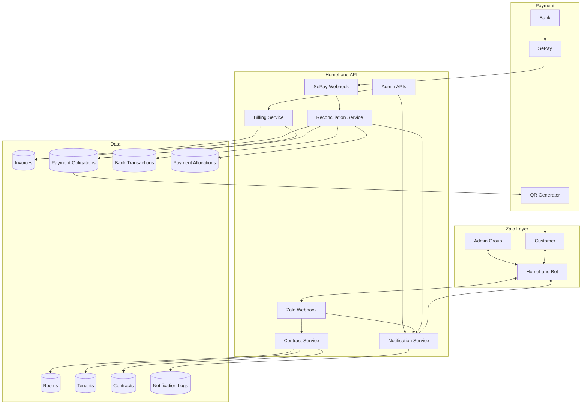

---

# 99. Checklist tích hợp vào project HomeLand hiện có

```text
[ ] Tạo module zaloBot.client
[ ] Tạo module zaloNormalizer
[ ] Tạo /webhooks/zalo
[ ] Lưu Admin Group ChatID
[ ] Tạo Settings > Integrations > Zalo
[ ] Button Test Bot
[ ] Button Test Admin Group
[ ] Button Connect Webhook
[ ] Button Test Endpoint

[ ] Tạo tables rooms/tenants/contracts/contract_tenants
[ ] Implement DK command
[ ] Bind customer chat_id
[ ] Admin registration notification

[ ] Tạo invoice
[ ] Tạo payment_obligation
[ ] Shared-room split
[ ] payment_code unique

[ ] Tạo QR adapter
[ ] Tạo payment notice
[ ] Send QR/link by Zalo

[ ] Tạo /webhooks/sepay
[ ] Verify HMAC raw body
[ ] Save transaction
[ ] Unique provider transaction
[ ] Exact payment-code reconciliation
[ ] Partial payment
[ ] Overpayment
[ ] Missing-code review

[ ] Customer payment confirmation
[ ] Admin payment confirmation
[ ] Admin unmatched page

[ ] Payment reminder jobs
[ ] Overdue jobs
[ ] Contract-expiry jobs

[ ] Audit logs
[ ] Notification logs
[ ] Retry logic
[ ] Production health monitoring
```

---

# 100. Kết luận kiến trúc

HomeLand nên dùng **một Zalo Bot** nhưng tách 3 context:

```text
ADMIN
CUSTOMER
SYSTEM
```

`chat_id` được thu tự động khi khách gửi lệnh đăng ký:

```text
DK <SĐT> <PHÒNG>
```

Không dùng phone làm payment note chính.

Mỗi khách và mỗi kỳ thanh toán nhận:

```text
payment_obligation
+
payment_code unique
+
QR unique
```

SePay webhook:

```text
transaction
→ payment_code
→ obligation
→ tenant
→ room
→ invoice
```

Sau khi DB commit:

```text
customer notification
+
admin notification
```

Nếu khách không giữ payment code:

```text
NEEDS_REVIEW
```

không tự xác nhận chỉ dựa vào số tiền.

Admin Project phải có trang Integration Settings với tối thiểu:

```text
Test Bot Token
Test Admin Group
Connect Zalo Webhook
Test Zalo Endpoint
Test QR
Send Test QR
Test Reconciliation
View Unmatched Transactions
```

Đây là boundary hợp lý để sau này HomeLand tăng số phòng, có khách ở ghép, nhiều kỳ hóa đơn và nhiều giao dịch mà không phải viết lại kiến trúc chính.
