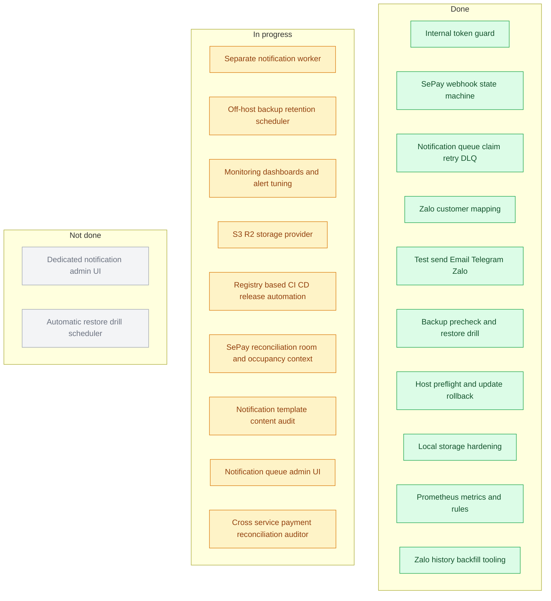
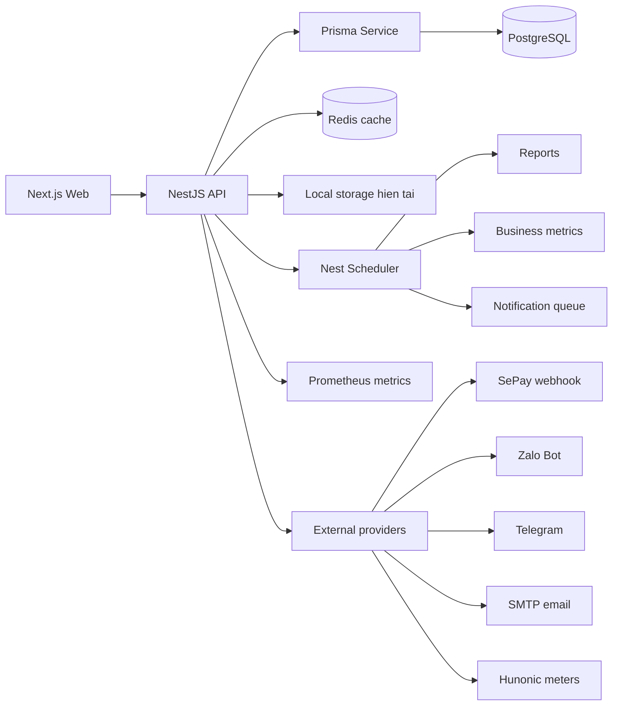
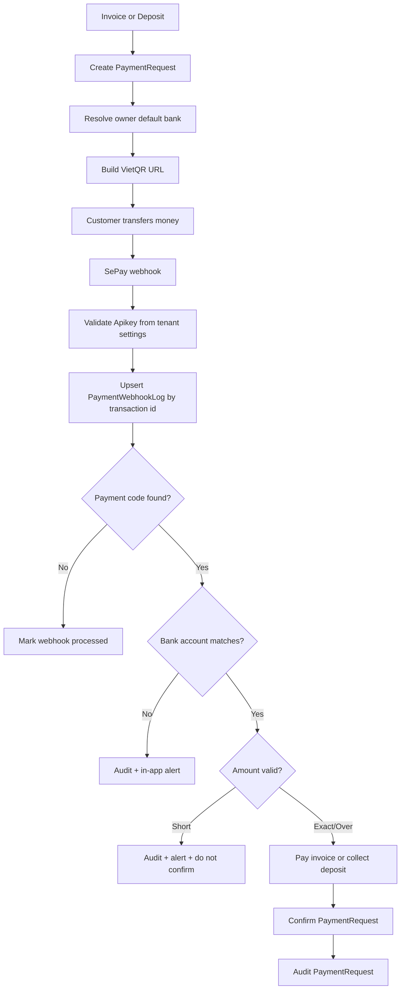
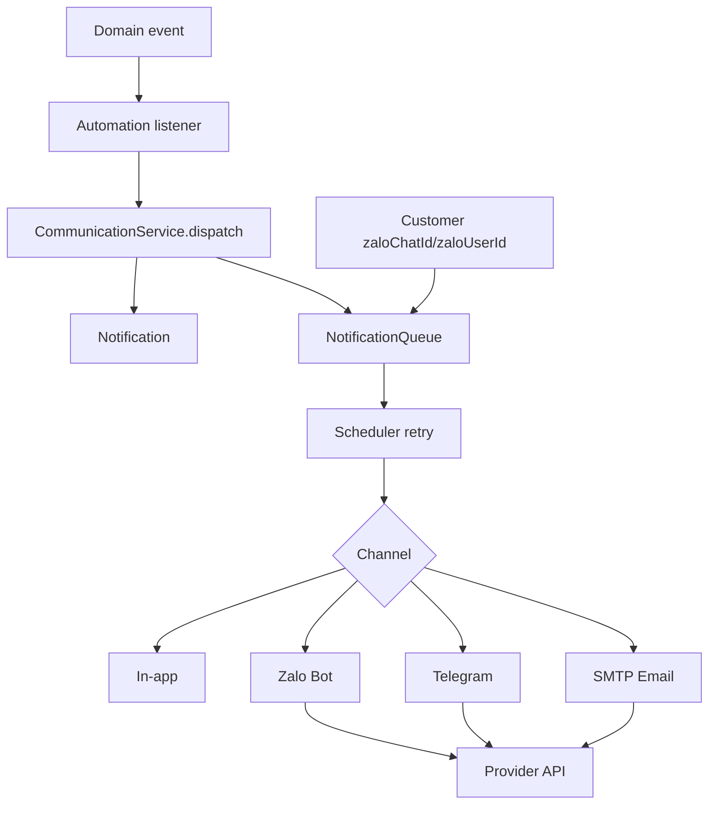
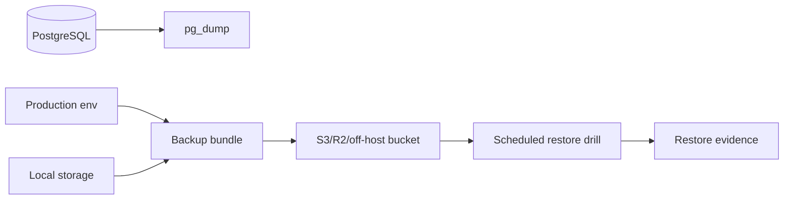
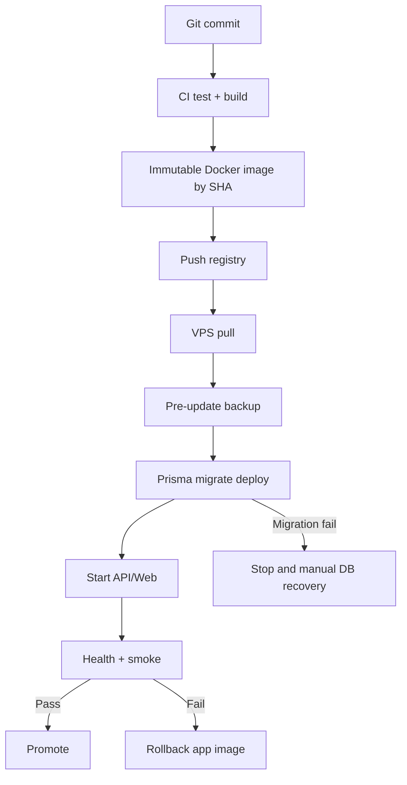

# HomeLand Code Graph

Tai lieu nay ghi lai ban do code van hanh chinh cua HomeLand SaaS de dung khi review, nang cap va xu ly su co.

## Trang thai tong hop

Chu thich mau:

- Xanh: done
- Vang: dang thuc hien
- Xam/trang: chua hoan thanh

## Checklist

Day la checklist con lai theo thu tu uu tien van hanh.

| Pri | Area | Status | Checklist |
|---|---|---|---|
| P1 | Notification worker | Doing | Da co worker service/heartbeat/compose; con dashboard canh bao va DLQ UI sau cung |
| P1 | SePay reconciliation auditor | Doing | Da co cross-service audit panel va API; con tiep duplicate/manual assign deep audit va SLA alert tuning |
| P2 | Backup retention + drill | Doing | Da co backup cycle wrapper; con off-host immutable policy va restore drill schedule that |
| P2 | Monitoring dashboards | Done | Da co operations dashboard + alert tuning cho SePay, notification worker/queue, backup, Hunonic |
| P2 | Zalo history backfill | Done | Da co script export recent webhook chats va import reviewed mapping vao customer identity |
| P2 | Storage provider | Doing | Da co storage abstraction + S3-compatible provider + audit script + lifecycle scaffold + preflight guard; con rollout object storage production |
| P3 | Release automation | Doing | Da co GHCR workflow, registry compose bundle cho VPS pull, va update runner auto rollback app manifest |
| P3 | Notification admin UI | Doing | Manual retry/cancel/monitor queue tung channel |
| P2 | Room occupancy selector | Done | Chon Nguyen can/Phong ghep truoc khi them khach, luu va map sang flow contract/Zalo/SePay |
| P2 | Notification template content audit | Doing | Dua room/building/occupancy vao subject-body template quan trong |
| P2 | SePay room context surface | Doing | Hien thi phong/toa nha/kieu thue tren bang doi soat SePay |

## Tong quan module

## Thanh toan SePay

Code chinh:

- `apps/api/src/payments/payments.controller.ts`
- `apps/api/src/payments/payments.service.ts`
- `apps/api/src/finance/finance-reporting.service.ts`
- `packages/database/prisma/schema.prisma`

Trang thai hien tai: luong webhook/request/source da co bang doi soat va them audit cheo giua `PaymentRequest`, `Payment`, `Invoice`, `Deposit`, `PaymentWebhookLog` de bat case confirmed-source-open, webhook-processed-request-pending, refund-treo, va payment SePay thieu confirmed request. Rui ro con lai P1: duplicate/manual-assign deep audit va SLA alert tuning.

## Notification, Zalo, Email

Code chinh:

- `apps/api/src/communication/communication.service.ts`
- `apps/api/src/communication/communication.scheduler.ts`
- `apps/api/src/communication/providers/communication.providers.ts`
- `apps/api/src/communication/communication.controller.ts`
- `apps/api/src/automation/jobs/job.dispatcher.ts`

Trang thai hien tai: queue da co claim/retry/DLQ, delivery log luu provider message id khi provider tra ve, Zalo webhook capture chat/user gan nhat, Customer da co `zaloChatId`/`zaloUserId` de gui Bot khong dung so dien thoai, va da co script backfill mapping tu webhook history sau khi operator review JSON. Rui ro con lai: provider send van chay trong API/scheduler process va can rollout worker rieng on dinh tren production.

## Backup va luu tru

Code/tai lieu chinh:

- `docs/operations/BACKUP.md`
- `docs/operations/RESTORE.md`
- `docs/operations/DISASTER_RECOVERY.md`
- `apps/api/src/documents/providers/storage/local-storage.provider.ts`
- `scripts/update/*`

Trang thai hien tai: co backup script, backup cycle wrapper cho cron/systemd, restore precheck, restore drill script vao database tam co guard ten DB, va metric backup freshness. Rui ro con lai: can off-host retention immutable policy va bang chung drill dinh ky.

## Release, update, rollback

App rollback co the tu dong khi image moi loi health trong update runner, va VPS production da co them compose registry de pull `API_TAG`/`WEB_TAG` immutable tu GHCR. Database rollback khong nen tu dong mac dinh vi migration co the la bien doi du lieu; can backup truoc update va runbook recovery rieng.

## Security surface

Endpoint public hop le:

- `GET /api/v1/health`
- `GET /api/v1/health/ready`
- Webhook provider co secret rieng: SePay, Zalo.

Endpoint van hanh can token noi bo:

- `GET /api/v1/metrics`
- `GET /api/v1/health/seed`
- `GET /api/v1/health/build-info`

Env can co trong production:

- `JWT_SECRET`
- `INTERNAL_API_TOKEN`
- `DATABASE_URL`
- `REDIS_URL`
- Provider secrets trong Integration Center: SePay, Zalo, Telegram, SMTP, Hunonic.
