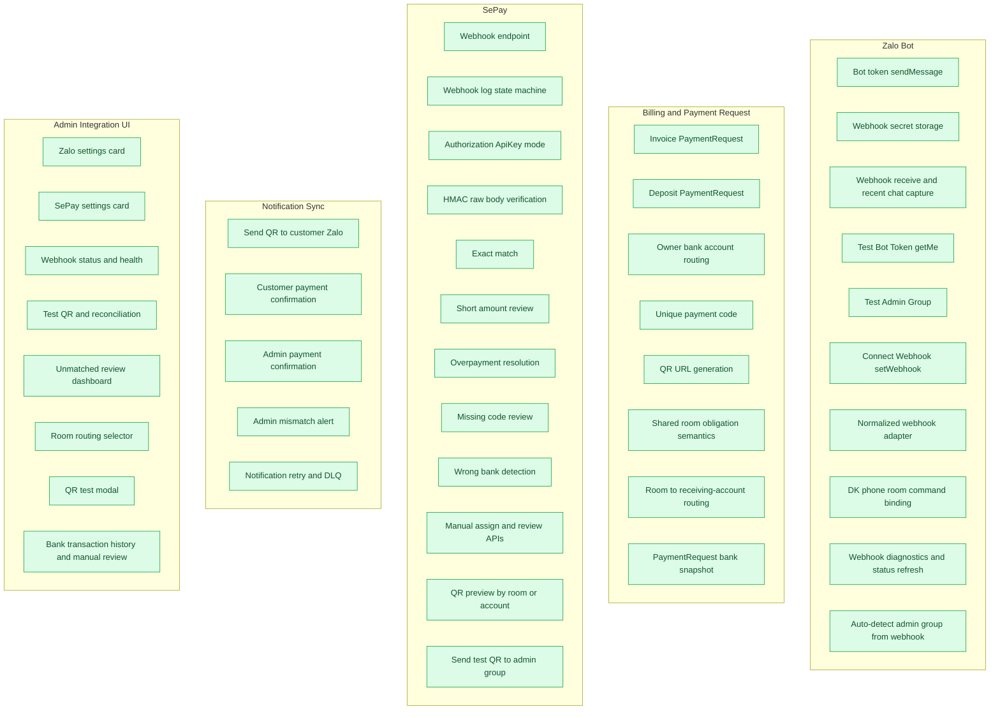
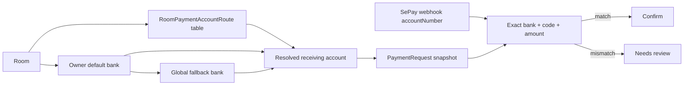

# HomeLand Zalo SePay Integration Codegraph

Tai lieu nay theo doi rieng tien do tich hop `Zalo Bot -> Customer Chat ID -> Billing -> SePay -> Reconciliation -> Notification`.

Chu thich:

- Xanh: done
- Vang: dang thuc hien
- Mac dinh: chua hoan thanh

## Checklist theo phase tai lieu

| Phase | Item | Status | Ghi chu |
|---|---|---|---|
| 1 | Zalo `sendMessage` | Done | Da co provider gui tin theo `chat_id` |
| 1 | Zalo webhook secret | Done | Da luu trong `zalo-provider.webhookSecret` |
| 1 | Zalo webhook receive | Done | Da verify secret va capture recent chat |
| 1 | Zalo `getMe` test | Done | Da co API test bot token trong settings |
| 1 | Zalo `setWebhook` connect | Done | Da co API connect webhook + guard khi settings chua luu |
| 1 | Zalo normalizer tach rieng | Done | Da tach sang `adapters/zalo-normalizer.ts` |
| 1 | Zalo webhook diagnostics | Done | Da luu `lastWebhook*` + preview keys + UI refresh status |
| 1 | Zalo auto-detect admin group | Done | Da uu tien group trong `recentWebhookChats`, fallback `lastWebhookChatId` |
| 2 | DK command bind `chat_id` | Done | Da parse `DK <phone> <room>`, validate room/hop dong/sdt, bind `zaloChatId` |
| 3 | Payment request theo invoice/deposit | Done | Da co `PaymentRequest` va QR |
| 3 | Shared-room obligation semantics | Done | Flow thanh toan dang customer-scoped va giu `roomRentalType` + `roomMemberCount` xuyen suot QR, Zalo, doi soat |
| 3 | Room -> receiving-account routing | Done | Da them bang `RoomPaymentAccountRoute`, fallback owner default / owner fallback / global fallback va doc fallback JSON cu neu chua migrate |
| 3 | Payment request bank snapshot | Done | Tiep tuc snapshot bang `bankAccountId`, `bankName`, `bankAccountNumber`, `bankAccountName` tren `PaymentRequest` |
| 4 | SePay webhook endpoint | Done | Da co endpoint + log state machine |
| 4 | SePay HMAC raw-body verify | Done | Da co mode `hmac` / `dual` va test verify |
| 4 | SePay exact/partial/over/wrong bank | Done | Da co mismatch va review flow |
| 4 | SePay admin integration status/test | Done | Da co status/test API va UI test QR + doi soat |
| 4 | SePay QR preview theo room/account | Done | Da co `previewSePayQr` resolve theo room route hoac account chon tay |
| 4 | SePay send test QR toi admin group | Done | Da co `POST /payments/sepay/test-qr/send-admin` gui vao `adminGroupChatId` |
| 4 | Lich su giao dich 2 account + tra soat tay | Done | `/finance/transactions` doc tu `PaymentWebhookLog`, loc theo account, trang thai review va giu giao dich sai noi dung/chua match |
| 5 | Customer payment confirmation qua Zalo | Done | Workflow gui sau event thanh toan va ton trong `sepay.sendPaymentResultToZalo` |
| 5 | Admin payment confirmation qua Zalo/group | Done | Da them workflow gui vao `adminGroupChatId` sau SePay commit |
| 6 | Zalo + SePay control-plane UI day du | Done | Da co card SePay gon, room routing, QR modal, webhook status, send-admin |

## Multi-account flow hien tai

## File map

- Zalo:
  - `apps/api/src/communication/communication.controller.ts`
  - `apps/api/src/communication/adapters/zalo-normalizer.ts`
  - `apps/api/src/communication/providers/communication.providers.ts`
  - `apps/api/src/communication/services/zalo-registration.service.ts`
  - `apps/web/components/settings/sections/SettingsZaloIntegration.tsx`
- SePay:
  - `apps/api/src/payments/payments.controller.ts`
  - `apps/api/src/payments/payments.service.ts`
  - `apps/web/components/settings/sections/SettingsSePayIntegration.tsx`
  - `apps/web/components/finance/BankTransactionHistory.tsx`
  - `apps/web/components/finance/SePayReconciliationSummary.tsx`
  - `apps/web/components/finance/SePayReconciliationAuditPanel.tsx`
  - `apps/web/lib/api/settings.api.ts`
  - `packages/database/prisma/migrations/20260824110000_add_room_payment_account_routes/migration.sql`
  - `packages/database/prisma/schema.prisma`
  - `packages/database/prisma/seed.ts`
- Workflow sync:
  - `apps/api/src/automation/workflow/workflow.engine.ts`
  - `apps/api/src/automation/workflow/workflow.registry.ts`
- Shared settings:
  - `apps/api/src/settings/settings.service.ts`
  - `apps/web/lib/api/settings.api.ts`
