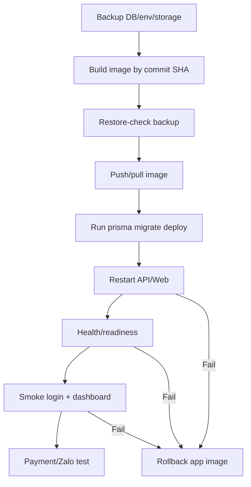

# Production Operations Runbook

## Daily checks

1. Health:
   - `GET /api/v1/health`
   - `GET /api/v1/health/ready`
2. Disk:
   - Warning neu `/` tren `75%`.
   - Critical neu `/` tren `85%`.
   - Chay `npm run host-check:prod -- --containers homeland_production_api,homeland_production_web,homeland_production_postgres,homeland_production_redis,homeland_production_cloudflared`.
3. Database:
   - `prisma migrate status` khong co failed migration.
   - Backup moi nhat duoi `24h`.
   - `backup_last_success == 1` va `backup_age_seconds < 86400`.
   - `notification_worker_heartbeat_age_seconds < 300` khi queue chay out-of-process.
4. Storage:
   - `STORAGE_DIR` la absolute path tren host/volume ben vung.
   - Thu muc storage co dung luong trong nguong va duoc backup vao manifest moi nhat.
   - Chay `npm run storage:audit:prod -- --env-file .env.public-production --storage-dir <storage-dir>` truoc khi tat local storage cu.
5. Payment:
   - Khong co SePay webhook `FAILED` qua `15m`.
   - Khong co SePay webhook `NEEDS_REVIEW` chua co owner xu ly.
   - Doi chieu payment request, invoice/deposit va bank.
6. Notification:
   - Queue `FAILED` dang giam sau retry.
   - Queue `DEAD_LETTER` phai co ticket.
   - Zalo test gui bang `chat_id`/`user_id`; khong dung so dien thoai lam recipient.
   - Customer can gui Zalo phai co `zaloChatId` hoac `zaloUserId`.
7. Hunonic:
   - Sync log thanh cong trong `2h`.
8. Security:
   - Khong co login failed bat thuong.
   - Khong co thay doi integration secret khong co audit.

## Pre-update checklist

1. Xac dinh commit SHA/release tag can update.
2. Tao backup DB, env va storage bang `node scripts/production-backup.js --env-file .env.public-production --output-dir .codex-backups/production --storage-dir storage`.
3. Xac minh backup checksum va off-host location.
4. Chay `npm run restore-check:prod -- --manifest .codex-backups/production/latest-manifest.json --require-off-host`.
5. Neu update lon, chay `npm run restore-drill:prod -- --database-url "$RESTORE_DRILL_DATABASE_URL" --confirm-target-db <db_tam>`.
6. Chay `npm run host-check:prod -- --min-free-gb 8 --max-used-percent 85 --containers homeland_production_api,homeland_production_web,homeland_production_postgres,homeland_production_redis,homeland_production_cloudflared`.
7. Chay preflight.
8. Neu production dung queue out-of-process, xac nhan `homeland_production_notification_worker` dang chay va co heartbeat moi.
8. Chay migration tren staging hoac database clone.
9. Chuan bi rollback app image/release path truoc do.
10. Chot maintenance window neu co migration.

## Scheduler khuyen nghi

- Backup cycle hang ngay: `npm run backup:cycle:prod -- --env-file .env.public-production --output-dir .codex-backups/production --storage-dir <storage-dir> --require-off-host`
- Restore drill hang tuan: `npm run restore-drill:prod -- --manifest .codex-backups/production/latest-manifest.json --max-age-hours 168 --require-off-host --database-url "$RESTORE_DRILL_DATABASE_URL" --confirm-target-db homeland_restore_drill`
- Host check truoc update va sau reboot: `npm run host-check:prod -- --containers homeland_production_api,homeland_production_web,homeland_production_postgres,homeland_production_redis,homeland_production_notification_worker,homeland_production_cloudflared`
- Template `systemd` units/timers da co tai `deploy/public-production/systemd/` de install thang tren Ubuntu cho backup cycle va restore drill.

## Update flow khuyen nghi

## Rollback rules

- App rollback duoc tu dong neu image moi khong qua health/smoke.
- Database rollback khong tu dong mac dinh.
- Neu migration da thay doi data/schema, uu tien forward-fix khi co the.
- Restore DB chi thuc hien khi co phe duyet va da restore thu tren ban sao.

## Incident response

1. Dung tac vu tu dong lien quan neu co sai lech tien.
2. Ghi lai timestamp, tenant, owner, provider, correlation ID.
3. Khong xoa log/webhook/payment record.
4. Neu loi deploy: rollback app truoc.
5. Neu loi data: tao snapshot hien trang truoc khi sua.
6. Sau khi phuc hoi: doi soat invoice/deposit/payment/bank/audit.
