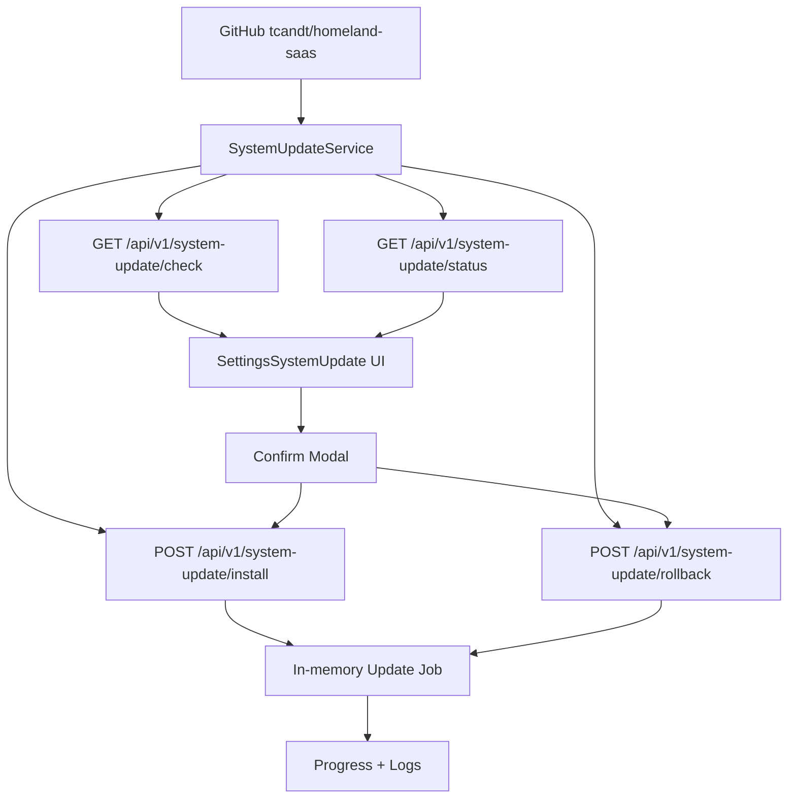

# System Update And Rollback

## Mục tiêu

Trang Settings > Cập nhật hệ thống cho phép `admin@homeland.vn` kiểm tra version mới, xem chi tiết thay đổi, tạo job cập nhật và tạo job rollback có kiểm soát.

Mặc định hệ thống chạy `SYSTEM_UPDATE_MODE=dry-run`, nghĩa là UI và API chỉ mô phỏng progress, không tự ghi đè source, không chạy migration và không restart service. Đây là lớp an toàn trước khi nối runner thật.

## Codegraph



## Mapping

| Layer | File | Trách nhiệm |
| --- | --- | --- |
| API module | `apps/api/src/system-update/system-update.module.ts` | Đăng ký controller/service |
| API controller | `apps/api/src/system-update/system-update.controller.ts` | Route check/status/install/rollback, chặn write nếu không phải `admin@homeland.vn` |
| API service | `apps/api/src/system-update/system-update.service.ts` | Đọc version đang chạy, `package.json` trên nhánh mặc định, release tag và SHA mục tiêu bất biến; tạo changelog/job an toàn |
| Web API client | `apps/web/lib/api/system-update.api.ts` | Gọi endpoint system update |
| Web UI | `apps/web/components/settings/sections/SettingsSystemUpdate.tsx` | Card version, changelog, progress, modal xác nhận |
| Settings registry | `apps/web/app/settings/page.tsx` | Thêm section `system-update` |
| Env | `.env.example`, `.env.docker.example` | `SYSTEM_UPDATE_MODE`, repository, previous version |

## Trạng thái hiện tại

- `[x]` Check current commit, remote HEAD, version trong `package.json` của nhánh mặc định và release tag.
- `[x]` Nếu Git CLI không xác thực được, dùng GitHub API với cùng `SYSTEM_UPDATE_GITHUB_TOKEN` làm fallback.
- `[x]` Phân biệt rõ `ok`, `tag-only`, `unavailable`; không còn coi lỗi GitHub là "đang ở phiên bản mới nhất".
- `[x]` Khóa nút và API install khi không có version mới hoặc kết quả kiểm tra không hợp lệ.
- `[x]` Hiển thị update available/changelog cơ bản.
- `[x]` Popup xác nhận cập nhật/rollback.
- `[x]` Job progress và log.
- `[x]` Backend chặn tạo job install/rollback song song; job mới nhận `409` nếu runner hiện tại chưa kết thúc.
- `[x]` Chỉ `admin@homeland.vn` được install/rollback.
- `[x]` Mặc định không destructive.
- `[x]` Runner thật tải source vào release directory riêng khi `SYSTEM_UPDATE_MODE=enabled`.
- `[x]` Backup DB/env/source metadata tự động trước update.
- `[x]` Build/preflight thật trong release directory.
- `[x]` Switch active version manifest có khóa `SYSTEM_UPDATE_ALLOW_SWITCH=true`.
- `[x]` Restart service thật bằng service manager production khi `SYSTEM_UPDATE_RESTART_COMMAND` đã được cấu hình.
- `[x]` Health check thật và auto rollback app manifest về release trước khi restart/health fail.

## Nguồn xác định phiên bản

`APP_VERSION` là version của artifact đang chạy. Version mới nhất được chọn theo semantic version lớn nhất giữa:

1. `version` trong `package.json` tại commit HEAD của nhánh mặc định trên GitHub.
2. Release tag dạng `vMAJOR.MINOR.PATCH`.

Khi version mới chỉ có trên nhánh mặc định (ví dụ `package.json=1.2.9` nhưng tag cao nhất mới là `v1.2.8`), API hiển thị `v1.2.9` và dùng commit SHA của HEAD làm `targetRef` để checkout chính xác. Với annotated tag, API dùng commit SHA đã dereference thay vì SHA của tag object.

Nếu `package.json` vẫn cùng version nhưng HEAD có SHA khác, API chỉ mở cập nhật khi GitHub Compare xác nhận HEAD remote ở trạng thái `ahead` so với commit đang chạy. Trạng thái `behind`, `diverged` hoặc không xác minh được đều bị khóa để tránh vô tình hạ cấp/đổi nhánh. Nhánh mặc định được ưu tiên hơn tag khi hai nguồn khai báo cùng SemVer.

Nếu không xác minh đầy đủ được cả nhánh mặc định và danh sách tag, API trả `versionCheckStatus=unavailable`, UI hiển thị lỗi và khóa cập nhật. Không tự động cài prerelease trừ khi chủ động đặt `SYSTEM_UPDATE_ALLOW_PRERELEASE=true`. Build metadata SemVer có dấu `+` bị từ chối vì không hợp lệ trong Docker image tag; dùng version/release tag không có build metadata. Kết quả kiểm tra được cache mặc định 5 phút (`SYSTEM_UPDATE_CHECK_CACHE_MS=300000`) và nút Làm mới sẽ bỏ qua cache.

Với repository private, phải cấu hình token chỉ có quyền đọc nội dung. Token được truyền cho Git bằng process environment/header tạm thời, không ghép vào URL clone và không lưu trong `.git/config`:

```env
SYSTEM_UPDATE_GITHUB_TOKEN=<github-token-read-only>
```

## Bật runner thật sau này

`SYSTEM_UPDATE_MODE=enabled` là biến môi trường của API service. Thiết lập trong file `.env` đang được API đọc, hoặc trong secret/environment của hệ thống deploy production, sau đó restart API để process mới nhận biến.

Ví dụ local/PM2:

```env
APP_VERSION=v1.1.4
SYSTEM_UPDATE_MODE=enabled
```

Ví dụ Docker Compose: đặt trong file `.env` cạnh `docker-compose.app.yml`; compose đang truyền `SYSTEM_UPDATE_MODE` vào service `api`.

```env
APP_VERSION=v1.1.4
SYSTEM_UPDATE_MODE=enabled
SYSTEM_UPDATE_ALLOW_SWITCH=false
```

Chỉ bật `SYSTEM_UPDATE_MODE=enabled` sau khi có script đã nghiệm thu cho các bước:

1. Tạo backup DB bằng `pg_dump`.
2. Snapshot `.env` và metadata version hiện tại.
3. Tải release artifact hoặc checkout commit SHA cụ thể.
4. Cài dependency theo lockfile, không tự nâng/hạ version framework.
5. Build API/Web.
6. Chạy preflight.
7. Chỉ apply migration an toàn, không reset DB.
8. Switch active version khi `SYSTEM_UPDATE_ALLOW_SWITCH=true`.
9. Restart service bằng `SYSTEM_UPDATE_RESTART_COMMAND` hoặc service manager ngoài app.
10. Health check `/api/v1/health` và `/api/v1/health/ready`.
11. Rollback nếu health check fail.

## Quy tắc an toàn

- Không dùng `latest` mơ hồ khi update thật; phải dùng commit SHA hoặc release tag.
- Không commit secret vào Git.
- Không tự chạy destructive migration.
- Rollback code không đồng nghĩa rollback dữ liệu; nếu migration đã thay schema/data phải có restore drill hoặc rollback migration riêng.

## Runner thật đã nối

| Script | Vai trò |
| --- | --- |
| `scripts/update/install-version.ps1` / `.sh` | Tạo backup bundle bằng `production-backup.js`, chạy `production-restore-check.js`, clone version mục tiêu vào `.codex-update/releases`, copy env, chạy `npm ci`, `npm run build`, `check-mojibake`, ghi manifest |
| `scripts/update/rollback-version.ps1` | Tạo rollback manifest về version trước hoặc target version; nhắc rõ restore DB là thao tác riêng |

Biến môi trường:

| Env | Mặc định | Ý nghĩa |
| --- | --- | --- |
| `APP_VERSION` | `unknown` | Version đang chạy để UI hiển thị dạng `v1.1.4`; khi build Docker có thể truyền bằng build arg `APP_VERSION` |
| `SYSTEM_UPDATE_MODE` | `dry-run` | `enabled` mới chạy runner thật |
| `SYSTEM_UPDATE_CHECK_CACHE_MS` | `300000` | TTL cache kiểm tra GitHub; tối đa 1 giờ |
| `SYSTEM_UPDATE_ALLOW_PRERELEASE` | `false` | Chỉ đặt `true` khi chủ động nhận bản prerelease |
| `SYSTEM_UPDATE_ROOT` | `<workspace>/.codex-update` | Nơi lưu release và manifest; runner chuẩn hóa thành đường dẫn tuyệt đối trước khi restart |
| `SYSTEM_UPDATE_ENV_FILE` | `<workspace>/.env` | Env file dùng cho backup và copy sang release mới |
| `SYSTEM_UPDATE_STORAGE_DIR` | `STORAGE_DIR` hoặc `<workspace>/storage` | Storage root đưa vào backup bundle |
| `SYSTEM_UPDATE_BACKUP_OUTPUT_DIR` | `<workspace>/.codex-backups/system-update` | Nơi ghi backup bundle của update runner |
| `SYSTEM_UPDATE_BACKUP_MAX_AGE_HOURS` | `24` | Tuổi backup tối đa được restore-check chấp nhận |
| `SYSTEM_UPDATE_REQUIRE_OFF_HOST` | `false` | `true` thì restore-check bắt buộc manifest có off-host location |
| `SYSTEM_UPDATE_SKIP_PG_RESTORE_LIST` | `false` | Chỉ bật khi môi trường runner không có `pg_restore` và đã có cách kiểm dump khác |
| `SYSTEM_UPDATE_AUTO_ROLLBACK` | `true` | Khi restart/health fail, ghi lại active manifest về release trước và chạy restart command lần nữa |
| `SYSTEM_UPDATE_RUN_BUILD` | `true` | `false` để bỏ qua build trong runner |
| `SYSTEM_UPDATE_ALLOW_SWITCH` | `false` | `true` mới ghi active manifest |
| `SYSTEM_UPDATE_RESTART_COMMAND` | rỗng | Lệnh restart service đã được duyệt |
| `SYSTEM_UPDATE_PG_DUMP_PATH` | rỗng | Đường dẫn `pg_dump` nếu không nằm ở vị trí mặc định |
| `SYSTEM_UPDATE_PG_RESTORE_PATH` | rỗng | Đường dẫn `pg_restore` nếu không nằm trong PATH |
| `SYSTEM_UPDATE_NPM_PATH` | rỗng | Đường dẫn `npm.cmd`/package manager đã duyệt |
| `SYSTEM_UPDATE_POWERSHELL_PATH` | rỗng | Đường dẫn PowerShell nếu service không thấy `powershell.exe` |
| `SYSTEM_UPDATE_SHELL_PATH` | rỗng | Đường dẫn shell Linux nếu service không thấy `bash` |
| `SYSTEM_UPDATE_API_HEALTH_URL` | `http://127.0.0.1:3001/api/v1/health/ready` | Health check API sau restart |
| `SYSTEM_UPDATE_WEB_HEALTH_URL` | `http://127.0.0.1:3000/login` | Health check web sau restart |
| `SYSTEM_UPDATE_HEALTH_TIMEOUT_SECONDS` | `90` | Timeout health check |

Ba mức vận hành:

1. `SYSTEM_UPDATE_MODE=dry-run`: chỉ mô phỏng progress, không chạy script.
2. `SYSTEM_UPDATE_MODE=enabled`, `SYSTEM_UPDATE_ALLOW_SWITCH=false`: chạy backup/clone/build/preflight thật, nhưng chưa chuyển active version và chưa restart.
3. `SYSTEM_UPDATE_MODE=enabled`, `SYSTEM_UPDATE_ALLOW_SWITCH=true`: ghi active manifest và chạy restart command nếu đã cấu hình.

Nếu restart command trả lỗi, ví dụ health check API/Web fail, runner sẽ:

1. Giữ lại manifest install với `status=FAILED_RESTART` hoặc `ROLLED_BACK_AFTER_FAILED_RESTART`.
2. Ghi `.codex-update/current.json` về `previousReleasePath`.
3. Chạy lại `SYSTEM_UPDATE_RESTART_COMMAND` để đưa app code về release trước.
4. Thoát non-zero để UI/job thể hiện update thất bại, dù app đã được rollback.

Database/schema không rollback tự động trong bước này.

## Linux + PM2

Phù hợp khi chạy trực tiếp trên VPS Linux, không đóng gói runtime bằng Docker.

File liên quan:

| File | Vai trò |
| --- | --- |
| `ecosystem.config.cjs` | Chạy `homeland-api` và `homeland-web` bằng PM2 |
| `scripts/update/restart-pm2.sh` | Đọc `.codex-update/current.json`, export `HOMELAND_RELEASE_PATH`, reload PM2 và health check |
| `scripts/update/health-check.sh` | Kiểm tra API và web sau restart |

Thiết lập một lần:

```bash
chmod +x scripts/update/*.sh
npm ci
npm run db:generate
npm run build
pm2 start ecosystem.config.cjs --update-env
pm2 save
```

Env staging mức 2:

```env
SYSTEM_UPDATE_MODE=enabled
SYSTEM_UPDATE_ALLOW_SWITCH=false
SYSTEM_UPDATE_RUN_BUILD=true
SYSTEM_UPDATE_RESTART_COMMAND=
SYSTEM_UPDATE_ROOT=/opt/homeland/.codex-update
SYSTEM_UPDATE_API_HEALTH_URL=http://127.0.0.1:3001/api/v1/health/ready
SYSTEM_UPDATE_WEB_HEALTH_URL=http://127.0.0.1:3000/login
```

Env production mức 3 sau khi mức 2 PASS:

```env
SYSTEM_UPDATE_MODE=enabled
SYSTEM_UPDATE_ALLOW_SWITCH=true
SYSTEM_UPDATE_RESTART_COMMAND="./scripts/update/restart-pm2.sh"
```

Luồng update:

1. Push code lên GitHub.
2. Đăng nhập `admin@homeland.vn`.
3. Vào Settings > Cập nhật hệ thống.
4. Bấm Kiểm tra version.
5. Bấm Cập nhật.
6. Theo dõi progress/log.
7. Sau restart, script health check API/Web.

Rollback PM2:

```env
SYSTEM_UPDATE_ALLOW_SWITCH=true
SYSTEM_UPDATE_RESTART_COMMAND="./scripts/update/restart-pm2.sh"
SYSTEM_UPDATE_PREVIOUS_VERSION=<commit-sha-truoc-do>
```

Sau đó bấm Rollback trên UI.

Runner hỗ trợ rollback một bước bằng `last-install-manifest.json`: khi update, hệ thống lưu `previousReleasePath`; khi rollback về `currentVersion` của lần update gần nhất, `restart-pm2.sh` sẽ đọc lại path này và reload PM2 về source cũ. Nếu cần rollback xa hơn một version hoặc rollback kèm thay đổi schema dữ liệu, phải dùng backup DB tương ứng và xác nhận thủ công trước khi switch.

`SYSTEM_UPDATE_ROOT` và `SYSTEM_UPDATE_BACKUP_OUTPUT_DIR` được chuẩn hóa thành đường dẫn tuyệt đối rồi truyền qua PM2. Không đặt state dưới thư mục release tương đối, vì process mới chạy với `cwd` mới và sẽ không tìm thấy manifest rollback của release trước.

## Docker + Linux

Phù hợp khi API/Web/PostgreSQL/Redis chạy bằng Docker Compose.

File liên quan:

| File | Vai trò |
| --- | --- |
| `Dockerfile.api` | Có thêm `git`, `curl`, `postgresql-client` để runner có thể clone/backup/check |
| `Dockerfile.web` | Build Next.js production |
| `docker-compose.yml` | PostgreSQL + Redis |
| `docker-compose.app.yml` | API + Web production services |
| `scripts/update/restart-docker.sh` | Host-side stop application containers, clean build, migrate one-off, restart/health, rồi mới xóa image cũ |

Khởi chạy Docker production:

```bash
docker compose -f docker-compose.yml -f docker-compose.app.yml up -d --build
```

Env mức 2 trong Docker:

```env
SYSTEM_UPDATE_MODE=enabled
SYSTEM_UPDATE_ALLOW_SWITCH=false
SYSTEM_UPDATE_RUN_BUILD=true
SYSTEM_UPDATE_RESTART_COMMAND=
SYSTEM_UPDATE_ROOT=/app/.codex-update
SYSTEM_UPDATE_API_HEALTH_URL=http://api:3001/api/v1/health/ready
SYSTEM_UPDATE_WEB_HEALTH_URL=http://web:3000/login
```

Ở mức này API container sẽ backup/clone/build/preflight trong volume `.codex-update`, nhưng không restart container. Job kết thúc ở trạng thái chờ kích hoạt; nó chỉ có nghĩa release đã được chuẩn bị, không có nghĩa Docker production đã chuyển version.

Docker restart có 2 phương án:

1. Host-controlled, bắt buộc cho Compose hiện tại:

   Chạy update mức 2 từ UI, sau khi PASS thì SSH vào host và chạy wrapper. Nếu version có release tag tương ứng:

   ```bash
   ./deploy/public-production/update-public-production.sh v1.2.9
   ```

   Nếu version mới chỉ có trên nhánh mặc định và chưa có tag, phải truyền thêm commit SHA bất biến mà API trả về:

   ```bash
   ./deploy/public-production/update-public-production.sh v1.2.9 <target-commit-sha>
   ```

   Wrapper fetch ref, tạo detached Git worktree theo đúng commit, kiểm tra `package.json` của worktree khớp version yêu cầu rồi mới build. Với bundle không có `.git`, wrapper chỉ chấp nhận source package có version khớp chính xác. Có thể truyền một release root đã được xác minh bằng `HOMELAND_RELEASE_ROOT=/absolute/path`.

   Runner thực hiện theo thứ tự cố định:

   1. Giữ exclusive host-update lock, validate Compose và xác nhận có `api`, `web`.
   2. Kiểm tra `_prisma_migrations` bằng one-off container của release đang chạy. Database thiếu lịch sử hoặc có migration lỗi bị từ chối trước downtime; không tự baseline database vận hành.
   3. Thu image ID hiện tại, từ chối image dùng chung/nhiều tag, đồng thời giữ image cũ làm recovery point.
   4. Prune dangling image trước downtime nhưng giữ nguyên mọi image đang được container tham chiếu, đặc biệt image rollback.
   5. Stop riêng `web`, `notification_worker`, `api`; PostgreSQL, Redis và named volumes tiếp tục chạy.
   6. Build `api`/`web` bằng `--pull --no-cache` từ immutable release source.
   7. Chạy duy nhất `prisma migrate deploy` bằng one-off container trong khi API/Web/worker vẫn dừng.
   8. Recreate application containers, lấy host port thực từ `docker compose port`, rồi health check API/Web.
   9. Chỉ sau khi health PASS mới xóa image ứng dụng cũ và prune dangling image lần cuối; không chạy `system prune`, `volume prune` hoặc builder prune.

   Nếu stop/build/migration/start/health thất bại, runner retag image cũ và recreate application containers bằng env backup. Wrapper cũng phục hồi file env. Named volume dữ liệu không bị xóa. Migration production vẫn phải được review theo nguyên tắc backward-compatible; recovery container không tự đảo migration dữ liệu.

### Database vận hành cũ thiếu migration history

Nếu database đã có bảng nghiệp vụ nhưng không có `_prisma_migrations`, host updater dừng ngay ở preflight, trước khi stop container. Đây là trạng thái cần DBA xử lý có kiểm soát, không phải database rỗng và **không** được chạy tự động theo runbook baseline tại `DATABASE_BASELINE.md`.

Trước khi mở lại update gate, DBA phải tạo restore point, khôi phục một bản sao cô lập, so sánh schema thực tế với toàn bộ migration đã phát hành, xác định drift/failed history, rồi phê duyệt một kế hoạch forward-fix hoặc reconciliation migration history có audit. Chỉ retry production sau khi bản sao restore chạy `prisma migrate status`/`prisma migrate deploy` thành công và database vận hành có migration history nhất quán. Updater không tự ghi, baseline hay sửa bảng `_prisma_migrations`.

2. Không chạy `restart-docker.sh` trực tiếp từ API container.

   API là một trong các service bị stop; nếu nó tự gọi runner, process cập nhật sẽ bị giết giữa chừng. Runner kiểm tra container hiện tại và fail-closed trước downtime. Không mount Docker socket vào API. Nếu cần tự động hoàn toàn, dùng host agent/systemd job hoặc một updater service độc lập không nằm trong `stop_services`, có audit và quyền Docker được giới hạn riêng.

## Compose registry cho production VPS

Bundle `deploy/public-production/docker-compose.registry-production.yml` dành cho trường hợp CI đã build/push image lên GHCR. File này:

- giữ PostgreSQL, Redis, backup volumes trên VPS
- pull `API_IMAGE:API_TAG` và `WEB_IMAGE:WEB_TAG`
- tránh build local trên VPS khi disk còn ít hoặc host không nên mang toolchain build

Luồng khuyến nghị:

1. Pipeline build và push image immutable theo SHA/tag.
2. Staging chạy đúng tag đó và smoke PASS.
3. VPS production cập nhật `API_TAG`, `WEB_TAG`.
4. Chạy `docker compose ... pull`.
5. Chạy `docker compose ... up -d`.
6. Health check, smoke, nếu lỗi thì quay lại tag trước.

App rollback có thể tự động ở mức manifest/restart runner. Rollback image trên VPS vẫn là thao tác có chủ đích bằng cách đổi lại `API_TAG` và `WEB_TAG`. Database/schema không rollback tự động.

## Linux systemd wrapper cho PM2

PM2 có thể tự sinh systemd service:

```bash
pm2 startup systemd
pm2 save
systemctl status pm2-$(whoami)
```

Sau đó update runner chỉ cần gọi `pm2 startOrReload ecosystem.config.cjs --update-env` qua `restart-pm2.sh`.

## Checklist trước khi bật mức 3

- `[ ]` Mức 2 chạy PASS trên staging.
- `[ ]` Backup DB tạo được và restore drill PASS.
- `[ ]` Build release mới PASS.
- `[ ]` Health check API/Web PASS.
- `[ ]` PM2 hoặc Docker restart command đã test thủ công.
- `[ ]` Rollback code PASS.
- `[ ]` Nếu có migration, đã có kế hoạch rollback/restore DB.
- `[ ]` Log không chứa secret.
- `[ ]` Chỉ `admin@homeland.vn` có quyền bấm update/rollback.
