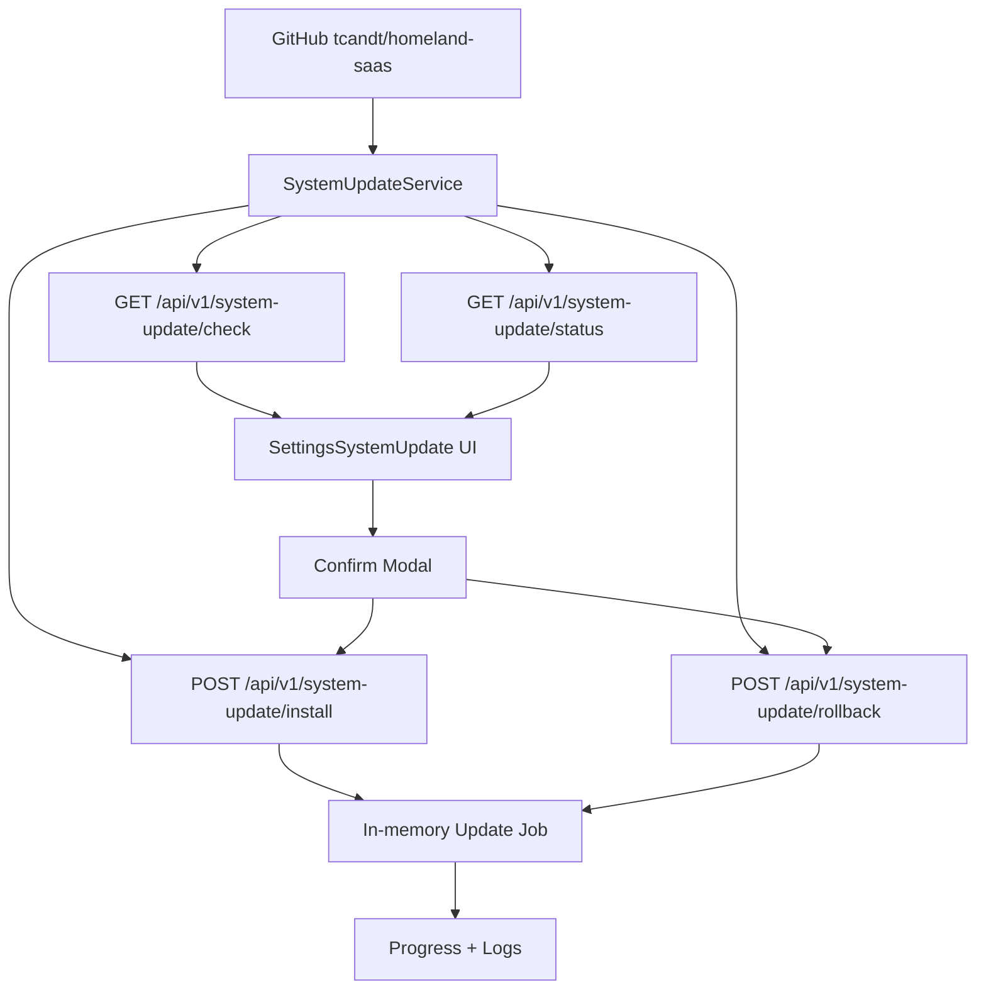

# System Update And Rollback

## Mục tiêu

Trang Settings > Cập nhật hệ thống cho phép `admin@homeland.vn` kiểm tra version mới, xem chi tiết thay đổi, tạo job cập nhật và tạo job rollback có kiểm soát.

Mặc định hệ thống chạy `SYSTEM_UPDATE_MODE=dry-run`, nghĩa là UI và API chỉ mô phỏng progress, không tự ghi đè source, không chạy migration và không restart service. Đây là lớp an toàn trước khi nối runner thật.

## Codegraph

## Mapping

| Layer | File | Trách nhiệm |
| --- | --- | --- |
| API module | `apps/api/src/system-update/system-update.module.ts` | Đăng ký controller/service |
| API controller | `apps/api/src/system-update/system-update.controller.ts` | Route check/status/install/rollback, chặn write nếu không phải `admin@homeland.vn` |
| API service | `apps/api/src/system-update/system-update.service.ts` | Đọc local SHA, remote SHA, tạo changelog an toàn, tạo job progress |
| Web API client | `apps/web/lib/api/system-update.api.ts` | Gọi endpoint system update |
| Web UI | `apps/web/components/settings/sections/SettingsSystemUpdate.tsx` | Card version, changelog, progress, modal xác nhận |
| Settings registry | `apps/web/app/settings/page.tsx` | Thêm section `system-update` |
| Env | `.env.example`, `.env.docker.example` | `SYSTEM_UPDATE_MODE`, repository, previous version |

## Trạng thái hiện tại

- `[x]` Check current commit và remote HEAD.
- `[x]` Hiển thị update available/changelog cơ bản.
- `[x]` Popup xác nhận cập nhật/rollback.
- `[x]` Job progress và log.
- `[x]` Chỉ `admin@homeland.vn` được install/rollback.
- `[x]` Mặc định không destructive.
- `[x]` Runner thật tải source vào release directory riêng khi `SYSTEM_UPDATE_MODE=enabled`.
- `[x]` Backup DB/env/source metadata tự động trước update.
- `[x]` Build/preflight thật trong release directory.
- `[x]` Switch active version manifest có khóa `SYSTEM_UPDATE_ALLOW_SWITCH=true`.
- `[ ]` Restart service thật bằng service manager production.
- `[ ]` Health check thật và auto rollback.

## Bật runner thật sau này

Chỉ bật `SYSTEM_UPDATE_MODE=enabled` sau khi có script đã nghiệm thu cho các bước:

1. Tạo backup DB bằng `pg_dump`.
2. Snapshot `.env` và metadata version hiện tại.
3. Tải release artifact hoặc checkout commit SHA cụ thể.
4. Cài dependency theo lockfile, không tự nâng/hạ version framework.
5. Build API/Web.
6. Chạy preflight.
7. Chỉ apply migration an toàn, không reset DB.
8. Switch active version khi `SYSTEM_UPDATE_ALLOW_SWITCH=true`.
9. Restart service bằng `SYSTEM_UPDATE_RESTART_COMMAND` hoặc service manager ngoài app.
10. Health check `/api/v1/health` và `/api/v1/health/ready`.
11. Rollback nếu health check fail.

## Quy tắc an toàn

- Không dùng `latest` mơ hồ khi update thật; phải dùng commit SHA hoặc release tag.
- Không commit secret vào Git.
- Không tự chạy destructive migration.
- Rollback code không đồng nghĩa rollback dữ liệu; nếu migration đã thay schema/data phải có restore drill hoặc rollback migration riêng.

## Runner thật đã nối

| Script | Vai trò |
| --- | --- |
| `scripts/update/install-version.ps1` | Backup `.env`, metadata, DB dump nếu có `pg_dump`; clone version mục tiêu vào `.codex-update/releases`; copy `.env`; chạy `npm ci`, `npm run build`, `check-mojibake`; ghi manifest |
| `scripts/update/rollback-version.ps1` | Tạo rollback manifest về version trước hoặc target version; nhắc rõ restore DB là thao tác riêng |

Biến môi trường:

| Env | Mặc định | Ý nghĩa |
| --- | --- | --- |
| `SYSTEM_UPDATE_MODE` | `dry-run` | `enabled` mới chạy runner thật |
| `SYSTEM_UPDATE_ROOT` | `.codex-update` | Nơi lưu release và manifest |
| `SYSTEM_UPDATE_RUN_BUILD` | `true` | `false` để bỏ qua build trong runner |
| `SYSTEM_UPDATE_ALLOW_SWITCH` | `false` | `true` mới ghi active manifest |
| `SYSTEM_UPDATE_RESTART_COMMAND` | rỗng | Lệnh restart service đã được duyệt |
| `SYSTEM_UPDATE_PG_DUMP_PATH` | rỗng | Đường dẫn `pg_dump` nếu không nằm ở vị trí mặc định |
| `SYSTEM_UPDATE_NPM_PATH` | rỗng | Đường dẫn `npm.cmd`/package manager đã duyệt |
| `SYSTEM_UPDATE_POWERSHELL_PATH` | rỗng | Đường dẫn PowerShell nếu service không thấy `powershell.exe` |

Ba mức vận hành:

1. `SYSTEM_UPDATE_MODE=dry-run`: chỉ mô phỏng progress, không chạy script.
2. `SYSTEM_UPDATE_MODE=enabled`, `SYSTEM_UPDATE_ALLOW_SWITCH=false`: chạy backup/clone/build/preflight thật, nhưng chưa chuyển active version và chưa restart.
3. `SYSTEM_UPDATE_MODE=enabled`, `SYSTEM_UPDATE_ALLOW_SWITCH=true`: ghi active manifest và chạy restart command nếu đã cấu hình.
