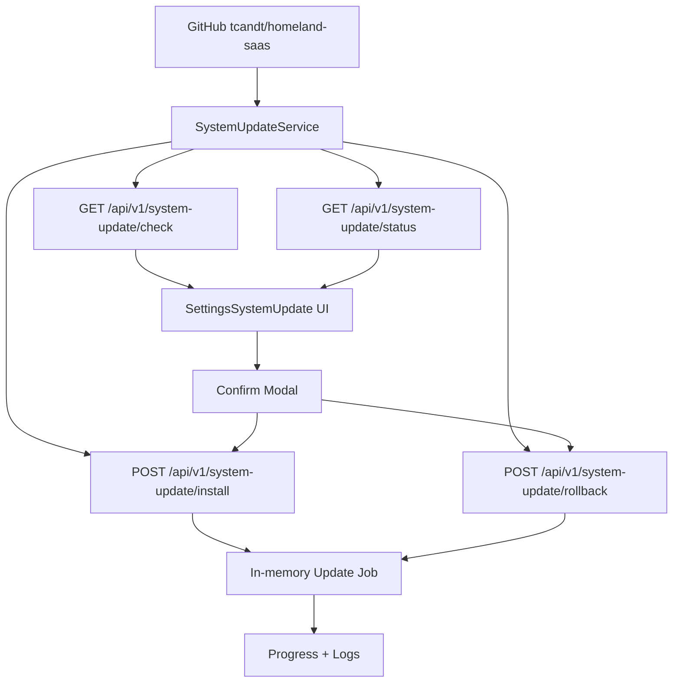

# System Update And Rollback

## Mục tiêu

Trang Settings > Cập nhật hệ thống cho phép `admin@homeland.vn` kiểm tra version mới, xem chi tiết thay đổi, tạo job cập nhật và tạo job rollback có kiểm soát.

Mặc định hệ thống chạy `SYSTEM_UPDATE_MODE=dry-run`, nghĩa là UI và API chỉ mô phỏng progress, không tự ghi đè source, không chạy migration và không restart service. Đây là lớp an toàn trước khi nối runner thật.

## Codegraph



## Mapping

| Layer | File | Trách nhiệm |
| --- | --- | --- |
| API module | `apps/api/src/system-update/system-update.module.ts` | Đăng ký controller/service |
| API controller | `apps/api/src/system-update/system-update.controller.ts` | Route check/status/install/rollback, chặn write nếu không phải `admin@homeland.vn` |
| API service | `apps/api/src/system-update/system-update.service.ts` | Đọc local SHA, remote SHA, tạo changelog an toàn, tạo job progress |
| Web API client | `apps/web/lib/api/system-update.api.ts` | Gọi endpoint system update |
| Web UI | `apps/web/components/settings/sections/SettingsSystemUpdate.tsx` | Card version, changelog, progress, modal xác nhận |
| Settings registry | `apps/web/app/settings/page.tsx` | Thêm section `system-update` |
| Env | `.env.example`, `.env.docker.example` | `SYSTEM_UPDATE_MODE`, repository, previous version |

## Trạng thái hiện tại

- `[x]` Check current commit và remote HEAD.
- `[x]` Hiển thị update available/changelog cơ bản.
- `[x]` Popup xác nhận cập nhật/rollback.
- `[x]` Job progress và log.
- `[x]` Chỉ `admin@homeland.vn` được install/rollback.
- `[x]` Mặc định không destructive.
- `[x]` Runner thật tải source vào release directory riêng khi `SYSTEM_UPDATE_MODE=enabled`.
- `[x]` Backup DB/env/source metadata tự động trước update.
- `[x]` Build/preflight thật trong release directory.
- `[x]` Switch active version manifest có khóa `SYSTEM_UPDATE_ALLOW_SWITCH=true`.
- `[ ]` Restart service thật bằng service manager production.
- `[ ]` Health check thật và auto rollback.

## Bật runner thật sau này

`SYSTEM_UPDATE_MODE=enabled` là biến môi trường của API service. Thiết lập trong file `.env` đang được API đọc, hoặc trong secret/environment của hệ thống deploy production, sau đó restart API để process mới nhận biến.

Ví dụ local/PM2:

```env
APP_VERSION=v1.0.0
SYSTEM_UPDATE_MODE=enabled
```

Ví dụ Docker Compose: đặt trong file `.env` cạnh `docker-compose.app.yml`; compose đang truyền `SYSTEM_UPDATE_MODE` vào service `api`.

```env
APP_VERSION=v1.0.0
SYSTEM_UPDATE_MODE=enabled
SYSTEM_UPDATE_ALLOW_SWITCH=false
```

Chỉ bật `SYSTEM_UPDATE_MODE=enabled` sau khi có script đã nghiệm thu cho các bước:

1. Tạo backup DB bằng `pg_dump`.
2. Snapshot `.env` và metadata version hiện tại.
3. Tải release artifact hoặc checkout commit SHA cụ thể.
4. Cài dependency theo lockfile, không tự nâng/hạ version framework.
5. Build API/Web.
6. Chạy preflight.
7. Chỉ apply migration an toàn, không reset DB.
8. Switch active version khi `SYSTEM_UPDATE_ALLOW_SWITCH=true`.
9. Restart service bằng `SYSTEM_UPDATE_RESTART_COMMAND` hoặc service manager ngoài app.
10. Health check `/api/v1/health` và `/api/v1/health/ready`.
11. Rollback nếu health check fail.

## Quy tắc an toàn

- Không dùng `latest` mơ hồ khi update thật; phải dùng commit SHA hoặc release tag.
- Không commit secret vào Git.
- Không tự chạy destructive migration.
- Rollback code không đồng nghĩa rollback dữ liệu; nếu migration đã thay schema/data phải có restore drill hoặc rollback migration riêng.

## Runner thật đã nối

| Script | Vai trò |
| --- | --- |
| `scripts/update/install-version.ps1` | Backup `.env`, metadata, DB dump nếu có `pg_dump`; clone version mục tiêu vào `.codex-update/releases`; copy `.env`; chạy `npm ci`, `npm run build`, `check-mojibake`; ghi manifest |
| `scripts/update/rollback-version.ps1` | Tạo rollback manifest về version trước hoặc target version; nhắc rõ restore DB là thao tác riêng |

Biến môi trường:

| Env | Mặc định | Ý nghĩa |
| --- | --- | --- |
| `APP_VERSION` | `unknown` | Version đang chạy để UI hiển thị dạng `v1.0.0`; khi build Docker có thể truyền bằng build arg `APP_VERSION` |
| `SYSTEM_UPDATE_MODE` | `dry-run` | `enabled` mới chạy runner thật |
| `SYSTEM_UPDATE_ROOT` | `.codex-update` | Nơi lưu release và manifest |
| `SYSTEM_UPDATE_RUN_BUILD` | `true` | `false` để bỏ qua build trong runner |
| `SYSTEM_UPDATE_ALLOW_SWITCH` | `false` | `true` mới ghi active manifest |
| `SYSTEM_UPDATE_RESTART_COMMAND` | rỗng | Lệnh restart service đã được duyệt |
| `SYSTEM_UPDATE_PG_DUMP_PATH` | rỗng | Đường dẫn `pg_dump` nếu không nằm ở vị trí mặc định |
| `SYSTEM_UPDATE_NPM_PATH` | rỗng | Đường dẫn `npm.cmd`/package manager đã duyệt |
| `SYSTEM_UPDATE_POWERSHELL_PATH` | rỗng | Đường dẫn PowerShell nếu service không thấy `powershell.exe` |
| `SYSTEM_UPDATE_SHELL_PATH` | rỗng | Đường dẫn shell Linux nếu service không thấy `bash` |
| `SYSTEM_UPDATE_API_HEALTH_URL` | `http://127.0.0.1:3001/api/v1/health/ready` | Health check API sau restart |
| `SYSTEM_UPDATE_WEB_HEALTH_URL` | `http://127.0.0.1:3000/login` | Health check web sau restart |
| `SYSTEM_UPDATE_HEALTH_TIMEOUT_SECONDS` | `90` | Timeout health check |

Ba mức vận hành:

1. `SYSTEM_UPDATE_MODE=dry-run`: chỉ mô phỏng progress, không chạy script.
2. `SYSTEM_UPDATE_MODE=enabled`, `SYSTEM_UPDATE_ALLOW_SWITCH=false`: chạy backup/clone/build/preflight thật, nhưng chưa chuyển active version và chưa restart.
3. `SYSTEM_UPDATE_MODE=enabled`, `SYSTEM_UPDATE_ALLOW_SWITCH=true`: ghi active manifest và chạy restart command nếu đã cấu hình.

## Linux + PM2

Phù hợp khi chạy trực tiếp trên VPS Linux, không đóng gói runtime bằng Docker.

File liên quan:

| File | Vai trò |
| --- | --- |
| `ecosystem.config.cjs` | Chạy `homeland-api` và `homeland-web` bằng PM2 |
| `scripts/update/restart-pm2.sh` | Đọc `.codex-update/current.json`, export `HOMELAND_RELEASE_PATH`, reload PM2 và health check |
| `scripts/update/health-check.sh` | Kiểm tra API và web sau restart |

Thiết lập một lần:

```bash
chmod +x scripts/update/*.sh
npm ci
npm run db:generate
npm run build
pm2 start ecosystem.config.cjs --update-env
pm2 save
```

Env staging mức 2:

```env
SYSTEM_UPDATE_MODE=enabled
SYSTEM_UPDATE_ALLOW_SWITCH=false
SYSTEM_UPDATE_RUN_BUILD=true
SYSTEM_UPDATE_RESTART_COMMAND=
SYSTEM_UPDATE_ROOT=.codex-update
SYSTEM_UPDATE_API_HEALTH_URL=http://127.0.0.1:3001/api/v1/health/ready
SYSTEM_UPDATE_WEB_HEALTH_URL=http://127.0.0.1:3000/login
```

Env production mức 3 sau khi mức 2 PASS:

```env
SYSTEM_UPDATE_MODE=enabled
SYSTEM_UPDATE_ALLOW_SWITCH=true
SYSTEM_UPDATE_RESTART_COMMAND="./scripts/update/restart-pm2.sh"
```

Luồng update:

1. Push code lên GitHub.
2. Đăng nhập `admin@homeland.vn`.
3. Vào Settings > Cập nhật hệ thống.
4. Bấm Kiểm tra version.
5. Bấm Cập nhật.
6. Theo dõi progress/log.
7. Sau restart, script health check API/Web.

Rollback PM2:

```env
SYSTEM_UPDATE_ALLOW_SWITCH=true
SYSTEM_UPDATE_RESTART_COMMAND="./scripts/update/restart-pm2.sh"
SYSTEM_UPDATE_PREVIOUS_VERSION=<commit-sha-truoc-do>
```

Sau đó bấm Rollback trên UI.

Runner hỗ trợ rollback một bước bằng `last-install-manifest.json`: khi update, hệ thống lưu `previousReleasePath`; khi rollback về `currentVersion` của lần update gần nhất, `restart-pm2.sh` sẽ đọc lại path này và reload PM2 về source cũ. Nếu cần rollback xa hơn một version hoặc rollback kèm thay đổi schema dữ liệu, phải dùng backup DB tương ứng và xác nhận thủ công trước khi switch.

## Docker + Linux

Phù hợp khi API/Web/PostgreSQL/Redis chạy bằng Docker Compose.

File liên quan:

| File | Vai trò |
| --- | --- |
| `Dockerfile.api` | Có thêm `git`, `curl`, `postgresql-client` để runner có thể clone/backup/check |
| `Dockerfile.web` | Build Next.js production |
| `docker-compose.yml` | PostgreSQL + Redis |
| `docker-compose.app.yml` | API + Web production services |
| `scripts/update/restart-docker.sh` | Host-side rebuild/recreate API/Web + health check |

Khởi chạy Docker production:

```bash
docker compose -f docker-compose.yml -f docker-compose.app.yml up -d --build
```

Env mức 2 trong Docker:

```env
SYSTEM_UPDATE_MODE=enabled
SYSTEM_UPDATE_ALLOW_SWITCH=false
SYSTEM_UPDATE_RUN_BUILD=true
SYSTEM_UPDATE_RESTART_COMMAND=
SYSTEM_UPDATE_ROOT=/app/.codex-update
SYSTEM_UPDATE_API_HEALTH_URL=http://api:3001/api/v1/health/ready
SYSTEM_UPDATE_WEB_HEALTH_URL=http://web:3000/login
```

Ở mức này API container sẽ backup/clone/build/preflight trong volume `.codex-update`, nhưng không restart container.

Docker restart có 2 phương án:

1. Host-controlled, khuyến nghị:

   Chạy update mức 2 từ UI, sau khi PASS thì SSH vào host và chạy:

   ```bash
   ./scripts/update/restart-docker.sh
   ```

   Cách này không cần mount Docker socket vào API container.

2. Web-controlled Docker restart, chỉ dùng khi đã chấp nhận rủi ro:

   - Cài Docker CLI trong API image hoặc dùng image có Docker CLI.
   - Mount Docker socket vào API container.
   - Cấu hình:

   ```env
   SYSTEM_UPDATE_ALLOW_SWITCH=true
   SYSTEM_UPDATE_RESTART_COMMAND="./scripts/update/restart-docker.sh"
   ```

   Docker socket gần tương đương quyền root trên host. Không bật trên production nếu chưa có giới hạn network, audit và backup off-host.

## Linux systemd wrapper cho PM2

PM2 có thể tự sinh systemd service:

```bash
pm2 startup systemd
pm2 save
systemctl status pm2-$(whoami)
```

Sau đó update runner chỉ cần gọi `pm2 startOrReload ecosystem.config.cjs --update-env` qua `restart-pm2.sh`.

## Checklist trước khi bật mức 3

- `[ ]` Mức 2 chạy PASS trên staging.
- `[ ]` Backup DB tạo được và restore drill PASS.
- `[ ]` Build release mới PASS.
- `[ ]` Health check API/Web PASS.
- `[ ]` PM2 hoặc Docker restart command đã test thủ công.
- `[ ]` Rollback code PASS.
- `[ ]` Nếu có migration, đã có kế hoạch rollback/restore DB.
- `[ ]` Log không chứa secret.
- `[ ]` Chỉ `admin@homeland.vn` có quyền bấm update/rollback.
