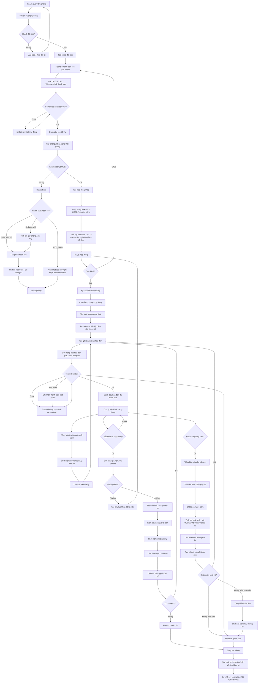
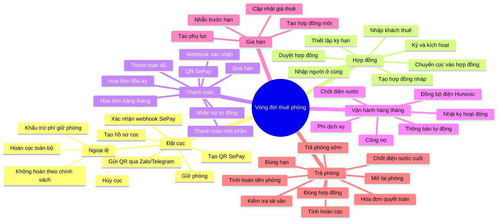
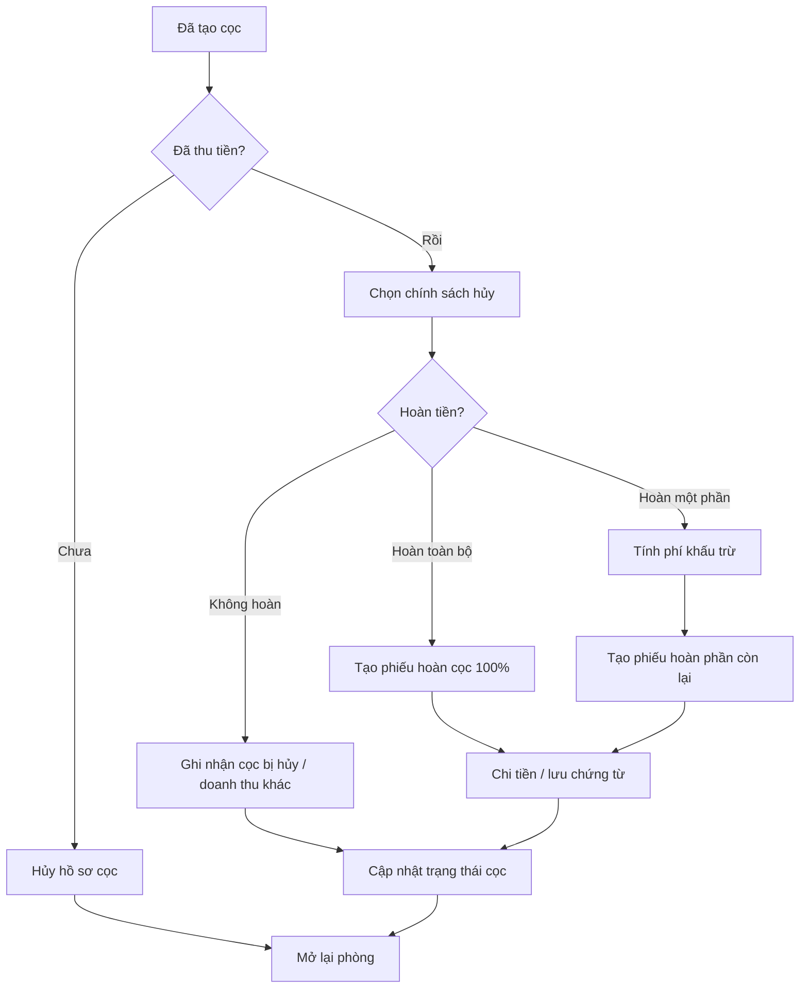
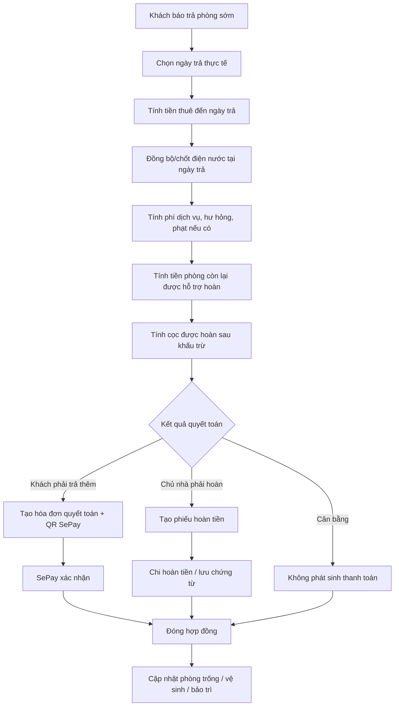
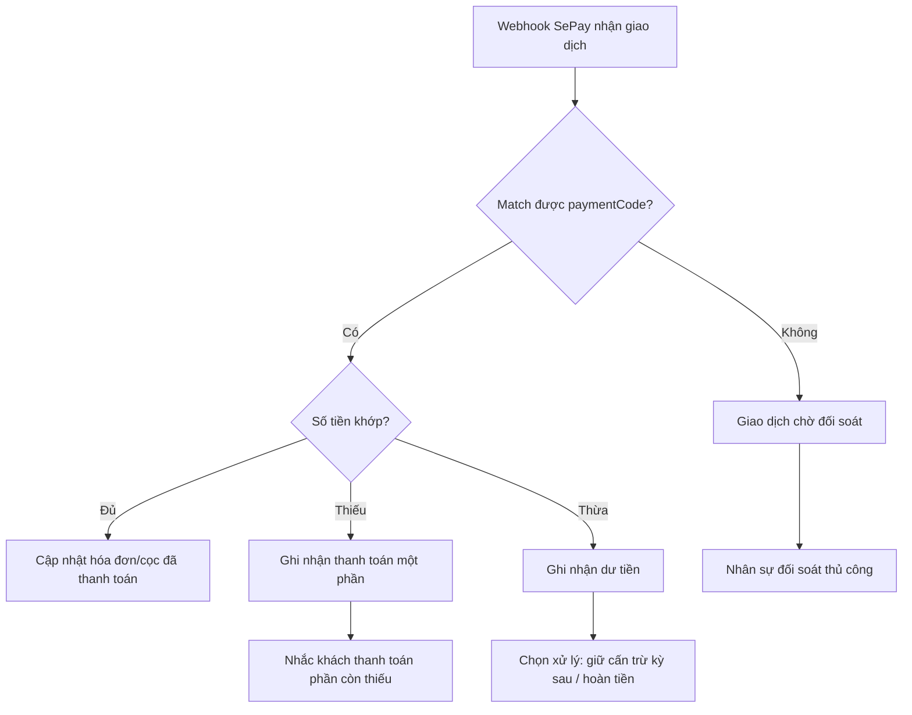

# Quy trình vòng đời thuê phòng HomeLand

Tài liệu này mô tả luồng vận hành từ đặt cọc đến hết hợp đồng, bao gồm các ngoại lệ như hủy cọc, hoàn cọc, trả phòng sớm, quyết toán điện nước, hoàn tiền phòng và các điểm tích hợp QR - SePay - Zalo/Telegram Bot.

## Flowchart tổng thể



## Mind map nghiệp vụ



## Quy trình chi tiết theo giai đoạn

| Giai đoạn | Trạng thái chính | Hành động hệ thống | Tích hợp tự động | Rủi ro cần kiểm soát |
|---|---|---|---|---|
| Tư vấn phòng | Lead / phòng trống | Lưu khách quan tâm, chọn phòng, ghi chú nhu cầu | Nhắc chăm sóc qua Telegram/Zalo nội bộ | Trùng khách, phòng đã được giữ bởi người khác |
| Đặt cọc | Cọc nháp, chờ thanh toán, đã thu | Tạo khoản cọc, QR SePay, gửi link/QR | SePay webhook, Zalo/Telegram gửi QR, audit log | Thanh toán sai nội dung, khách chuyển thiếu/thừa |
| Giữ phòng | Phòng đặt cọc | Khóa phòng tạm thời, hiển thị trạng thái đặt cọc | Nhắc hết hạn giữ phòng | Quên mở lại phòng khi hủy |
| Hủy cọc | Hủy / hoàn / khấu trừ | Tính số tiền hoàn, tạo phiếu chi hoàn cọc, lưu lý do | Thông báo trạng thái cho khách và nội bộ | Thiếu chứng từ hoàn tiền, chính sách không rõ |
| Tạo hợp đồng | Nháp, chờ duyệt, đã duyệt | Tạo hợp đồng từ phòng + khách + cọc, kiểm tra dữ liệu bắt buộc | Nhắc duyệt hợp đồng | Sai kỳ hạn, sai tiền thuê, thiếu CCCD/người ở |
| Kích hoạt | Đang hiệu lực | Chuyển cọc sang hợp đồng, cập nhật phòng đang thuê, tạo hóa đơn đầu kỳ | Gửi hợp đồng/hóa đơn | Kích hoạt khi cọc chưa đủ |
| Thanh toán định kỳ | Hóa đơn nháp, đã phát hành, trả một phần, đã trả, quá hạn | Tạo hóa đơn, QR, ghi nhận thanh toán, phân bổ tiền | SePay webhook, nhắc nợ Zalo/Telegram | Trùng hóa đơn tháng, phân bổ sai thanh toán |
| Điện nước | Chưa chốt, đã chốt | Đồng bộ Hunonic, chốt chỉ số, tính tiền điện nước/dịch vụ | Sync 1 giờ/lần, job tạo hóa đơn | Chỉ số thiếu/trùng, cần khóa kỳ đã chốt |
| Sắp hết hạn | HĐ sắp hết hạn | Nhắc gia hạn/trả phòng, tạo phụ lục hoặc hợp đồng mới | Bot nhắc trước 30/15/7 ngày | Quên gia hạn, phòng bị mở bán sai |
| Trả phòng đúng hạn | Quyết toán | Kiểm tra tài sản, chốt điện nước, tính công nợ/hoàn cọc | QR quyết toán, thông báo kết quả | Bỏ sót phí phát sinh, chưa thu đủ công nợ |
| Trả phòng sớm | Chấm dứt sớm | Tính tiền thuê theo ngày, chốt điện nước sớm, hoàn tiền phòng còn lại nếu hỗ trợ | QR phần phải thu hoặc phiếu hoàn tiền | Chính sách hoàn tiền không rõ, cần phê duyệt |
| Kết thúc | Đã chấm dứt | Đóng hợp đồng, lưu chứng từ, chuyển phòng trống/vệ sinh/bảo trì | Audit log, thông báo nội bộ | Phòng chưa dọn nhưng đã mở bán |

## Các nhánh ngoại lệ cần có

### 1. Đặt cọc rồi hủy



Điểm cần có trong hệ thống:
- Lý do hủy cọc.
- Người duyệt hoàn cọc.
- Số tiền cọc ban đầu, số tiền khấu trừ, số tiền hoàn.
- Chứng từ hoàn tiền.
- Trạng thái phòng sau hủy.

### 2. Trả phòng sớm và hoàn tiền phòng



Điểm cần có trong hệ thống:
- Công thức tính tiền thuê theo ngày.
- Cấu hình có hỗ trợ hoàn tiền phòng hay không.
- Tỷ lệ/số ngày được hoàn.
- Quy định tiền nước, điện, dịch vụ khi trả sớm.
- Phê duyệt khoản hoàn tiền lớn.

### 3. Thanh toán thiếu, thừa hoặc sai nội dung



Điểm cần có trong hệ thống:
- Màn hình giao dịch chờ đối soát.
- Cơ chế xử lý dư tiền.
- Không tạo trùng payment khi webhook gửi lại.
- Audit log đầy đủ.

## Tích hợp QR - SePay - Zalo/Telegram

| Sự kiện | QR/SePay | Zalo/Telegram Bot | Ghi log |
|---|---|---|---|
| Tạo cọc | Tạo payment request cho cọc | Gửi QR và hạn thanh toán | `deposit.payment_requested` |
| SePay báo cọc đã thu | Webhook cập nhật cọc | Báo nội bộ và xác nhận khách | `deposit.collected` |
| Tạo hóa đơn | Tạo payment request cho hóa đơn | Gửi QR hóa đơn | `invoice.payment_requested` |
| Hóa đơn quá hạn | Không tạo QR mới nếu còn hiệu lực | Nhắc nợ theo lịch | `invoice.overdue_reminder_sent` |
| Thanh toán một phần | Ghi nhận allocation | Báo còn thiếu | `invoice.partially_paid` |
| Thanh toán đủ | Đóng hóa đơn | Báo đã nhận tiền | `invoice.paid` |
| Hủy cọc / hoàn cọc | Không dùng SePay thu, cần phiếu chi | Báo kết quả xử lý | `deposit.refund_requested/paid` |
| Quyết toán trả phòng | Tạo QR nếu còn phải thu | Gửi bảng quyết toán | `contract.final_settlement_issued` |

## Mô hình nhiều chủ dùng chung vận hành

Hai chủ sở hữu theo dõi chung trên cùng website và cùng luồng SePay, nhưng cần có account riêng để truy vết lịch sử đăng nhập, thay đổi và chỉnh sửa. Hệ thống vẫn phải tách dữ liệu tài chính theo chủ sở hữu ở tầng nghiệp vụ, không phụ thuộc vào việc vận hành chung một màn hình quản trị.

### Mapping chủ sở hữu hiện tại

| Chủ sở hữu | Account quản trị | Tòa thuộc chủ | Quyền nhạy cảm |
|---|---|---|---|
| Tính | `adminA@homeland.local` | `LK01-31`, `LK08-25` | Owner/admin toàn quyền, được chỉnh token tích hợp |
| Thể | `adminB@homeland.local` | `LK01-32`, `LK08-24` | Owner/admin toàn quyền, được chỉnh token tích hợp |
| Admin vận hành | `admin@homeland.local` | Xem và vận hành chung | Không được chỉnh token, cookie, mật khẩu tích hợp |

### Nguyên tắc phân tách

| Thành phần | Cách xử lý đề xuất | Mục tiêu kiểm soát |
|---|---|---|
| Chủ sở hữu | Mỗi chủ có một hồ sơ owner riêng | Biết tòa/phòng/doanh thu/chi phí thuộc chủ nào |
| Tòa nhà | Mỗi tòa gắn với một chủ chính, hoặc tỷ lệ sở hữu nếu có đồng sở hữu | Chia lợi nhuận đúng theo quyền sở hữu |
| Tài khoản admin | Owner A/B có account riêng; admin vận hành dùng account chung nhưng bị chặn thao tác token nhạy cảm | Truy vết được người đăng nhập/thao tác và giảm rủi ro lộ token |
| Bank SePay | Tích hợp nhiều tài khoản bank vào cùng luồng SePay | Webhook phải nhận diện bank account để phân bổ tiền vào đúng chủ/tòa |
| Payment request | Mỗi QR cần lưu `bankAccountId`, `ownerId`, `buildingId`, `sourceType`, `sourceId` | Tránh tiền vào sai tài khoản nhưng hệ thống không biết |
| Đối soát | Một màn đối soát chung, lọc theo bank/chủ/tòa/phòng | Theo dõi tất cả dòng tiền tại một nơi |

### Chi phí phát sinh và người ứng tiền

Mọi chi phí phát sinh trong vận hành phải được nhập vào module Chi phí/Finance, không nhập rời rạc trong ghi chú. Nếu một người ứng tiền trước, hệ thống cần lưu người chi để khấu trừ hoặc hoàn lại khi chia lợi nhuận.

| Trường dữ liệu | Bắt buộc | Ghi chú |
|---|---|---|
| Tòa nhà | Có | Dùng để phân bổ về đúng chủ |
| Phòng | Không bắt buộc | Có nếu chi phí gắn với phòng cụ thể |
| Chủ sở hữu | Có, có thể suy ra từ tòa | Dùng cho báo cáo chia lợi nhuận |
| Người chi/ứng tiền | Có | Ví dụ chủ A, chủ B, admin, nhân viên |
| Loại chi phí | Có | Vật tư, sửa chữa, điện nước chung, vệ sinh, hoàn tiền khách, khác |
| Số tiền | Có | Có thể có nhiều dòng chi tiết XXX, YYY, ZZZ |
| Tài khoản thanh toán | Có nếu đã chi từ bank/quỹ | Đối chiếu với sổ quỹ/ngân hàng |
| Ảnh/chứng từ | Nên có | Hóa đơn, ảnh chuyển khoản, phiếu mua hàng |
| Trạng thái duyệt | Có | Nháp, chờ duyệt, đã duyệt, đã chi, hủy |
| Cách xử lý khi chia lợi nhuận | Có | Khấu trừ vào lợi nhuận chủ tương ứng hoặc hoàn lại người ứng |

### Công thức chia lợi nhuận theo chủ

```text
Doanh thu thuần theo chủ
- Chi phí trực tiếp của các tòa thuộc chủ
- Chi phí chung được phân bổ
- Khoản phải hoàn/khấu trừ cho người đã ứng tiền
= Lợi nhuận còn lại cần chia/trả
```

Ví dụ: nếu chủ A ứng tiền mua dụng cụ cho tòa thuộc chủ B, khoản chi vẫn gắn vào tòa/chủ B, nhưng `paidBy` là chủ A. Khi quyết toán, hệ thống ghi nhận chủ B phải hoàn lại hoặc cấn trừ cho chủ A.

## Rà soát thiếu sót quy trình

| Mảng | Cần kiểm tra trong hệ thống | Mức ưu tiên |
|---|---|---|
| Hủy cọc | Có màn hình hoàn cọc/khấu trừ/không hoàn và chứng từ hoàn tiền chưa | Cao |
| Đối soát SePay | Có hàng chờ giao dịch không match paymentCode chưa | Cao |
| Trả phòng sớm | Có công thức tính tiền thuê theo ngày và khoản hoàn tiền phòng chưa | Cao |
| Chốt điện nước sớm | Có nút chốt điện nước tại ngày trả phòng chưa | Cao |
| Khóa kỳ điện nước | Có khóa kỳ đã chốt để tránh sync ghi đè không | Cao |
| Hoàn tiền | Có phiếu chi hoàn tiền và phê duyệt không | Cao |
| Dư tiền | Có xử lý cấn trừ kỳ sau hoặc hoàn tiền không | Trung bình |
| Nhắc nợ | Có lịch nhắc trước/sau hạn qua Zalo/Telegram không | Trung bình |
| Gia hạn | Có phụ lục hợp đồng hoặc tạo hợp đồng nối tiếp không | Trung bình |
| Kiểm kê tài sản | Có checklist tình trạng phòng khi trả không | Trung bình |
| Phòng sau trả | Có trạng thái vệ sinh/bảo trì trước khi mở bán lại không | Trung bình |
| Audit log | Mọi chuyển trạng thái tiền/hợp đồng/phòng có log chưa | Cao |
| Nhiều chủ sở hữu | Tòa nhà đã gắn owner và báo cáo được theo từng chủ chưa | Cao |
| Nhiều bank SePay | Payment request/webhook đã lưu bank account để phân bổ dòng tiền chưa | Cao |
| Chi phí phát sinh | Có màn nhập chi phí với người ứng tiền, chứng từ, tòa/phòng/chủ chưa | Cao |
| Chia lợi nhuận | Có báo cáo doanh thu - chi phí - khoản hoàn ứng - lợi nhuận còn lại theo chủ chưa | Cao |

## Đề xuất trạng thái chuẩn

### Deposit

- `DRAFT`: mới tạo, chưa gửi thanh toán.
- `PENDING_PAYMENT`: đã tạo QR, chờ thanh toán.
- `PAID`: đã thu cọc.
- `CONVERTED_TO_CONTRACT`: đã chuyển sang hợp đồng.
- `CANCELLED`: hủy trước khi thu.
- `REFUND_PENDING`: chờ hoàn.
- `REFUNDED`: đã hoàn.
- `FORFEITED`: cọc bị giữ lại theo chính sách.

### Contract

- `DRAFT`: nháp.
- `PENDING_APPROVAL`: chờ duyệt.
- `APPROVED`: đã duyệt.
- `ACTIVE`: đang hiệu lực.
- `EXPIRING`: sắp hết hạn.
- `EXPIRED`: hết hạn tự nhiên.
- `TERMINATED`: chấm dứt sớm/đã trả phòng.
- `CANCELLED`: hủy trước khi hiệu lực.

### Invoice

- `DRAFT`: nháp.
- `ISSUED`: đã phát hành.
- `PARTIALLY_PAID`: trả một phần.
- `PAID`: đã trả đủ.
- `OVERDUE`: quá hạn.
- `CANCELLED`: hủy.
- `WRITTEN_OFF`: xóa nợ/ghi nhận không thu.

## Gợi ý màn hình cần bổ sung

1. **Bảng quyết toán trả phòng**: tiền thuê theo ngày, điện, nước, dịch vụ, khấu trừ, hoàn cọc, hoàn tiền phòng.
2. **Màn hình hoàn cọc/hoàn tiền**: số tiền, lý do, người duyệt, chứng từ.
3. **Đối soát SePay**: giao dịch không khớp, thiếu, thừa, trùng webhook.
4. **Chốt điện nước**: chốt kỳ tháng và chốt sớm theo ngày trả phòng.
5. **Checklist trả phòng**: tài sản, vệ sinh, hình ảnh, phí phát sinh.
6. **Rule thông báo tự động**: lịch nhắc cọc, hóa đơn, quá hạn, sắp hết hợp đồng, trả phòng.
7. **Quản lý chủ sở hữu**: gắn owner cho từng tòa, cấu hình tỷ lệ chia nếu có đồng sở hữu.
8. **Chi phí phát sinh**: nhập khoản chi, người ứng tiền, tòa/phòng/chủ, chứng từ và trạng thái duyệt.
9. **Báo cáo chia lợi nhuận**: tổng thu, tổng chi, khoản hoàn ứng/khấu trừ và số còn lại theo từng chủ.

## Checklist triển khai hiện tại

Phần này ghi lại các việc đã hoàn thành và các việc cần làm tiếp theo để đưa hệ thống từ mức MVP sang vận hành thực tế cho mô hình 4 tòa, 2 chủ, dùng chung account admin, nhiều bank SePay và có chi phí phát sinh.

### Đã hoàn thành

#### 1. Tài liệu nghiệp vụ

- [x] Tạo tài liệu vòng đời thuê phòng `docs/product/rental-lifecycle-flow.md`.
- [x] Mô tả flow từ đặt cọc, giữ phòng, tạo hợp đồng, kích hoạt hợp đồng, tạo hóa đơn, thanh toán định kỳ, vận hành hàng tháng, trả phòng và kết thúc hợp đồng.
- [x] Mô tả ngoại lệ hủy cọc, hoàn cọc, khấu trừ cọc, trả phòng sớm, quyết toán điện nước và hoàn tiền phòng.
- [x] Mô tả tích hợp QR, SePay, Zalo Bot và Telegram Bot trong các điểm chạm vận hành.
- [x] Bổ sung mô hình 2 chủ dùng chung một account admin.
- [x] Bổ sung mô hình nhiều tài khoản bank SePay theo owner nhưng theo dõi chung trên website.
- [x] Bổ sung yêu cầu chi phí phát sinh phải lưu người chi hoặc người ứng tiền để hoàn ứng/khấu trừ khi chia lợi nhuận.

#### 2. Database và Prisma

- [x] Thêm migration `20260809020000_add_owner_expense_allocation`.
- [x] Thêm model `Owner`.
- [x] Thêm `Building.ownerId` để gắn tòa nhà với chủ sở hữu.
- [x] Thêm `BankAccount.ownerId` để gắn bank SePay với chủ sở hữu.
- [x] Thêm `PaymentRequest.ownerId`, `buildingId`, `roomId`, `bankAccountId` để phân bổ dòng tiền.
- [x] Thêm `CostCenter.ownerId` và `buildingId` để báo cáo theo tòa/chủ.
- [x] Mở rộng `Expense` với owner, building, room, người chi, loại chi phí, nhà cung cấp, chứng từ, trạng thái duyệt và trạng thái quyết toán.
- [x] Thêm enum `ExpenseCategory`.
- [x] Thêm enum `ExpenseSettlementStatus`.
- [x] Baseline Prisma migration history bằng `prisma migrate resolve --applied`.
- [x] Xác nhận `prisma migrate status` báo database schema up to date.

#### 3. Seed và dữ liệu dev

- [x] Seed `Owner A`.
- [x] Seed `Owner B`.
- [x] Seed owner Tính với account `adminA@homeland.local`.
- [x] Seed owner Thể với account `adminB@homeland.local`.
- [x] Gắn `LK01.31` và `LK08.25` với owner Tính.
- [x] Gắn `LK01.32` và `LK08.24` với owner Thể.
- [x] Seed 2 bank account mẫu tương ứng 2 owner.
- [x] Backfill cost center theo building và owner.
- [x] Chạy seed lại an toàn bằng upsert, không reset dữ liệu.

#### 4. Backend Finance

- [x] Thêm API `GET /finance/owners`.
- [x] Thêm API `GET /finance/owners/profit-summary`.
- [x] Thêm API `GET /finance/banks/cashflow`.
- [x] Thêm API `GET /finance/expenses`.
- [x] Thêm API `POST /finance/expenses`.
- [x] Thêm API `PATCH /finance/expenses/:id/approve`.
- [x] Thêm logic tạo chi phí phát sinh.
- [x] Thêm logic duyệt chi phí và tùy chọn đánh dấu đã chi.
- [x] Thêm báo cáo chia lợi nhuận theo chủ.
- [x] Tính khoản owner đã ứng hộ.
- [x] Tính khoản owner phải hoàn/khấu trừ cho owner khác.
- [x] Cập nhật tenant isolation cho `Owner`, `BankAccount`, `CashAccount`, `ChartOfAccount`, `CostCenter`, `Expense`, `Receipt`, `JournalEntry`, `JournalLine`, `Reconciliation`.

#### 5. SePay và Payment

- [x] Payment request có metadata owner/building/room/bank.
- [x] Tạo QR thanh toán chọn bank theo owner nếu suy ra được từ phòng/tòa.
- [x] Ưu tiên bank mặc định của owner khi tạo QR SePay, fallback an toàn về bank đang bật đầu tiên.
- [x] Fallback về bank active đầu tiên nếu chưa xác định được owner.
- [x] Giữ tương thích với luồng payment cũ.

#### 6. Frontend Finance

- [x] Thêm API client cho owner, owner profit summary và expenses.
- [x] Thêm query hook cho owner profit summary.
- [x] Thêm block `Chia loi nhuan theo chu` trên trang Finance.
- [x] Thêm modal `Them chi phi` trên trang Finance.
- [x] Modal tạo chi phí có các trường: tòa nhà, chủ sở hữu suy ra, loại chi phí, trạng thái, số tiền, người chi/ứng tiền, nhà cung cấp và mô tả.
- [x] Nối modal tạo chi phí với `POST /finance/expenses`.
- [x] Invalidate lại owner profit summary, expense list và ledger sau khi tạo chi phí.

#### 7. Kiểm tra đã chạy

- [x] `node scripts/check-mojibake.js`.
- [x] `npx prisma validate --schema=packages/database/prisma/schema.prisma`.
- [x] `npm run typecheck --workspace=api`.
- [x] `npm run typecheck --workspace=web`.
- [x] `npx prisma migrate status --schema=packages/database/prisma/schema.prisma`.
- [x] Test API `GET /api/v1/dashboard` trả `200`.
- [x] Test API `GET /api/v1/buildings?limit=100` trả `200`.
- [x] Test API `GET /api/v1/finance/owners/profit-summary` trả `200`.
- [x] Test API `POST /api/v1/finance/expenses` tạo chi phí thành công.

### Dữ liệu test cần quyết định

- [ ] Quyết định có giữ hoặc xóa khoản test tạo bằng API hay không.
- [ ] Khoản test hiện tại:
  - Expense ID: `cmslbshz700044pujl79iqkv3`
  - Tòa: `LK01.31`
  - Số tiền: `1.000`
  - Người chi: `Codex TEST`
  - Trạng thái: `PENDING`
  - Mô tả: `TEST expense creation flow - safe small amount`
- [ ] Nếu xóa, ưu tiên soft-delete hoặc thao tác có backup, không xóa cứng.

## Todo phát triển tiếp theo

### 1. Hoàn thiện bảng chi phí phát sinh

- [x] Thêm bảng danh sách chi phí trên trang Finance.
- [x] Hiển thị mã chi phí.
- [x] Hiển thị ngày phát sinh.
- [x] Hiển thị tòa nhà thông qua cost center.
- [x] Hiển thị phòng nếu có.
- [x] Hiển thị chủ chịu chi phí.
- [x] Hiển thị người chi/người ứng tiền.
- [x] Hiển thị loại chi phí.
- [x] Hiển thị nhà cung cấp.
- [x] Hiển thị số tiền.
- [x] Hiển thị trạng thái duyệt.
- [x] Hiển thị trạng thái hoàn ứng/khấu trừ.
- [x] Hiển thị chứng từ nếu có.
- [x] Thêm lọc theo tháng.
- [x] Thêm lọc theo năm.
- [x] Thêm lọc theo tòa.
- [x] Thêm lọc theo owner.
- [x] Thêm lọc theo người chi qua ô tìm kiếm.
- [x] Thêm lọc theo loại chi phí.
- [x] Thêm lọc theo trạng thái.
- [x] Thêm tìm kiếm theo mô tả, mã chi phí, nhà cung cấp.
- [x] Thêm phân trang.
- [x] Thêm trạng thái loading, empty, error.
- [ ] Tối ưu responsive mobile.

### 2. Workflow duyệt chi và hoàn ứng

- [x] Thêm nút duyệt chi phí.
- [x] Thêm nút đánh dấu đã chi.
- [x] Thêm nút hủy chi phí.
- [x] Thêm nút đánh dấu đã hoàn ứng.
- [x] Thêm nút đánh dấu đã khấu trừ vào lợi nhuận.
- [x] Thêm popup xác nhận trước khi duyệt/đánh dấu đã chi.
- [x] Lưu `approvedBy`.
- [x] Lưu `approvedAt`.
- [x] Lưu `reimbursedAt`.
- [x] Ghi audit log cho mỗi lần đổi trạng thái.
- [x] Ghi audit log khi tạo chi phí phát sinh.
- [x] Khóa không cho chuyển ngược chi phí đã `PAID` về trạng thái khác qua endpoint approve.
- [x] Không cho sửa số tiền sau khi đã posted journal, trừ khi tạo bút toán điều chỉnh.

### 3. Upload và quản lý chứng từ chi phí

- [x] Thêm upload ảnh hóa đơn/chứng từ.
- [x] Cho phép nhiều file trên một khoản chi.
- [x] Preview chứng từ trong modal tạo chi phí.
- [x] Lưu `attachmentUrls`.
- [x] Kiểm tra dung lượng file.
- [x] Kiểm tra loại file hợp lệ.
- [x] Thêm quyền xem/tải chứng từ.

### 4. Báo cáo chia lợi nhuận theo owner

- [x] Làm màn chi tiết cho từng owner.
- [x] Hiển thị danh sách tòa thuộc owner.
- [x] Hiển thị tổng doanh thu.
- [x] Hiển thị tổng chi phí.
- [x] Hiển thị lợi nhuận trước hoàn ứng.
- [x] Hiển thị khoản owner đã ứng hộ cho owner khác.
- [x] Hiển thị khoản owner phải hoàn cho người khác.
- [x] Hiển thị lợi nhuận sau hoàn ứng/khấu trừ.
- [x] Lọc theo tháng/quý/năm.
- [x] Drill-down từ owner xuống tòa.
- [x] Drill-down từ tòa xuống phòng.
- [x] Drill-down từ phòng xuống hợp đồng/hóa đơn/chi phí.
- [x] Export Excel.
- [x] Export PDF.
- [x] Thêm biểu đồ xu hướng lợi nhuận theo tháng.

### 5. Báo cáo theo tòa nhà

- [x] Thay block placeholder Building P&L bằng dữ liệu thật.
- [x] Doanh thu thuê phòng theo tòa.
- [x] Doanh thu điện theo tòa.
- [x] Doanh thu nước/dịch vụ theo tòa.
- [x] Chi phí trực tiếp theo tòa.
- [x] Lợi nhuận theo tòa.
- [x] Công nợ theo tòa.
- [x] Tỷ lệ lấp đầy theo tòa.
- [x] So sánh 4 tòa trên cùng một màn hình.
- [x] Cảnh báo tòa có chi phí bất thường.

### 6. Đối soát SePay

- [x] Thêm màn đối soát SePay read-only trên Finance page.
- [x] Hiển thị giao dịch khớp hóa đơn.
- [x] Hiển thị giao dịch khớp cọc.
- [x] Hiển thị giao dịch thiếu tiền.
- [x] Hiển thị giao dịch thừa tiền.
- [x] Hiển thị giao dịch sai nội dung/chưa match payment code.
- [x] Hiển thị giao dịch sai bank.
- [x] Hiển thị giao dịch treo chưa match payment code.
- [x] Cho phép gán thủ công giao dịch vào hóa đơn/cọc.
- [x] Ghi nhận thanh toán một phần.
- [ ] Xử lý thừa tiền bằng hoàn lại, dư có hoặc cấn trừ kỳ sau.
- [x] Cảnh báo nếu tiền vào bank không thuộc owner của tòa/phòng.
- [x] Chống ghi nhận trùng webhook.
- [x] Log toàn bộ webhook raw payload.

### 7. Hạch toán tự động

- [x] Thu cọc tạo journal entry.
- [x] Thanh toán hóa đơn tạo journal entry.
- [x] Chi phí đã chi tạo journal entry.
- [ ] Hoàn cọc tạo journal entry.
- [ ] Hoàn tiền phòng tạo journal entry.
- [ ] Khấu trừ cọc tạo journal entry.
- [ ] Cấn trừ dư tiền kỳ sau tạo journal entry.
- [x] Đảm bảo journal entry chi phí cân bằng debit/credit.
- [x] Chống tạo trùng journal entry chi phí theo `sourceType` và `sourceId`.
- [x] Cho phép reversal thay vì sửa/xóa bút toán đã posted.

### 8. Quyết toán trả phòng

- [ ] Thêm Settlement Engine.
- [ ] Tạo màn bảng quyết toán trả phòng.
- [ ] Chọn hợp đồng cần trả phòng.
- [ ] Chọn ngày trả phòng thực tế.
- [ ] Tính tiền thuê theo ngày.
- [ ] Chốt điện tại ngày trả phòng.
- [ ] Chốt nước tại ngày trả phòng.
- [ ] Tính phí dịch vụ còn lại.
- [ ] Tính phí phát sinh/hư hỏng.
- [ ] Tính hỗ trợ nước nếu có.
- [ ] Tính hoàn tiền phòng nếu trả sớm và chính sách cho phép.
- [ ] Tính hoàn cọc.
- [ ] Tính khấu trừ cọc.
- [ ] Tạo hóa đơn quyết toán nếu khách còn phải trả.
- [ ] Tạo phiếu hoàn tiền nếu hệ thống phải trả lại khách.
- [ ] Ghi chứng từ và audit log.
- [ ] Chuyển phòng sang `CLEANING` hoặc `MAINTENANCE`.
- [ ] Sau khi hoàn tất vệ sinh/bảo trì, chuyển phòng về `AVAILABLE`.

### 9. Đặt cọc nâng cao

- [ ] Hoàn cọc toàn phần.
- [ ] Hoàn cọc một phần.
- [ ] Giữ cọc theo chính sách.
- [ ] Khấu trừ phí từ cọc.
- [ ] Tạo phiếu chi hoàn cọc.
- [ ] Phê duyệt hoàn cọc.
- [ ] Lưu lý do hủy/hoàn/giữ cọc.
- [ ] Lưu chứng từ hoàn tiền.
- [ ] Gửi thông báo cho khách và nội bộ.
- [x] Không cho `cancel` cọc đã paid nếu chưa chọn rõ hoàn/giữ/khấu trừ.

### 10. Hóa đơn và công nợ

- [x] Hỗ trợ thanh toán một phần.
- [ ] Hỗ trợ dư tiền khách.
- [ ] Cấn trừ dư tiền vào kỳ sau.
- [ ] Hoàn dư tiền nếu cần.
- [x] Tự động chuyển hóa đơn sang quá hạn.
- [ ] Nhắc nợ trước hạn.
- [ ] Nhắc nợ sau hạn.
- [x] Báo cáo công nợ theo khách.
- [x] Báo cáo công nợ theo phòng.
- [x] Báo cáo công nợ theo tòa.
- [x] Báo cáo công nợ theo owner.

### 11. Hunonic và điện nước

- [ ] Khóa kỳ điện đã chốt để sync không ghi đè.
- [ ] Chốt điện sớm khi trả phòng.
- [ ] Lưu snapshot chỉ số tại thời điểm quyết toán.
- [ ] Tính điện theo giá EVN.
- [ ] Tính điện theo giá custom.
- [ ] Gắn doanh thu điện về đúng owner/building/room.
- [ ] Đối chiếu dữ liệu Hunonic với hóa đơn đã phát hành.
- [ ] Cảnh báo chỉ số thiếu/trùng/bất thường.
- [ ] Export lịch sử điện theo phòng/tháng/năm.

### 12. Thông báo tự động

- [ ] Gửi thông báo tạo cọc.
- [ ] Gửi thông báo cọc đã thu.
- [ ] Gửi hóa đơn mới.
- [ ] Gửi xác nhận thanh toán thành công.
- [ ] Gửi nhắc quá hạn.
- [ ] Gửi nhắc sắp hết hợp đồng.
- [ ] Gửi yêu cầu duyệt chi.
- [ ] Gửi thông báo chi phí phát sinh mới.
- [ ] Gửi thông báo quyết toán trả phòng.
- [ ] Gửi cảnh báo SePay không khớp.
- [ ] Thêm retry nếu gửi thất bại.
- [ ] Log trạng thái gửi Zalo/Telegram.

### 13. Owner và Bank Management

- [x] Thêm màn cấu hình owner trong Settings.
- [x] Thêm sửa tên hiển thị owner trong Settings.
- [x] Thêm thông tin liên hệ owner trong Settings.
- [x] Gắn tòa với owner trong seed và backfill an toàn.
- [x] Hiển thị mapping cố định: Tính quản lý LK01-31/LK08-25, Thể quản lý LK01-32/LK08-24.
- [ ] Đổi owner của tòa có audit log.
- [x] Thêm màn tra cứu bank theo owner trong Settings.
- [x] Chọn bank mặc định cho owner trong Settings và dùng khi tạo QR SePay.
- [ ] Kiểm tra bank đang dùng bởi payment request trước khi tắt/xóa.
- [x] Báo cáo dòng tiền theo bank trên Finance page.

### 14. Bảo mật và phân quyền

- [x] Seed account riêng `adminA@homeland.local` và `adminB@homeland.local` cho hai owner.
- [x] Chặn admin thường chỉnh token, cookie, mật khẩu Hunonic ở backend.
- [x] Khóa input token/mật khẩu Hunonic trên UI nếu không phải owner admin A/B.
- [x] Lưu IP/User-Agent vào audit log khi login thành công hoặc thất bại.
- [x] Ghi audit log khi lưu Settings, có redact token/cookie/mật khẩu nhạy cảm.
- [x] Ghi audit log khi admin thường bị chặn chỉnh token Hunonic.
- [x] Thêm API `GET /audit/logs` để xem lịch sử thao tác gần nhất.
- [x] Hiển thị lịch sử Auth/Settings trong màn Owner Management.
- [x] Quyền xem tài chính.
- [x] Quyền tạo chi phí.
- [x] Quyền sửa chi phí ở API/backend.
- [x] Quyền duyệt chi.
- [x] Quyền đánh dấu đã chi.
- [x] Quyền hoàn ứng.
- [x] Quyền xem lợi nhuận owner.
- [x] Quyền export báo cáo.
- [x] Audit log cho tạo, duyệt, hủy, hoàn ứng/khấu trừ chi phí phát sinh.
- [ ] Audit log cho các thao tác tiền ngoài expense còn thiếu.
- [x] Audit log cho login, thay đổi cài đặt và sửa token.
- [ ] Audit log cho đổi owner và các thao tác tài chính ngoài expense còn thiếu.
- [ ] Cảnh báo thao tác nhạy cảm bằng popup xác nhận.

### 15. UI/UX cleanup

- [x] Sửa các text mojibake đã phát hiện trong Settings sidebar, API client và settings hook.
- [ ] Tiếp tục rà soát các text mojibake còn tồn tại nếu hiển thị trên UI.
- [ ] Chuẩn hóa tiếng Việt có dấu toàn bộ Finance/Expenses/Settings.
- [ ] Tối ưu Finance page trên mobile.
- [ ] Tối ưu bảng chi phí responsive.
- [x] Toast không bị che bởi modal.
- [x] Modal xác nhận đẹp hơn cho thao tác chi phí.
- [x] Loading state mượt hơn cho bảng chi phí.
- [x] Empty state rõ hành động tiếp theo cho bảng chi phí.
- [x] Giữ tone giao diện dịu, sạch, ít rối cho Finance/Expense.

### 16. Kiểm thử

- [x] Unit test finance reporting.
- [ ] Unit test owner profit summary.
- [x] Unit test create expense.
- [x] Unit test approve expense.
- [x] Test payment request chọn bank theo owner.
- [x] Test SePay webhook thiếu tiền.
- [x] Test SePay webhook thừa tiền.
- [x] Test SePay webhook sai nội dung.
- [ ] Test settlement trả phòng.
- [ ] E2E Finance page.
- [ ] E2E tạo chi phí phát sinh.
- [ ] E2E duyệt chi phí.

### Thứ tự ưu tiên khuyến nghị

1. Hoàn thiện bảng chi phí phát sinh.
2. Thêm duyệt chi, đánh dấu đã chi, hoàn ứng và khấu trừ lợi nhuận.
3. Làm báo cáo owner chi tiết theo tháng.
4. Làm báo cáo tòa nhà bằng dữ liệu thật.
5. Làm đối soát SePay.
6. Làm hạch toán tự động đầy đủ.
7. Làm Settlement Engine cho trả phòng.
8. Hoàn thiện đặt cọc nâng cao.
9. Hoàn thiện thông báo Zalo/Telegram.
10. Cleanup UI, tiếng Việt và mobile.
